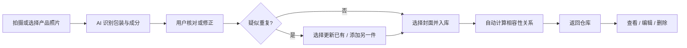
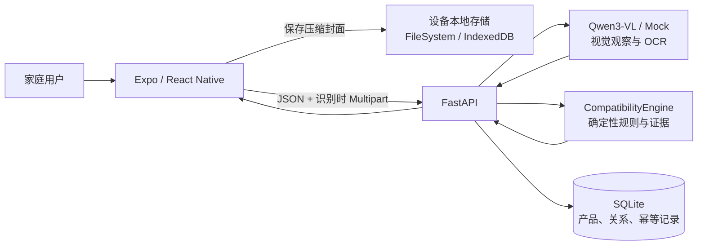

# 家庭化学品安全管理系统

[](https://github.com/gsj1225/household-chemical-safety/actions/workflows/ci.yml)

面向普通家庭的化学品安全管理工具：用户扫描一件产品并建立可维护档案，之后可以查看照片、日期、储存条件、危险性和不可混用对象；每次库存变化，系统重新检查受影响的产品关系。

> 当前项目是可运行的 Demo，不是专业检测设备。识别结果和品类提示不能替代产品标签、实验室检测、医生诊断或专业安全意见。

## 为什么做这个项目

家庭中的清洁剂、消毒剂、杀虫剂、胶黏剂和其他化学品通常分散在厨房、卫生间、阳台与储物柜中。真正容易被忽略的风险，往往不是"家里有没有某种产品"，而是：

- 不相容产品被放在一起，存在误混或泄漏后接触的可能
- 原包装、标签、瓶盖或警示信息缺失
- 产品被分装进饮料瓶等非原始容器
- 用户只看到商品名，却无法快速理解包装文字与风险规则

传统的化学品安全内容通常以说明书、科普文章或规则清单出现。它们有价值，但存在一个传播上的现实问题：**内容严肃、进入门槛高、检查步骤长，而且结果很难成为日常维护习惯。**

所以我们想做的不是另一款只强调识别准确率的化学品工具，而是一条更完整的行为路径：

> 先让用户愿意拍一张照片开始建档，再让用户看懂并处理真实风险，最后让检查结果成为一个可以长期维护的化学品档案。

## 产品目标

1. **降低开始建档的门槛。** 用户不需要学习化学知识，只需扫描一件产品，核对后即可入库。
2. **把识别转化为行动。** 系统不仅说"可能有什么"，还要说明风险事实、证据状态和可以马上执行的处置建议。
3. **让档案可维护。** 仓库以双列陈列产品照片和摘要，支持搜索、详情、编辑和删除。
4. **让相容性检查自动化。** 每次库存变化，系统重新检查受影响的产品关系，无需用户手动比对。

## 核心功能

- 扫描单件产品：相机拍摄或相册选图，使用 Qwen3-VL 识别品牌、产品名、品类、包装文字和成分
- 用户核对：识别结果先形成草稿，用户核对后才能写入正式库存
- 疑似重复检查：扫描疑似已有产品时，由用户决定更新旧记录或增加另一件
- 仓库管理：双列展示产品照片和摘要，支持搜索、筛选、详情、编辑和删除
- 本地封面：封面照片压缩去元数据后只存设备本地，不进入后端数据库
- 相容性检查：基于版本化确定性规则，自动计算产品间的禁止混用、分开储存、使用间隔和待补充信息关系
- 信息完整性：产品信息不完整时标记为 `needs_information`，提示用户补拍
- 幂等操作：创建和修改携带 operationId，防止超时重试重复创建
- 乐观并发：修改和删除携带 expectedRevision，防止陈旧覆盖
- 提供 Mock AI 模式，无 API Key 也可以进行本地开发和流程演示

## 工作流程



## 技术架构



| 模块 | 技术 | 职责 |
|---|---|---|
| 移动端 / Web | Expo 57、React Native、TypeScript | 拍照、核对、仓库、详情编辑、相容性界面 |
| 状态与导航 | Zustand 5、React Navigation 7 | 实体缓存与短期入库草稿分离 |
| 后端 | FastAPI、Pydantic | API、流程编排、校验、幂等与错误契约 |
| AI | Qwen OpenAI-compatible API / Mock Provider | 包装识别与 OCR |
| 安全判断 | JSON 规则 + Python 纯逻辑 | 确定性相容性判断，不依赖 AI 结论 |
| 数据存储 | SQLite | 产品、关系、幂等记录，不保存原始图片 |
| 本地封面 | expo-file-system / IndexedDB | Native 和 Web 的封面缩略图存储 |

模型只负责"看见了什么"，本地规则负责"如何判断"。完整设计见 [架构方案](./docs/architecture/架构方案.md)。

## 项目结构

```text
.
├─ backend/                 FastAPI 后端、规则库与自动化测试
│  ├─ app/api/routes/       Inventory、Recognition、Compatibility 路由
│  ├─ app/core/             AI Provider、CompatibilityEngine、DuplicateMatcher
│  ├─ app/services/         InventoryService、RecognitionService、CompatibilityService
│  ├─ app/data/             SQLite Repository 与 JSON 规则数据
│  ├─ app/models/           Pydantic 模型
│  ├─ tests/                pytest 测试（127 项）
│  └─ tests/_v1_archive/    V1 归档测试
├─ mobile/                  Expo React Native 应用
│  ├─ src/screens/          Inventory、Intake、ProductDetail、ProductEdit、Compatibility
│  ├─ src/components/       Primitives、Composites、Features
│  ├─ src/store/            inventoryStore、intakeStore、compatibilityStore
│  ├─ src/services/         inventoryApi、photoAssetService
│  ├─ src/view-models/      DTO → ViewModel 映射
│  └─ _v1_archive/          V1 归档脚本
├─ design/                  可视化源文件、PNG 与真实页面验收图
├─ docs/                    产品、设计、架构、实施、运维与历史文档
│  ├─ product/              产品背景与用户流程
│  ├─ design/               线框图、视觉规范与组件边界
│  ├─ architecture/         架构图集与完整架构方案
│  ├─ implementation/       功能切片实施计划
│  ├─ operations/           部署和运行说明
│  └─ history/              开发日记
└─ README.md                项目入口
```

## 环境要求

- Git
- Python 3.10 或更高版本
- Node.js 22.13 或更高版本（Expo SDK 57 的最低要求）
- npm
- 手机预览时安装与项目 SDK 兼容的 Expo Go，且手机与电脑处于同一局域网

## 快速开始

### 1. 获取代码

```bash
git clone https://github.com/gsj1225/household-chemical-safety.git
cd household-chemical-safety
```

该仓库为公开仓库，任何人都可以查看和克隆代码；提交修改时建议创建分支并通过 Pull Request 合并。

### 2. 启动后端

Windows PowerShell：

```powershell
cd backend
python -m venv .venv
.\.venv\Scripts\Activate.ps1
pip install -r requirements.txt
Copy-Item .env.example .env
python -m uvicorn app.main:app --reload --host 0.0.0.0 --port 8000
```

macOS / Linux：

```bash
cd backend
python3 -m venv .venv
source .venv/bin/activate
pip install -r requirements.txt
cp .env.example .env
python -m uvicorn app.main:app --reload --host 0.0.0.0 --port 8000
```

启动后可访问：

- 健康检查：<http://127.0.0.1:8000/health>
- API 文档：<http://127.0.0.1:8000/docs>

默认 `AI_PROVIDER=mock`，不需要模型密钥。

### 3. 配置并启动前端

另开一个终端：

```bash
cd mobile
npm install
```

复制环境变量模板：

```powershell
# Windows PowerShell
Copy-Item .env.example .env
```

```bash
# macOS / Linux
cp .env.example .env
```

电脑浏览器预览时可设置：

```env
EXPO_PUBLIC_API_BASE_URL=http://127.0.0.1:8000/api
```

然后运行：

```bash
npm run web
```

浏览器通常会打开 <http://localhost:8081>。

## 在手机上运行

1. 用 `ipconfig`（Windows）或 `ifconfig` / `ip addr`（macOS、Linux）找到电脑的局域网 IPv4 地址。
2. 修改 `mobile/.env`，不能在真机上使用 `127.0.0.1`：

```env
EXPO_PUBLIC_API_BASE_URL=http://192.168.1.100:8000/api
```

3. 确保手机和电脑连接同一个 Wi-Fi，并允许防火墙放行后端的 8000 端口。
4. 启动 Expo：

```bash
cd mobile
npm start
```

5. 使用 Expo Go 扫描终端二维码。Android 也可以运行 `npm run android` 打开已配置的模拟器。

## 启用 Qwen 真实识别

编辑 `backend/.env`：

```env
AI_PROVIDER=qwen
QWEN_API_KEY=在本机填写自己的密钥
QWEN_BASE_URL=https://dashscope.aliyuncs.com/compatible-mode/v1
QWEN_VL_MODEL=qwen3-vl-plus
QWEN_TEXT_MODEL=qwen-flash
QWEN_TIMEOUT_SECONDS=30
QWEN_MAX_RETRIES=1
```

保存后重启后端。模型服务的区域必须与 API Key 匹配。

安全要求：

- 真实密钥只能放在 `backend/.env` 或部署平台的密钥管理中
- 不要把密钥写入前端、源代码、截图、日志或 Git 提交
- `.env` 已被 Git 忽略；`.env.example` 只保存无密钥模板
- 如果密钥曾出现在聊天、截图或公开位置，应立即在服务商后台撤销并重新生成

## 自动化检查

后端测试：

```bash
cd backend
pip install -r requirements-dev.txt
python -m pytest -q
```

前端类型检查：

```bash
cd mobile
npx tsc --noEmit
```

前端 Web 构建：

```bash
cd mobile
npx expo export --platform web
```

当前已验证：后端 127 项 + 移动端 103 项测试通过、TypeScript 类型检查通过、Expo Web 导出成功。

仓库已配置 GitHub Actions。推送到 `main`、向 `main` 提交 Pull Request 或手动触发时，云端会自动运行后端测试和前端类型检查与 Web 构建；工作流强制使用 Mock 模式，不需要 Qwen API Key，也不会消耗模型额度。

## 主要 API

| 方法 | 路径 | 说明 |
|---|---|---|
| `GET` | `/api/inventory/products` | 产品列表、搜索、筛选、排序 |
| `POST` | `/api/inventory/products` | 创建产品（携带 productId、operationId 和重复决策） |
| `GET` | `/api/inventory/products/{productId}` | 产品详情 |
| `PATCH` | `/api/inventory/products/{productId}` | 编辑产品（携带 expectedRevision） |
| `DELETE` | `/api/inventory/products/{productId}` | 删除产品（携带 expectedRevision） |
| `POST` | `/api/inventory/recognitions` | 上传照片识别产品（Multipart） |
| `POST` | `/api/inventory/duplicates/check` | 疑似重复查询 |
| `GET` | `/api/inventory/compatibility/summary` | 仓库相容性摘要 |
| `GET` | `/api/inventory/compatibility/relations` | 关系列表（按产品、类型或级别筛选） |
| `GET` | `/api/inventory/compatibility/relations/{relationId}` | 关系详情 |

创建和修改响应统一返回产品、相容性摘要和受影响关系列表。接口字段和在线调试以 `/docs` 中的 OpenAPI 文档为准。

## 数据与隐私边界

- 识别图片只在当前请求中以内存处理，不保存到 SQLite、文件系统或应用日志
- SQLite 只保存产品、相容性关系和幂等记录
- 本地封面照片压缩去 EXIF 后只存设备本地，后端不保存图片 URL
- 使用 Qwen 模式时，图片会发送给配置的第三方模型服务，正式发布前必须提供相应隐私政策和用户授权说明
- 当前历史数据没有用户账号隔离，只适合本地 Demo；正式上线前需要增加身份认证与数据隔离
- 相容性规则中的 `verified` 表示已登记资料来源，不表示应用完成了实验室检测

## 常见问题

### 手机无法连接后端

确认 `EXPO_PUBLIC_API_BASE_URL` 使用电脑局域网 IP，而不是 `127.0.0.1`；同时检查手机与电脑是否同网、8000 端口是否被防火墙拦截。

### 下载代码后为什么没有历史记录

本地 SQLite 数据库不会提交到 Git。新环境第一次启动时会创建自己的空数据库。

### 为什么没有 API Key

密钥属于个人机密，不应随代码分发。下载者需要复制 `backend/.env.example` 并配置自己的密钥，或者继续使用默认 Mock 模式。

### 识别结果可以直接视为安全结论吗

不可以。图片识别可能受角度、遮挡、光线和包装版本影响；应用要求用户核对产品信息，并通过本地规则提供预防性提示，但仍不能替代标签说明与专业检测。系统在没有命中规则时只显示"当前未发现已登记禁忌"，不表示绝对安全。

## 更多文档

- [架构方案](./docs/architecture/架构方案.md)
- [家庭化学品库实施计划](./docs/implementation/家庭化学品库实施计划.md)
- [产品方案](./docs/product/家庭化学品安全方案.md)
- [用户流程](./docs/product/用户流程.md)
- [手机端页面线框图](./docs/design/手机端页面线框图.md)
- [移动端视觉规范](./docs/design/移动端视觉规范.md)
- [前端组件图与设计令牌映射](./docs/design/前端组件图与设计令牌映射.md)
- [部署指南](./docs/operations/部署指南.md)
- [开发日记](./docs/history/开发日记.md)
- [文档总目录](./docs/README.md)
