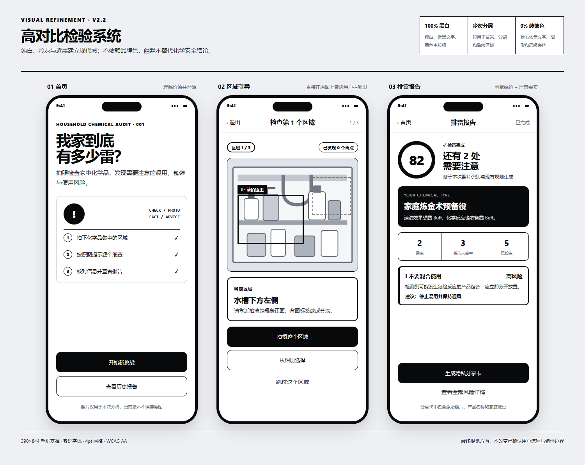
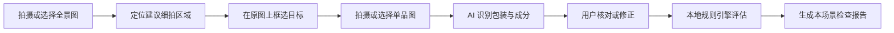
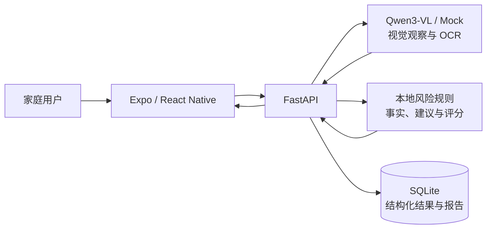

# 家庭化学品排雷大挑战

[](https://github.com/gsj1225/household-chemical-safety/actions/workflows/ci.yml)

一个面向家庭场景的化学品安全扫描应用。用户可以拍摄或从相册选择全景照片，系统会在原图上标记建议细拍的位置；完成单品识别并由用户核对产品信息后，再由本地规则引擎给出风险提示和排雷报告。

> 当前项目是可运行的 Demo，不是专业检测设备。识别结果和品类提示不能替代产品标签、实验室检测、医生诊断或专业安全意见。



## 项目背景

家庭中的清洁剂、消毒剂、杀虫剂、胶黏剂和其他化学品通常分散在厨房、卫生间、阳台与储物柜中。真正容易被忽略的风险，往往不是“家里有没有某种产品”，而是：

- 不相容产品被放在一起，存在误混或泄漏后接触的可能
- 原包装、标签、瓶盖或警示信息缺失
- 产品被分装进饮料瓶等非原始容器
- 儿童或宠物可以轻易接触
- 用户只看到商品名，却无法快速理解包装文字与风险规则

本项目尝试把一次安全检查压缩成一条短路径：拍摄一个场景的全景图，在原图上圈出 1～3 个最值得靠近核对的位置，识别包装后让用户确认，再用本地规则生成当前场景的预防性报告。

它遵循四条产品原则：

1. **一次只检查一个场景。** 不强迫用户连续拍完厨房、卫生间和其他房间。
2. **AI 负责观察，规则负责判断。** 模型不能直接决定风险等级或最终分数。
3. **用户确认优先。** 包装识别可能受光线、遮挡和版本影响，确认后才进入规则引擎。
4. **最小化保存。** 原始照片不进入数据库或日志，历史记录只保存结构化结果和报告。

## 当前阶段

- 单场景快速检查主流程已经完成：全景图 → 原图区域引导 → 近景识别 → 用户确认 → 场景报告
- Android、iOS 和 Web 共用 Expo / React Native 代码
- 黑白“检验档案”视觉与组件令牌已经迁移到核心页面
- 首页与全景分析的就地异常恢复代表性切片已经实现
- 细拍、确认和报告阶段的统一异常恢复暂缓，仍需继续迁移
- 项目仍处于 Demo / 验证阶段，账号体系、云端数据隔离、正式隐私授权和专业规则审查尚未完成

## 核心功能

- 支持相机拍摄和相册选图，兼容 Android、iOS 与电脑浏览器预览
- 每次检查一张场景全景图，定位 1～3 个最有信息价值的细拍区域
- 在用户的同一张原图上框出下一处细拍位置
- 使用 Qwen3-VL 识别品牌、产品名、品类、包装文字和成分
- 识别结果先由用户核对或修正，再进入风险判断
- 风险等级、冲突规则和报告评分由本地规则引擎确定，模型不直接裁决安全结论
- 生成当前场景的抽查评分、雷点列表、证据状态和历史报告
- 原始图片只在单次请求的内存中处理，不写入数据库或日志
- 提供 Mock AI 模式，无 API Key 也可以进行本地开发和流程演示

## 工作流程



## 技术架构



| 模块 | 技术 | 职责 |
|---|---|---|
| 移动端 / Web | Expo 57、React Native、TypeScript | 拍照、相册、区域引导、确认与报告 UI |
| 状态与导航 | Zustand、React Navigation 7 | 挑战状态和页面流转 |
| 后端 | FastAPI、Pydantic | API、流程编排、校验、限流与错误契约 |
| AI | Qwen OpenAI-compatible API / Mock Provider | 全景观察、包装识别与 OCR |
| 风险判断 | 本地 JSON 规则库 | 确定性风险判断、证据关联和评分 |
| 数据存储 | SQLite | 挑战状态和历史报告，不保存原始图片 |

模型只负责“看见了什么”，本地规则负责“如何判断”。完整设计见 [架构方案](./架构方案.md)。

更多可视化说明见 [架构图集](./docs/architecture/README.md)，其中包含系统上下文、单场景时序、后端分层、移动端组件边界和异常恢复架构。

## 项目结构

```text
.
├─ backend/                 FastAPI 后端、规则库与自动化测试
│  ├─ app/api/              API 路由
│  ├─ app/core/             AI Provider、风险引擎和限流
│  ├─ app/services/         挑战、扫描、旁白和报告服务
│  ├─ app/data/             SQLite Repository 与 JSON 规则数据
│  └─ tests/                pytest 测试
├─ mobile/                  Expo React Native 应用
│  └─ src/                  页面、组件、状态与 API 客户端
├─ design/                  线框图、视觉规范、组件图与真实页面验收图
├─ docs/architecture/       GitHub 可直接渲染的 Mermaid 架构图集
├─ 架构方案.md              技术设计与变更约束
├─ 部署指南.md              本地、Docker、APK 部署说明
└─ 开发日记.md              开发记录与验证结果
```

## 环境要求

- Git
- Python 3.10 或更高版本
- Node.js 22.13 或更高版本（Expo SDK 57 的最低要求）
- npm
- 手机预览时安装与项目 SDK 兼容的 Expo Go，且手机与电脑处于同一局域网

## 快速开始

### 1. 获取代码

```bash
git clone https://github.com/gsj1225/household-chemical-safety.git
cd household-chemical-safety
```

该仓库为公开仓库，任何人都可以查看和克隆代码；提交修改时建议创建分支并通过 Pull Request 合并。

### 2. 启动后端

Windows PowerShell：

```powershell
cd backend
python -m venv .venv
.\.venv\Scripts\Activate.ps1
pip install -r requirements.txt
Copy-Item .env.example .env
python -m uvicorn app.main:app --reload --host 0.0.0.0 --port 8000
```

macOS / Linux：

```bash
cd backend
python3 -m venv .venv
source .venv/bin/activate
pip install -r requirements.txt
cp .env.example .env
python -m uvicorn app.main:app --reload --host 0.0.0.0 --port 8000
```

启动后可访问：

- 健康检查：<http://127.0.0.1:8000/health>
- API 文档：<http://127.0.0.1:8000/docs>

默认 `AI_PROVIDER=mock`，不需要模型密钥。

### 3. 配置并启动前端

另开一个终端：

```bash
cd mobile
npm install
```

复制环境变量模板：

```powershell
# Windows PowerShell
Copy-Item .env.example .env
```

```bash
# macOS / Linux
cp .env.example .env
```

电脑浏览器预览时可设置：

```env
EXPO_PUBLIC_API_BASE_URL=http://127.0.0.1:8000/api
```

然后运行：

```bash
npm run web
```

浏览器通常会打开 <http://localhost:8081>。

## 在手机上运行

1. 用 `ipconfig`（Windows）或 `ifconfig` / `ip addr`（macOS、Linux）找到电脑的局域网 IPv4 地址。
2. 修改 `mobile/.env`，不能在真机上使用 `127.0.0.1`：

```env
EXPO_PUBLIC_API_BASE_URL=http://192.168.1.100:8000/api
```

3. 确保手机和电脑连接同一个 Wi-Fi，并允许防火墙放行后端的 8000 端口。
4. 启动 Expo：

```bash
cd mobile
npm start
```

5. 使用 Expo Go 扫描终端二维码。Android 也可以运行 `npm run android` 打开已配置的模拟器。

## 启用 Qwen 真实识别

编辑 `backend/.env`：

```env
AI_PROVIDER=qwen
QWEN_API_KEY=在本机填写自己的密钥
QWEN_BASE_URL=https://dashscope.aliyuncs.com/compatible-mode/v1
QWEN_VL_MODEL=qwen3-vl-plus
QWEN_TEXT_MODEL=qwen-flash
QWEN_TIMEOUT_SECONDS=30
QWEN_MAX_RETRIES=1
```

保存后重启后端。模型服务的区域必须与 API Key 匹配。

安全要求：

- 真实密钥只能放在 `backend/.env` 或部署平台的密钥管理中
- 不要把密钥写入前端、源代码、截图、日志或 Git 提交
- `.env` 已被 Git 忽略；`.env.example` 只保存无密钥模板
- 如果密钥曾出现在聊天、截图或公开位置，应立即在服务商后台撤销并重新生成

## 自动化检查

后端：

```bash
cd backend
pip install -r requirements-dev.txt
python -m pytest -q
```

前端类型检查：

```bash
cd mobile
npx tsc --noEmit
```

异常恢复映射测试：

```bash
cd mobile
npm run test:recovery
```

前端 Web 构建：

```bash
cd mobile
npx expo export --platform web
```

当前已验证：后端 22 项测试、异常恢复映射 6 项测试、TypeScript 类型检查和 Expo Web 构建通过。

仓库已配置 GitHub Actions。推送到 `main`、向 `main` 提交 Pull Request 或手动触发时，云端会自动运行上述检查；工作流强制使用 Mock 模式，不需要 Qwen API Key，也不会消耗模型额度。

## 主要 API

| 方法 | 路径 | 说明 |
|---|---|---|
| `POST` | `/api/challenge/start` | 创建挑战 |
| `POST` | `/api/scan/panorama` | 分析全景图并返回细拍区域 |
| `POST` | `/api/scan/identify` | 识别单品并生成待确认草稿 |
| `POST` | `/api/scan/confirm` | 确认或修正产品后执行本地风险判断 |
| `POST` | `/api/narration/generate` | 生成非安全结论类的趣味旁白 |
| `POST` | `/api/challenge/result` | 生成或读取挑战报告 |
| `GET` | `/api/challenge/history` | 查询最近完成的挑战 |

接口字段和在线调试以 `/docs` 中的 OpenAPI 文档为准。

## 数据与隐私边界

- 图片只在当前请求中以内存处理，不保存到 SQLite、文件系统或应用日志
- SQLite 只保存挑战状态、结构化识别结果和报告
- 使用 Qwen 模式时，图片会发送给配置的第三方模型服务，正式发布前必须提供相应隐私政策和用户授权说明
- 当前历史数据没有用户账号隔离，只适合本地 Demo；正式上线前需要增加身份认证与数据隔离
- 风险规则中的 `verified` 表示已登记资料来源，不表示应用完成了实验室检测

## 常见问题

### 手机无法连接后端

确认 `EXPO_PUBLIC_API_BASE_URL` 使用电脑局域网 IP，而不是 `127.0.0.1`；同时检查手机与电脑是否同网、8000 端口是否被防火墙拦截。

### 下载代码后为什么没有历史记录

本地 SQLite 数据库不会提交到 Git。新环境第一次启动时会创建自己的空数据库。

### 为什么没有 API Key

密钥属于个人机密，不应随代码分发。下载者需要复制 `backend/.env.example` 并配置自己的密钥，或者继续使用默认 Mock 模式。

### 识别结果可以直接视为安全结论吗

不可以。图片识别可能受角度、遮挡、光线和包装版本影响；应用要求用户核对产品信息，并通过本地规则提供预防性提示，但仍不能替代标签说明与专业检测。

## 更多文档

- [后端说明](./backend/README.md)
- [架构图集](./docs/architecture/README.md)
- [架构方案](./架构方案.md)
- [用户流程](./用户流程.md)
- [手机端页面线框图](./手机端页面线框图.md)
- [移动端视觉基础约束（最终视觉待定）](./移动端视觉规范.md)
- [前端组件图与设计令牌映射](./前端组件图与设计令牌映射.md)
- [第一条功能垂直切片实施计划](./第一条功能垂直切片实施计划.md)
- [第二条功能垂直切片实施计划](./第二条功能垂直切片实施计划.md)
- [部署指南](./部署指南.md)
- [开发日记](./开发日记.md)
- [产品方案](./家庭化学品安全方案.md)
