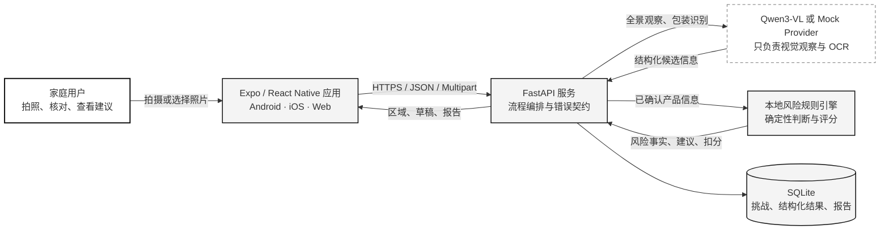
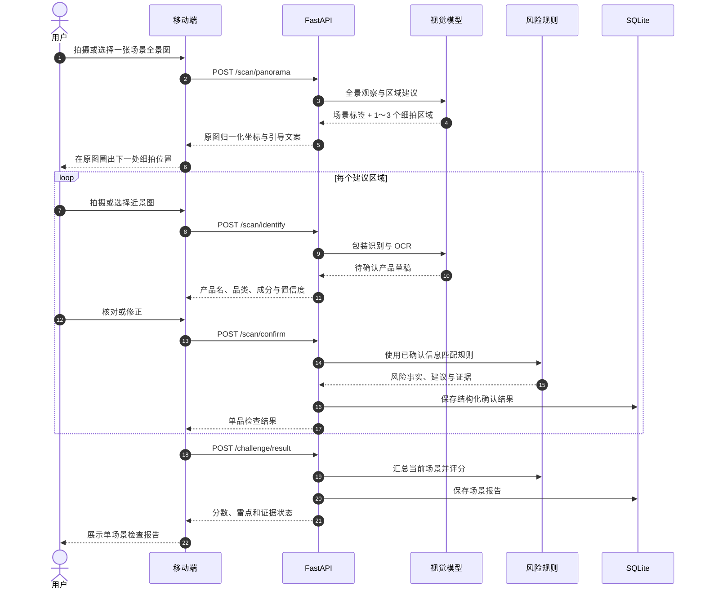
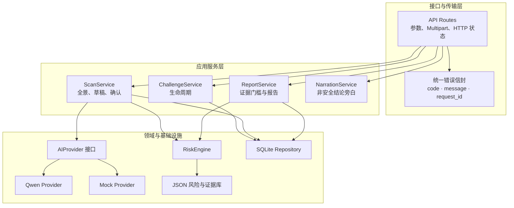
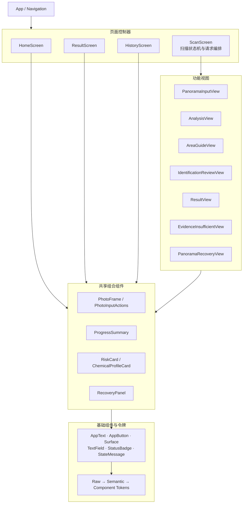
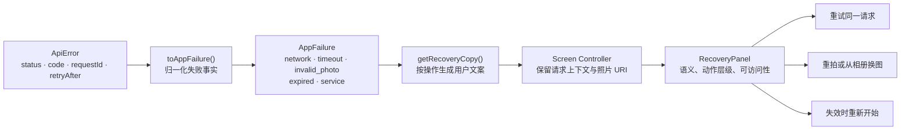

# 架构图集

> 本页用于快速理解项目边界、数据流和组件职责。详细约束、决策记录与迁移顺序以同目录的 [架构方案](./架构方案.md) 为准。

## 1. 系统上下文

核心边界：

- 模型负责回答“画面里可能有什么”，不能直接裁决安全结论。
- 用户必须核对或修正产品信息，确认后才进入风险规则。
- 风险事实、处置建议和分数由本地规则引擎确定，结果可测试、可追溯。
- 原始图片只存在于当前请求和页面会话中，不写入 SQLite、日志或长期缓存。

## 2. 单场景检查数据流

为什么改成单场景：

- 一次只检查厨房、储物柜等一个场景，避免强制用户连续拍摄多个房间。
- 每张全景图只产生 1～3 个最有信息价值的细拍区域，缩短完成路径。
- 报告只描述本张全景图覆盖的范围，不暗示整套住宅已经完成检查。

## 3. 后端分层与信任边界

禁止跨越的边界：

- API 路由不直接拼装风险结论。
- AI Provider 不读写 SQLite，也不计算最终分数。
- 风险规则不依赖模型自由文本，只接收已确认的结构化字段。
- Repository 不保存原始照片。

## 4. 移动端组件边界

职责规则：

- Screen 负责 API、Zustand、导航和请求互斥。
- View 只接收数据与 typed callbacks，不直接调用 API 或导航。
- Composite 组合业务语义，但不拥有页面状态机。
- Primitive 只表达通用交互；颜色、间距、字号和边框从令牌读取。

完整组件图：

## 5. 异常恢复架构

> 当前已落地首页创建失败和全景分析失败代表性切片；细拍、确认和报告恢复暂缓，后续沿同一边界迁移。

恢复原则：

- 可重试错误留在当前页面，不用系统弹窗覆盖任务。
- 网络或超时优先复用原 challenge 和原照片。
- 图片无效时优先重拍或换图，不能把所有错误都包装成“网络问题”。
- 错误对象、失败照片 URI 和重试闭包不写入全局 store。
- 用户消息不出现 API 地址、端口、堆栈、密钥或完整内部异常。

## 6. 数据所有权与隐私

| 数据 | 页面内存 | Zustand | SQLite | 模型服务 |
|---|---:|---:|---:|---:|
| 原始全景/近景照片 | 是，短期 | 否 | 否 | Qwen 模式会发送 |
| challenge ID | 是 | 是 | 是 | 否 |
| 场景标签与区域坐标 | 是 | 是 | 是 | 由视觉模型产生 |
| 待确认识别草稿 | 是 | 是，当前流程 | 临时状态 | 由视觉模型产生 |
| 用户确认产品信息 | 是 | 是 | 是 | 否 |
| 风险事实、证据与评分 | 是 | 是 | 是 | 否 |
| 恢复错误与失败照片 URI | 是，短期 | 否 | 否 | 否 |

## 7. 配套设计资料

- [用户流程](../product/用户流程.md)
- [手机端低保真线框图](../design/手机端页面线框图.md)
- [移动端视觉规范](../design/移动端视觉规范.md)
- [前端组件图与设计令牌映射](../design/前端组件图与设计令牌映射.md)
- [异常恢复用户流程](../product/异常恢复用户流程.md)
- [异常恢复低保真线框图](../design/异常恢复页面线框图.md)
