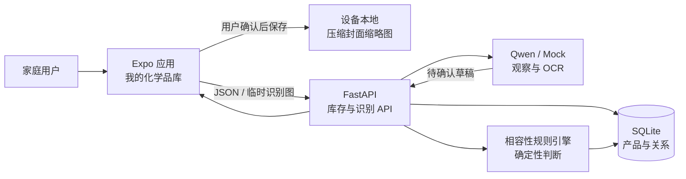
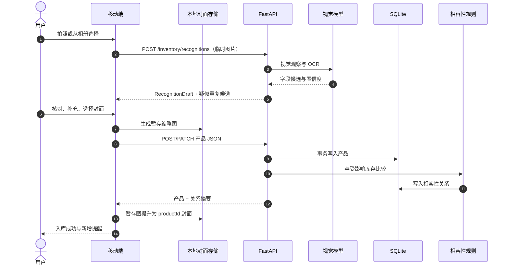
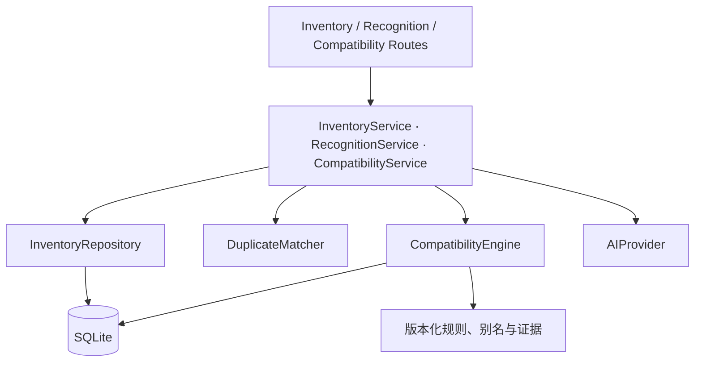
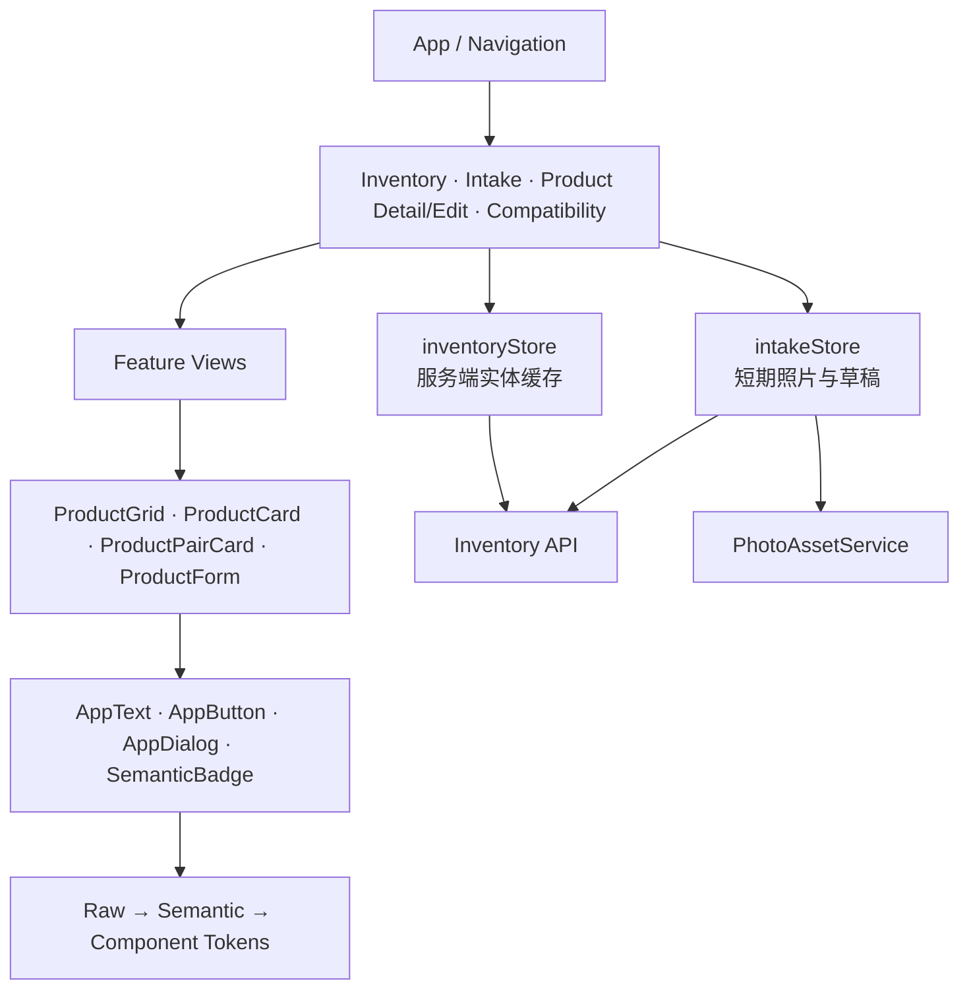
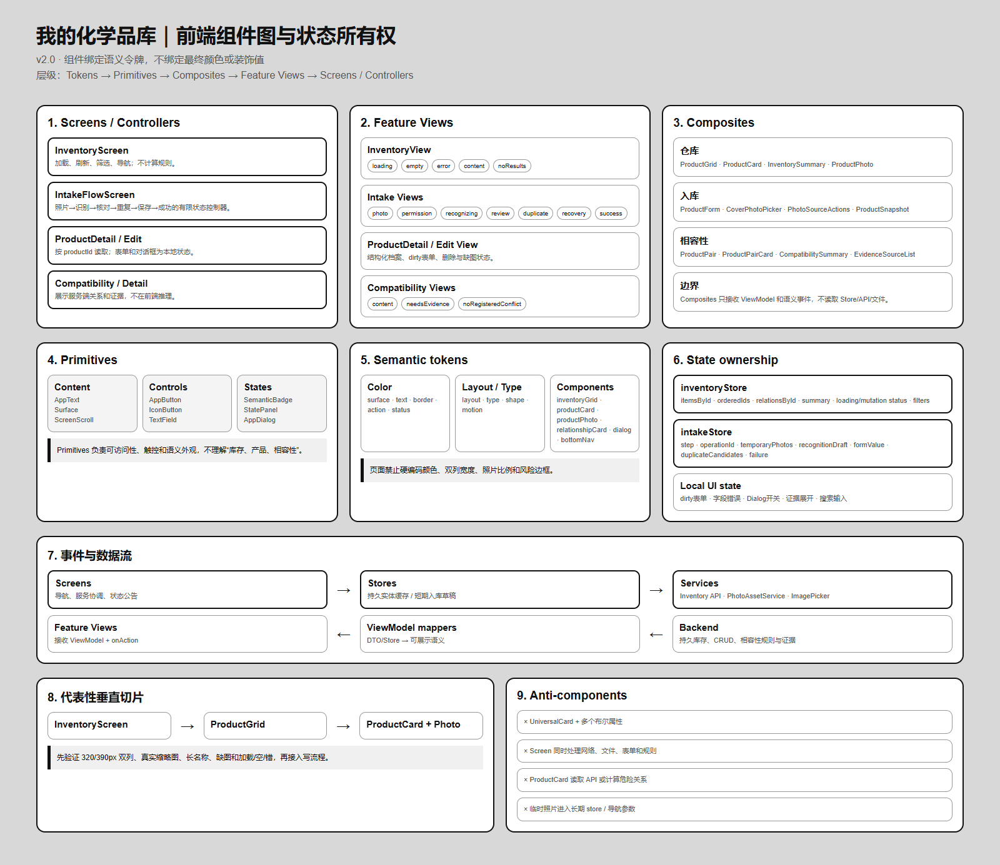
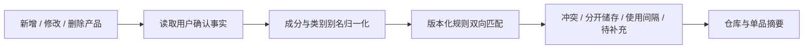

# 家庭化学品库——架构图集

> 版本：v2.0（待确认）
>
> 本页用于快速理解目标边界；字段、错误码、迁移和验收以 [完整架构方案](./架构方案.md) 为准。

## 1. 系统上下文

核心边界：

- AI 回答“包装上可能写了什么”，不直接回答“是否安全”。
- 用户确认后的结构化事实才写入库存和相容性计算。
- 封面照片保存在设备本地，后端不保存本地 URI 或全尺寸家庭照片。
- 关系提示表示规则条件可能成立，不表示产品正在共同存放或混用。

## 2. 扫描入库数据流

失败恢复：识别失败保留临时照片；保存失败保留表单与 operationId；本地封面提升失败显示可恢复占位，不删除结构化产品。

## 3. 后端分层

- Route 只负责 HTTP、校验和稳定错误码。
- Service 编排事务、重复决策、revision 和 operationId。
- Repository 不调用模型和规则。
- Engine 只接收已确认事实，不读取图片。

## 4. 移动端组件与状态

状态所有权：

- `inventoryStore`：产品、关系、摘要、筛选和请求状态。
- `intakeStore`：单次入库步骤、operationId、临时照片、草稿和失败恢复。
- 页面本地：表单 dirty、对话框、字段错误、搜索输入和证据展开。
- 组件：只接收 ViewModel 和语义事件，不读取 Store/API。

完整组件图：

## 5. 数据所有权

| 数据 | 移动端会话 | 设备封面存储 | SQLite | 模型服务 |
|---|---:|---:|---:|---:|
| 相机/相册临时图 | 是 | 否 | 否 | 否 |
| 识别上传压缩图 | 请求期 | 否 | 否 | Qwen 模式短期发送 |
| 用户选择的封面缩略图 | 解析引用 | 是 | 否 | 否 |
| 识别草稿 | 是 | 否 | 否 | 产生后返回 |
| 用户确认产品 | 缓存 | 否 | 是 | 否 |
| 相容性关系与证据 | 缓存 | 否 | 是 | 否 |
| operationId | 入库/编辑会话 | 否 | 幂等记录 | 否 |

## 6. 相容性计算

- 新增和修改只与受影响产品比较；删除级联移除相关关系。
- 无命中不创建 `safe` 记录，展示“当前规则库未发现已登记禁忌”。
- 每条命中保存规则 ID、版本、说明、动作、证据状态和来源。

## 7. 迁移顺序

1. 锁定 DTO、错误码和规则枚举。
2. 建立令牌兼容层与无障碍 Primitive。
3. 新增 Inventory 表/API 与相容性引擎；旧 challenge 能力保留。
4. 完成只读双列仓库代表性切片。
5. 接入真实查询，再实现扫描入库和本地封面。
6. 实现重复、补拍、详情、编辑、删除和相容性界面。
7. 完成 24 状态和 Android/iOS/Web QA。
8. 产品确认后单独清理旧 challenge、报告和传播代码。

具体 Agent 任务包见 [家庭化学品库实施计划](../implementation/家庭化学品库实施计划.md)。

## 8. 配套资料

- [产品方案](../product/家庭化学品安全方案.md)
- [用户流程](../product/用户流程.md)
- [低保真线框图](../design/手机端页面线框图.md)
- [视觉基础](../design/移动端视觉规范.md)
- [组件图与令牌映射](../design/前端组件图与设计令牌映射.md)
- [完整架构方案](./架构方案.md)
- [功能实施计划](../implementation/家庭化学品库实施计划.md)
