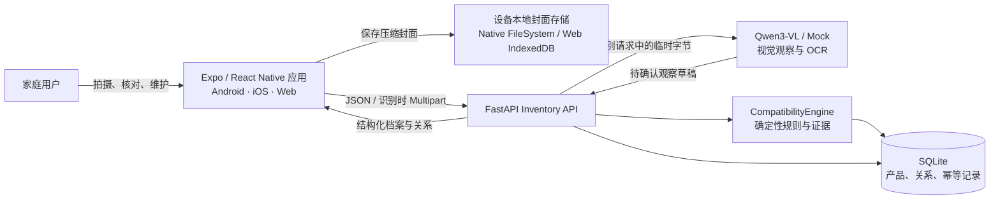

# 家庭化学品安全管理系统——架构方案

> 版本：v2.0（家庭化学品库，已确认）
>
> 日期：2026-08-02
>
> 技术权威状态：已确认。本文件取代旧版 challenge、全景扫描、评分报告和传播卡架构，是后续编码的唯一跨模块技术权威。

## 一、已确认输入与架构门禁

已确认的上游输入：

- [家庭化学品安全管理方案](../product/家庭化学品安全方案.md) v2.0。
- [用户流程](../product/用户流程.md) v2.0。
- [手机端页面线框图](../design/手机端页面线框图.md) v2.0，覆盖 24 个状态。
- [移动端视觉基础](../design/移动端视觉规范.md) v3.0。
- [前端组件图与设计令牌映射](../design/前端组件图与设计令牌映射.md) v2.0。

架构已确认，功能实现已完成 P0 至 F6 全部切片。最终配色、图标、插画、阴影、圆角细节和动效性格继续留到视觉润色阶段。

## 二、架构目标

系统围绕三个长期对象工作：

1. **库存产品**：用户确认过的一件家庭化学品档案。
2. **本地封面**：用户明确选择、经过压缩和去元数据处理的仓库陈列图。
3. **相容性关系**：两件库存产品之间由可追溯规则产生的条件式提醒。

目标能力：

- 直接拍摄或选择一件产品，不要求先拍家庭大场景。
- 识别结果先形成草稿，用户核对后才能写入正式库存。
- 仓库以固定双列展示产品照片和摘要，支持搜索、筛选、详情、编辑和删除。
- 新增、修改或删除产品时，只重算受影响的相容性关系。
- 再次扫描疑似已有产品时，由用户决定更新旧记录或增加另一件。
- 所有安全结论区分标签事实、用户填写、模型观察、规则推导和证据状态。

## 三、非目标

MVP 不实现：

- SBTI、人格测试、排雷分数、排行榜或传播挑战。
- 全景图、房间区域引导和真实存放位置追踪。
- 账号、家庭成员、云端图片同步或跨设备封面同步。
- 自动判断用户正在混用、共同存放或已经发生事故。
- 复杂关系网络图、拖拽陈列、批量编辑和批量删除。
- 药品、工业化学品或医疗诊断。
- 由视觉模型直接裁决“安全/危险”。

旧 challenge API、表和页面只作为迁移期回退能力保留，不再扩展。

## 四、AS-IS 与 TO-BE

| 维度 | 当前 AS-IS | 目标 TO-BE |
|---|---|---|
| 核心实体 | `ChallengeState` 与一次性报告 | `InventoryProduct` 与长期库存 |
| 入口 | 首页 → 全景 → 细拍 | 我的化学品库 → 扫描入库 |
| 图片 | 请求结束后全部丢弃 | 识别原图短期；用户确认的本地缩略图长期 |
| 状态 | `challengeStore` 承载扫描流程 | `inventoryStore` 缓存实体，`intakeStore` 承载短期草稿 |
| 关系判断 | 当前 challenge 内交叉风险 | 全库存受影响产品的相容性重算 |
| 结果 | 分数、雷点、历史报告 | 产品档案、相容性提醒、增删改查 |
| 表达 | challenge / 排雷 / 评分 | 管理 / 入库 / 相容性 / 待补充 |

旧报告不得自动转换成库存产品：旧数据没有用户选定封面，也不保证字段经过新方案的核对。迁移期不丢弃旧 SQLite 表，但新 UI 不把旧报告伪装成库存。

## 五、系统上下文



### 5.1 信任边界

- 模型只提取画面可见文字和候选类别；模型输出全部是草稿。
- 用户确认后的事实才可进入库存和规则计算。
- 相容性结论只由版本化规则产生，不使用模型自由文本直接下结论。
- “没有关系记录”只表示当前规则未命中，不等于检测合格或绝对安全。
- 封面照片属于设备本地资产，后端产品记录不得保存 `file://`、`content://` 或浏览器临时 URL。

## 六、技术栈与模块边界

| 层 | 现有选型 | v2 用法 |
|---|---|---|
| 客户端 | Expo 57、React Native、TypeScript | Android/iOS 主端，Expo Web 为评审入口 |
| 导航 | React Navigation 7 | Inventory、Intake、ProductDetail、ProductEdit、Compatibility、CompatibilityDetail |
| 客户端状态 | Zustand 5 | 实体缓存与短期入库草稿分离 |
| 图片输入 | expo-camera、expo-image-picker | 相机和相册汇合到同一临时照片模型 |
| 图片处理 | expo-image-manipulator | 识别上传压缩；本地封面压缩与去元数据 |
| 本地图片 | expo-file-system / IndexedDB | 原生与 Web 的 `PhotoAssetService` 实现 |
| API | FastAPI + Pydantic | Inventory、Recognition、Compatibility 三组路由 |
| 持久化 | SQLite | 产品、关系、幂等操作；保留旧 challenge 表 |
| 识别 | `AIProvider` 的 Qwen / Mock 实现 | 新增仅返回 `RecognitionObservation` 的产品标签识别能力 |
| 安全判断 | JSON 规则 + Python 纯逻辑 | 新增 `CompatibilityEngine`，不依赖 AI 结论 |

### 6.1 后端分层

```text
API Routes
  ├─ inventory.py       HTTP、校验、状态码
  ├─ recognition.py     Multipart、图片校验
  └─ compatibility.py   查询筛选
        ↓
Application Services
  ├─ InventoryService
  ├─ RecognitionService
  └─ CompatibilityService
        ↓
Domain / Infrastructure
  ├─ InventoryRepository
  ├─ CompatibilityEngine
  ├─ DuplicateMatcher
  ├─ AIProvider
  ├─ JSON rules + evidence
  └─ SQLite
```

Route 不访问 SQL、不拼安全结论；Repository 不调用模型或规则；Provider 不写库存；Engine 不读取图片。

### 6.2 客户端分层

```text
Screens / Controllers
  → Feature Views
    → Composites
      → Accessible Primitives
        → Raw / Semantic / Component Tokens

Screens
  → inventoryStore / intakeStore
  → Inventory API client
  → PhotoAssetService
```

组件不得读取 API、SQL、规则文件或完整 store。详细边界以已确认的组件图为准。

## 七、领域模型

### 7.1 `InventoryProduct`

```ts
type InventoryProduct = {
  id: string;                    // 客户端生成 UUID，跨重试稳定
  revision: number;              // 乐观并发版本
  brand: string | null;
  name: string;                  // 必填，去除首尾空格后 1..120
  category: ProductCategory;     // 必填，可选 other
  barcode: string | null;
  productionDate: PartialDate;
  expiryDate: PartialDate;
  shelfLifeText: string | null;
  ingredients: ConfirmedFact[];
  labelWarnings: ConfirmedFact[];
  storageRequirements: SafetyStatement[];
  hazards: SafetyStatement[];
  incompatibilityTargets: SafetyStatement[];
  identificationConfidence: 'high' | 'medium' | 'low' | 'unknown';
  informationStatus: 'complete' | 'needs_information';
  createdAt: string;
  updatedAt: string;
};
```

`PartialDate` 保存 `value`、`precision(day/month/year/unknown)` 与 `source`，不把模糊喷码猜成精确日期。`ConfirmedFact` 必须保存展示值、规范化值、来源和用户确认状态。产品 DTO 不包含本地封面 URI。

### 7.2 事实来源

```ts
type FactSource = 'label' | 'user' | 'model_observation' | 'rule';
type ConfirmationStatus = 'confirmed' | 'unknown';
```

- `model_observation` 在入库前只能存在于识别草稿。
- 用户确认模型观察后，正式产品事实记录为 `label` 或 `user`，并保留审计来源。
- 系统建议必须标记为 `rule`，不能伪装成包装标签要求。

### 7.3 `LocalCoverAsset`

```ts
type LocalCoverAsset = {
  productId: string;
  localUri: string;              // 只在 PhotoAssetService 内部流转
  mimeType: 'image/jpeg';
  width: number;
  height: number;
  byteSize: number;
  checksum: string;
  updatedAt: string;
};
```

UI 只接收 `ProductPhotoViewModel`，不直接持有文件句柄。Native 最终键为 `inventory-covers/{productId}.jpg`；Web IndexedDB 以 `productId` 为键。图片缺失时显示可恢复占位，不删除结构化产品。

### 7.4 `RecognitionDraft`

```ts
type RecognitionDraft = {
  draftId: string;
  observations: DraftFact[];
  proposedProduct: ProductFormValue;
  missingRequiredFields: Array<'name' | 'category'>;
  lowConfidenceFields: string[];
  duplicateCandidates: ProductSnapshot[];
  createdAt: string;
};
```

草稿不写入正式产品表；服务端不长期保存识别照片。补拍正面、背标或日期喷码时，每次返回一组观察，客户端按字段来源合并，冲突字段必须再次让用户选择。

### 7.5 `CompatibilityRelation`

```ts
type CompatibilityRelation = {
  id: string;
  productAId: string;
  productBId: string;
  relationType: 'do_not_mix' | 'separate_storage' | 'usage_interval' | 'needs_information';
  severity: 'critical' | 'attention' | 'info' | 'unknown';
  title: string;
  rationale: string;
  recommendedAction: string;
  ruleId: string | null;
  ruleVersion: string;
  evidenceStatus: 'verified' | 'needs_review';
  sources: EvidenceSource[];
  updatedAt: string;
};
```

产品对按 `min(productId), max(productId)` 规范化，数据库唯一约束禁止重复方向。无规则命中时不创建“safe”关系行；API 用摘要状态 `no_registered_conflict` 表达当前规则未命中。

## 八、数据所有权与生命周期

| 数据 | Screen 内存 | Zustand | 设备封面存储 | SQLite | 模型服务 |
|---|---:|---:|---:|---:|---:|
| 相机/相册原始临时 URI | 是 | `intakeStore` 短期 | 否 | 否 | 否 |
| 识别上传压缩图 | 请求期 | 否 | 否 | 否 | Qwen 模式短期发送 |
| 入库封面缩略图 | 解析引用 | 只缓存 ViewModel | 是 | 否 | 否 |
| 识别草稿 | 是 | `intakeStore` | 否 | 否 | 产生后返回 |
| 用户确认产品 | 是 | `inventoryStore` 缓存 | 否 | 是 | 否 |
| 相容性关系与证据 | 是 | `inventoryStore` 缓存 | 否 | 是 | 否 |
| 表单 dirty/对话框 | 是 | 否 | 否 | 否 | 否 |
| 操作幂等记录 | 否 | operationId | 否 | 是，限期清理 | 否 |

### 8.1 封面保存顺序

1. 入库流程开始时生成稳定的 `productId` 与 `operationId`。
2. 用户选定封面后，`PhotoAssetService` 生成最长边不超过 1280px、JPEG、去 EXIF 的暂存图。
3. 客户端用 JSON 创建产品；照片不进入产品 API。
4. 创建成功后将暂存图原子提升为 `productId` 对应封面。
5. 若产品创建失败，保留暂存图与表单供重试；明确取消时删除暂存图。
6. 若产品已创建但本地提升失败，产品保留并显示“封面需要恢复”，不能伪装成功保存照片。

启动时清理超过 24 小时且没有活动入库草稿的暂存图。删除产品时先提交后端事务；成功后删除本地封面，本地删除失败进入清理队列，不让已删除产品重新出现。

## 九、SQLite 目标结构

沿用 `DATABASE_PATH`，在同一数据库新增表，旧 `challenges` 表不改名、不自动删除。

### 9.1 `inventory_products`

| 列 | 约束 |
|---|---|
| `product_id` | TEXT PRIMARY KEY |
| `revision` | INTEGER NOT NULL DEFAULT 1 |
| `brand`、`name`、`category`、`barcode` | 核心可检索字段 |
| `production_date_json`、`expiry_date_json` | 部分日期 |
| `facts_json` | 成分、警示语、储存、危险性与来源 |
| `information_status`、`confidence` | 状态摘要 |
| `created_at`、`updated_at` | UTC ISO 8601 |

索引：`updated_at DESC`、`category`、`information_status`、规范化名称。首期不做全文检索；搜索用转义后的参数化 `LIKE`，最大返回 500 件。

### 9.2 `compatibility_relations`

| 列 | 约束 |
|---|---|
| `relation_id` | TEXT PRIMARY KEY |
| `product_a_id`、`product_b_id` | 外键，级联删除 |
| `relation_type`、`severity` | 可筛选 |
| `rule_id`、`rule_version` | 可追溯 |
| `payload_json` | 说明、建议、证据快照 |
| `updated_at` | UTC ISO 8601 |

唯一约束：`UNIQUE(product_a_id, product_b_id, rule_id)`，并保证 `product_a_id < product_b_id`。

### 9.3 `inventory_mutations`

保存 `operation_id`、操作类型、资源 ID、请求哈希、响应快照和创建时间。相同 operationId + 相同请求返回原结果；相同 operationId + 不同请求返回 `409 IDEMPOTENCY_CONFLICT`。记录默认保留 7 天并限量清理。

所有写操作和受影响关系重算使用一个 SQLite 事务；Repository 开启外键并沿用线程锁。测试使用独立临时数据库。

## 十、API 契约

API 基路径继续使用 `/api`，统一错误信封继续为：

```json
{"error":{"code":"STABLE_CODE","message":"用户可读文案","request_id":"..."}}
```

### 10.1 Recognition

| 方法 | 路径 | 用途 |
|---|---|---|
| POST | `/inventory/recognitions` | Multipart 上传一张临时照片，返回识别观察草稿 |
| POST | `/inventory/duplicates/check` | 对已核对表单执行疑似重复查询 |

识别接口接受 `image`、`photo_role(front/back/date/other)`，复用 MIME、5MB、超时、限流和无日志原图约束。响应结束后服务端丢弃图片字节。

### 10.2 Products

| 方法 | 路径 | 用途 |
|---|---|---|
| GET | `/inventory/products` | 列表、搜索、筛选、排序 |
| POST | `/inventory/products` | 创建产品，必须携带 productId、operationId 和重复决策 |
| GET | `/inventory/products/{productId}` | 产品详情 |
| PATCH | `/inventory/products/{productId}` | 编辑，携带 expectedRevision 与 operationId |
| DELETE | `/inventory/products/{productId}` | 删除，携带 expectedRevision 与 operationId |

创建和修改响应统一返回：

```ts
type ProductMutationResult = {
  product: InventoryProduct;
  compatibilitySummary: CompatibilitySummary;
  changedRelations: CompatibilityRelation[];
};
```

疑似重复不会自动覆盖：普通创建若服务端再次命中候选，返回 `409 DUPLICATE_CANDIDATE` 和候选摘要；用户明确选择“添加另一件”后发送 `duplicateDecision: 'create_another'`。选择更新时调用目标产品 PATCH。

### 10.3 Compatibility

| 方法 | 路径 | 用途 |
|---|---|---|
| GET | `/inventory/compatibility/summary` | 仓库提醒数量与最高级别 |
| GET | `/inventory/compatibility/relations` | 按产品、类型或级别列出关系 |
| GET | `/inventory/compatibility/relations/{relationId}` | 关系依据、建议和来源详情 |

前端不自行计算关系。不存在关系行时，列表响应同时返回适用边界和 `no_registered_conflict` 状态。

### 10.4 稳定错误码

| 错误码 | HTTP | 客户端处理 |
|---|---:|---|
| `PRODUCT_NOT_FOUND` | 404 | 刷新仓库并返回 |
| `DUPLICATE_CANDIDATE` | 409 | 展示重复分支，不丢表单 |
| `PRODUCT_VERSION_CONFLICT` | 409 | 拉取新版本，要求用户确认覆盖方式 |
| `IDEMPOTENCY_CONFLICT` | 409 | 停止自动重试并提示重新发起 |
| `INVENTORY_VALIDATION_ERROR` | 422 | 映射字段错误 |
| `IMAGE_TOO_LARGE` | 413 | 换图或重新压缩 |
| `UNSUPPORTED_IMAGE_TYPE` | 415 | 换图 |
| `AI_TIMEOUT` / `AI_PROVIDER_ERROR` | 504 / 502 | 保留照片并重试 |
| `RATE_LIMITED` | 429 | 按 Retry-After 禁用重试 |
| `INTERNAL_ERROR` | 500 | 保留上下文、显示短追踪号 |

## 十一、识别、重复与用户确认

### 11.1 识别职责

`AIProvider` 增加面向库存的 `recognize_product_label(image_bytes, photo_role)` 方法。旧全景和报告方法迁移期保留，但新 `RecognitionService` 不依赖 challengeId。

Provider 输出：原始可见文字片段、候选品牌/名称/品类、候选日期、候选成分、字段置信度。Provider 禁止输出最终相容性关系、事故断言或“安全”结论。

### 11.2 重复匹配

`DuplicateMatcher` 使用可解释特征：

1. 条码完全一致：强候选。
2. 规范化品牌 + 产品名一致：强候选。
3. 品类、产品名相似和已确认成分重合：普通候选。

响应返回匹配原因，不只返回分数。阈值配置写入服务端常量并用测试固定；任何阈值都只能触发“疑似重复”，不能自动合并。

## 十二、相容性规则架构

### 12.1 规则格式

每条规则必须包含：

- `id`、`version`、`enabled`。
- A/B 两侧的规范化成分或产品类别触发条件。
- `relation_type` 与 `severity`。
- 条件式说明、建议动作和适用边界。
- 证据状态、来源、复核日期。

现有 `risk_rules.json` 可作为迁移输入，但必须增加别名规范化、规则版本和双侧命中测试。未经复核的内容标记 `needs_review`。

### 12.2 计算规则

- 创建产品：与全部有效库存比较，复杂度 O(n)。
- 修改产品：删除所有涉及该产品的旧关系后，与其余库存重算。
- 删除产品：通过外键级联删除相关关系并刷新摘要。
- 只使用用户确认或清晰标签事实；低置信度模型候选不触发确定性冲突。
- 信息不足但品类可能需要关键成分时，可产生 `needs_information`，并给出补拍入口。
- 规则匹配必须对 A/B 顺序对称，并对别名、大小写、空白和常见中文写法归一化。

`CompatibilityService` 返回关系事实；UI 根据语义 ViewModel 排序展示，不改变严重等级或建议。

## 十三、移动端导航与状态

### 13.1 导航

```ts
type RootStackParamList = {
  Inventory: undefined;
  Intake: { source?: 'inventory' | 'empty' | 'product'; productId?: string };
  ProductDetail: { productId: string };
  ProductEdit: { productId: string };
  Compatibility: { productId?: string } | undefined;
  CompatibilityDetail: { relationId: string };
};
```

App 启动页为 `Inventory`。入库流程成功后 `replace` 到成功状态，再返回仓库；返回产品详情时按 productId 重新选择实体，不传完整产品对象。

### 13.2 `inventoryStore`

保存规范化的 `itemsById`、`orderedIds`、`relationsById`、摘要、筛选和请求状态。Store 是服务端实体缓存，不是第二数据库；所有写操作只有后端成功后才提交正式缓存变更。

### 13.3 `intakeStore`

保存单次流程的 step、operationId、productId、临时照片、封面选择、识别草稿、表单值、重复候选和最近失败。成功或明确取消后清空；应用重启不承诺恢复临时识别任务。

### 13.4 ViewModel

DTO → Store → ViewModel 映射集中在 `mobile/src/view-models/`。日期、危险性、相容性摘要和照片缺失文案不得散落在 ProductCard 与各页面中。

## 十四、缓存、离线与一致性

- MVP 需要后端在线才能读取和修改结构化库存；不宣称离线可编辑。
- 页面可在刷新失败时保留当前会话中已加载的缓存，并标记“可能不是最新”。
- 本地封面加载失败不阻止产品详情和编辑。
- 写操作使用 operationId 防重复、revision 防陈旧覆盖。
- 新建/编辑/删除成功响应携带最新摘要，客户端无需立即并发发起第二次摘要请求。
- 列表刷新以服务端为准，再为每个 productId 解析本地封面。

## 十五、安全、隐私与内容治理

- 识别上传只接受 JPEG/PNG/WEBP，默认最大 5MB；请求结束不写数据库、文件或日志。
- 本地封面最长边不超过 1280px、压缩为 JPEG、移除 EXIF；只在用户确认入库后长期保留。
- 页面提醒用户尽量让画面只包含产品，避免家庭成员、地址或房间细节。
- 删除产品同步清理本地封面和关系；失败清理可重试并记录不含路径的诊断事件。
- 日志禁止记录图片、完整产品自由文本、API Key、文件 URI、请求体和证据 URL 查询参数。
- 所有资料来源展示复核日期；无可靠来源时明确“资料待复核”。
- 任何紧急暴露或误食场景只提示遵循标签并联系当地专业急救/中毒咨询，不提供诊断。

## 十六、可观测性与性能

- 延续 `X-Request-ID` 和统一 JSON 错误信封。
- 记录 endpoint、status、duration、requestId、operation 类型；不记录产品内容。
- 识别、CRUD、相容性重算分别计时。
- MVP 性能目标：500 件以内仓库列表查询与单产品 O(n) 重算在本地 SQLite 环境保持可交互；超出目标后再引入后台任务或增量索引。
- 图片卡使用本地缩略图，不在滚动时重复执行压缩；列表仅解析可见区域资产。

## 十七、迁移与回退

### 17.1 兼容迁移

1. 新增语义令牌和 Primitive，旧导出保留兼容别名。
2. 新增 Inventory 领域模型、表和路由，不改旧 challenge 表与 API。
3. 先完成只读双列仓库代表性切片，并使用可替换 Mock 数据源验证布局。
4. 接通真实库存查询，再实现识别、创建、编辑、删除和相容性。
5. 新导航成为默认入口后，旧页面文件暂时保留但不再可达。
6. 完整回归通过且产品方确认后，单独切片删除 challenge、报告、SBTI/传播相关代码与旧令牌。

### 17.2 回退

- 新旧后端路由共存，库存迁移失败不影响旧 challenge 表。
- 客户端迁移期保留旧 Root Navigator 文件或可恢复提交；不要用运行时远程开关长期维护两套产品。
- 每个切片只拥有明确文件范围；回退当前切片不得回滚用户无关修改。
- 数据库新增表通过 `CREATE TABLE IF NOT EXISTS` 向前兼容；回退版本忽略新表，不删除库存数据。

## 十八、测试策略

### 18.1 后端

- Pydantic 模型边界、部分日期和来源状态。
- Repository CRUD、事务、外键、revision 和 operationId。
- 重复匹配原因与不得自动覆盖。
- 规则 A/B 对称、别名、证据、信息不足和无命中边界。
- 新增/修改/删除后只保留最新相关关系。
- 原图不写盘、不写数据库、不写日志。
- 统一错误码、限流、请求追踪和旧 API 回归。

### 18.2 客户端

- DTO/ViewModel 映射、未知日期、缺图和“未命中不等于安全”文案。
- inventoryStore 规范化更新、失败保留、revision 冲突。
- intakeStore 重试复用 operationId、取消清理、重复分支。
- PhotoAssetService Native/Web 合约、原子提升、删除和孤儿清理。
- 24 个低保真状态的功能渲染与语义事件。
- 320×568、390×844、520px 内容上限、长中文/英文和动态字号。
- Android/iOS 相机、相册、权限、键盘、返回键和删除确认。

## 十九、实施顺序

编码切片及每个 Agent 的文件所有权、依赖、测试命令和验收条件见：

- [家庭化学品库功能实施计划](../implementation/家庭化学品库实施计划.md)

代表性切片固定为：

```text
InventoryScreen
  → ProductGrid
    → ProductCard
      → ProductPhoto
```

先验证固定双列、真实本地缩略图、长名称、缺图、加载/空/错误，再进入写流程。

## 二十、架构确认清单

- [x] 结构化产品和关系存 SQLite，封面缩略图存设备本地。
- [x] 识别照片只在请求中短期使用；模型输出必须经过用户确认。
- [x] 产品 CRUD、revision、operationId 与重复分支契约明确。
- [x] 相容性由版本化确定性规则计算，前端不自行推导。
- [x] 不记录真实位置，不保留 SBTI、评分或传播挑战主线。
- [x] 旧 challenge 表与 API 在迁移期保留，旧报告不自动转换库存。
- [x] 代表性只读仓库切片和后续编码顺序明确。
- [ ] 最终装饰性视觉决策仍未冻结。

架构已于 2026-08-02 确认，P0 至 F6 全部功能切片已完成编码和自动化验证。
