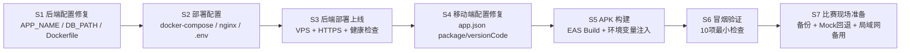

# Android 演示版落地方案

> 版本：v1.0（待确认）
>
> 日期：2026-08-04
>
> 阶段定位：**单家庭、比赛演示版**，非正式多用户产品。

---

## 一、当前架构审计

### 1.1 移动端

| 审计项 | 现状 | 阻塞/风险 |
|--------|------|-----------|
| `android.package` | **未设置** | P0 阻塞 — APK 构建必须有 applicationId |
| `versionCode` | **未设置** | P0 阻塞 — APK 构建必须有整数 versionCode |
| `eas.json` | 已存在，含 `preview`（APK, internal）和 `production` 两个 profile | 可用 |
| `EXPO_PUBLIC_API_BASE_URL` | 3 处读取：`inventoryApi.ts`、`compatibilityApi.ts`、`intakeStore.ts`，默认 `http://127.0.0.1:8000/api` | 需改为公网 HTTPS 地址 |
| APK 构建环境变量 | `EXPO_PUBLIC_API_BASE_URL`（编译时注入） | Qwen API Key **不得**放入 `EXPO_PUBLIC_*` |
| 相机/相册/文件存储 | 使用 `expo-camera`、`expo-image-picker`、`expo-media-library`、`expo-file-system`，均为标准 Expo 插件 | 独立 APK 中可用，不依赖 Expo Go |
| 产品照片保存位置 | **设备本地**（`FileSystem.documentDirectory/covers/`），不上传后端 | 仅保存在手机 |
| Expo Go 专属逻辑 | `index.ts` 中 `?qa=1` 检测逻辑使用 `window.location.search`，但已加 `typeof window.location !== 'undefined'` 保护 | 无残留 Expo Go 依赖 |
| `app.config.js` | `APP_ENTRY=qa` 动态入口切换，仅 QA 用 | 不影响生产构建 |
| Expo SDK | 57.0.7 | iOS Expo Go 不兼容（SDK 57 太新），Android Expo Go 可用 |

### 1.2 后端

| 审计项 | 现状 | 阻塞/风险 |
|--------|------|-----------|
| 启动命令 | `uvicorn app.main:app --host 0.0.0.0 --port 8000` | 可用 |
| SQLite 数据库路径 | `data/challenges.db`（相对路径，解析为 `backend/data/challenges.db`） | 需确保持久化磁盘挂载 |
| 服务重启后数据 | SQLite 文件在磁盘上则保留；容器重建需挂载 volume | 部署时必须配置持久卷 |
| Qwen API Key 读取 | 环境变量 `QWEN_API_KEY`，通过 `.env` 文件或环境变量注入 | **`.env` 已在 `.gitignore` 中，未提交到 Git** |
| Mock/真实 Qwen 切换 | `AI_PROVIDER=mock`（默认）或 `AI_PROVIDER=qwen`，通过环境变量切换 | Mock 可用于无网络演示 |
| CORS | `CORS_ORIGINS=["*"]`（默认），生产模式 `DEBUG=false` 时禁止 `*` | P1 — 需配置明确域名 |
| 限流 | 内存滑动窗口限流器，单进程 | 演示版够用；多实例不共享 |
| 请求大小 | `MAX_IMAGE_SIZE_MB=5`，`read_validated_image` 校验 MIME 和大小 | 可用 |
| 健康检查 | `GET /health` 返回 `{"status":"ok","app":settings.APP_NAME}` | P1 — `APP_NAME` 仍为"排雷挑战" |
| Dockerfile | 已存在，基于 `python:3.12-slim` | 可用，但注释仍写"排雷挑战" |
| 旧 challenge 路由 | `app/api/routes/challenge.py` 存在但**未注册到 `main.py`** | 无影响，但不干净 |

### 1.3 数据与安全

| 审计项 | 现状 | 风险等级 |
|--------|------|---------|
| 库存共享 | **所有请求共享同一 SQLite 库存**，无用户/家庭隔离 | **P0 风险** — 公网部署后所有设备看到同一库存 |
| 用户/家庭隔离 | **不存在**，无认证、无多租户 | 明确为非目标（演示版） |
| 日志记录内容 | 请求日志记录 method/path/status/duration，**不记录图片数据、不记录 API Key** | 安全 |
| 图片数据 | 识别图片仅在请求处理期间内存使用，**不写入磁盘** | 安全 |
| API Key 泄漏 | `.env` 在 `.gitignore` 中，Git 历史中**未发现** `sk-` 格式密钥提交 | 安全 |
| `backend/.env` 本地文件 | 包含真实 Qwen API Key，但**未被 Git 跟踪** | 部署时需通过环境变量注入，不复制文件 |

### 1.4 数据库现状

```
Tables: challenges(13行) | inventory_products(3行) | inventory_mutations(5行) | compatibility_relations(1行)
```

- `challenges` 表为旧排雷挑战遗留，新流程不使用。
- `inventory_products` 等 3 张表为 v2 化学品库数据，演示库存已有 3 件产品。

---

## 二、本阶段范围

### 2.1 定位

**单家庭、比赛演示版**。一个受控演示库存，SQLite + 持久化磁盘，Android APK 直接安装，真实 Qwen 或 Mock 回退，临时公网后端。

### 2.2 允许

- 一个受控演示库存（所有设备共享同一库存，视为"一个家庭"）
- SQLite + 持久化磁盘
- Android APK 直接安装
- 真实 Qwen 识别或 Mock 回退
- 临时公网后端（HTTPS）

### 2.3 不包含

- App Store / Google Play 发布
- 多用户注册登录
- 支付
- 正式隐私合规
- iOS 正式构建
- 大规模并发

### 2.4 共享库存风险声明

> **当前后端无用户隔离，公网部署后所有连接的设备将看到同一库存。** 这在"单家庭演示版"定位下是可接受的，但不得默认为正式可用。如果比赛现场有多人同时操作，可能出现并发写入冲突。演示时建议指定一人操作。

---

## 三、目标架构

### 3.1 调用链

```
Android APK（离线可启动）
  → HTTPS API（公网域名 + TLS）
    → FastAPI（uvicorn）
      → InventoryService / RecognitionService / CompatibilityService
        → SQLite（持久化磁盘卷）
        → Qwen API（公网调用，失败时 Mock 回退）
```

### 3.2 数据流向

| 数据 | 存储位置 | 说明 |
|------|---------|------|
| 产品结构化信息（名称、品牌、品类、成分、日期等） | 服务端 SQLite | 所有设备共享 |
| 相容性关系 | 服务端 SQLite | 规则引擎计算后写入 |
| 产品封面照片 | **手机本地**（`FileSystem.documentDirectory/covers/`） | 不上传后端，不跨设备同步 |
| 识别上传照片 | **内存临时** | 识别完成后丢弃，不写磁盘 |
| 识别草稿 | 手机内存 | 用户确认前不写服务端 |
| operationId | 服务端 SQLite | 幂等保证 |

### 3.3 AI 不可用时回退

```
AI_PROVIDER=qwen
  → Qwen API 调用失败（超时/网络错误/配额耗尽）
    → 返回错误信息给前端
    → 前端显示"识别服务暂时不可用，请手动输入或稍后重试"

手动切换 AI_PROVIDER=mock
  → 使用预设产品库返回识别结果
  → 演示流程不受影响，但识别结果为固定预设
```

### 3.4 后端离线时应用行为

- 前端各页面已有 loading/error/empty 状态处理
- 网络请求失败时显示"无法连接服务"错误页面
- 库存列表保留上次缓存（Zustand store）
- 识别页面提示重试

### 3.5 比赛现场快速恢复

| 故障 | 恢复方式 | 预计时间 |
|------|---------|---------|
| 后端崩溃 | 重启进程/容器 | < 30s |
| SQLite 损坏 | 恢复最近备份文件 | < 2min |
| Qwen 不可用 | 切换 `AI_PROVIDER=mock` 重启 | < 1min |
| APK 崩溃 | 重新安装 APK | < 2min |
| 网络中断 | 切换到局域网模式（备用方案） | < 5min |

---

## 四、部署方案比较

### 4.1 方案对比

| 维度 | A. 国内云 VPS | B. 持久化托管平台 | C. 比赛现场局域网 |
|------|-------------|-----------------|-----------------|
| **国内手机访问** | 稳定，延迟低 | 取决于平台区域 | 局域网内极低延迟 |
| **HTTPS** | 需配置域名+证书 | 平台自动提供 | 需自签证书或用 HTTP |
| **SQLite 持久化** | 挂载磁盘卷，完全可控 | 需选支持持久磁盘的平台 | 本机磁盘，天然持久 |
| **休眠/冷启动** | 不休眠 | 免费层可能休眠，首请求慢 | 不休眠 |
| **成本** | 约 30-60 元/月（轻量） | 免费层可用，但有限制 | 0 元 |
| **部署复杂度** | 中（Docker + Nginx） | 低（git push / CLI） | 低（docker run） |
| **日志** | 完全可控 | 平台提供查看界面 | 本机文件 |
| **回滚** | Docker 镜像版本回滚 | 平台版本回滚 | 重启旧镜像 |
| **备案/域名** | 需域名，HTTP 80 端口需备案 | 平台提供子域名，通常免备案 | 不需要 |

### 4.2 推荐方案：A. 国内云 VPS

**理由**：
- HTTPS 可控（Let's Encrypt 免费证书）
- 不休眠，比赛现场响应稳定
- SQLite 持久化完全可控（挂载磁盘卷）
- 成本可控，赛后可随时释放

**不选 B 的原因**：免费托管平台通常有冷启动延迟、休眠策略和 SQLite 限制。

**不选 C 作为主方案的原因**：局域网无法 HTTPS，Android 9+ 默认禁止明文 HTTP（需额外配置 network security config）；且依赖比赛现场电脑稳定性。

### 4.3 现场备用方案：C. 比赛现场局域网

**触发条件**：VPS 不可用、网络中断、延迟过高。

**实现**：
- 比赛电脑运行 Docker 容器
- APK 预置局域网 IP 配置（通过环境变量编译第二个 APK）
- Android `networkSecurityConfig` 允许明文 HTTP（仅演示用）

---

## 五、Android 构建方案

### 5.1 APK 配置

| 配置项 | 值 |
|--------|-----|
| `applicationId` | `com.homechem.safety` |
| 应用名称 | 家庭化学品安全检查 |
| `version` | `1.0.1` |
| `versionCode` | `2` |
| 图标 | 已有 adaptive icon（`./assets/android-icon-*.png`） |
| 构建方式 | EAS Build（preview profile, APK, internal distribution） |

### 5.2 环境变量

| 变量 | 用途 | 放置位置 |
|------|------|---------|
| `EXPO_PUBLIC_API_BASE_URL` | 编译时注入后端 API 地址 | EAS Build 环境变量或 `eas.json` env |
| `AI_PROVIDER` | 运行时后端 AI 切换 | 后端环境变量 |
| `QWEN_API_KEY` | 运行时后端调用 Qwen | 后端环境变量（**不放入 APK**） |

### 5.3 测试环境与演示环境 API 地址

| 环境 | `EXPO_PUBLIC_API_BASE_URL` | 用途 |
|------|---------------------------|------|
| 本地开发 | `http://127.0.0.1:8000/api` | 默认值，Expo Go / Web |
| 局域网测试 | `http://192.168.x.x:8000/api` | 真机局域网调试 |
| 演示环境 | `https://<域名>/api` | APK 编译时注入 |

### 5.4 签名密钥管理

- EAS Build 自动管理签名密钥（Google Play 签名）
- 演示版使用 EAS 内部分发签名，不需要自管理 keystore
- 如需本地 Gradle 构建，需生成 debug keystore

### 5.5 APK 下载/分发

- EAS Build 完成后生成下载链接
- 生成二维码贴在 `docs/deployment/` 中
- 比赛现场扫码安装

### 5.6 版本更新

- 修改 `app.json` 中 `version` 和 `versionCode`
- 重新 `eas build --profile preview`
- 分享新 APK 下载链接

---

## 六、差距清单

| 编号 | 差距 | 优先级 | 涉及文件 |
|------|------|--------|---------|
| G1 | `app.json` 缺少 `android.package` | P0 | `mobile/app.json` |
| G2 | `app.json` 缺少 `android.versionCode` | P0 | `mobile/app.json` |
| G3 | `EXPO_PUBLIC_API_BASE_URL` 默认 `127.0.0.1`，需编译时注入公网地址 | P0 | `mobile/eas.json` |
| G4 | `APP_NAME` 仍为"排雷挑战" | P1 | `backend/app/config.py` |
| G5 | `DATABASE_PATH` 仍为 `data/challenges.db` | P1 | `backend/app/config.py` |
| G6 | Dockerfile 注释仍为"排雷挑战" | P2 | `backend/Dockerfile` |
| G7 | `.env.example` 注释仍为"排雷挑战" | P2 | `backend/.env.example` |
| G8 | CORS 生产配置未设明确域名 | P1 | `backend/app/config.py` 或 `.env` |
| G9 | 后端无健康检查就绪探针（K8s/Docker） | P2 | `backend/app/main.py` |
| G10 | 无数据备份脚本 | P1 | 新建 `backend/scripts/backup.sh` |
| G11 | 无 Mock 回退运行时切换（需重启） | P2 | 可接受，演示版用环境变量 |
| G12 | `eas.json` 缺少环境变量注入配置 | P0 | `mobile/eas.json` |

---

## 七、文件级修改计划

### 7.1 后端（仅文档标注，本轮不修改业务代码）

| 文件 | 修改内容 | 关联差距 |
|------|---------|---------|
| `backend/app/config.py` | `APP_NAME` 改为"家庭化学品库"；`DATABASE_PATH` 默认改为 `data/inventory.db` | G4, G5 |
| `backend/Dockerfile` | 注释更新；添加 `VOLUME /app/data` 声明 | G6 |
| `backend/.env.example` | 注释更新；新增演示环境配置示例 | G7 |
| `backend/app/main.py` | 健康检查增加 DB 连通性验证 | G9 |
| `backend/scripts/backup.sh` | 新建 SQLite 备份脚本 | G10 |
| `backend/scripts/restore.sh` | 新建 SQLite 恢复脚本 | G10 |

### 7.2 移动端（仅文档标注，本轮不修改业务代码）

| 文件 | 修改内容 | 关联差距 |
|------|---------|---------|
| `mobile/app.json` | 添加 `android.package: "com.homechem.safety"`；添加 `android.versionCode: 2` | G1, G2 |
| `mobile/eas.json` | `preview` profile 添加 `env.EXPO_PUBLIC_API_BASE_URL` | G3, G12 |
| `mobile/app.config.js` | 可选：从 `EXPO_PUBLIC_API_BASE_URL` 读取注入 `extra` | G3 |

### 7.3 部署配置（新建文件，本轮可创建）

| 文件 | 用途 |
|------|------|
| `deploy/docker-compose.yml` | Docker Compose 编排（FastAPI + Nginx 反代） |
| `deploy/nginx.conf` | Nginx HTTPS 反向代理配置 |
| `deploy/.env.example` | 部署环境变量模板 |
| `deploy/README.md` | 部署操作手册 |

---

## 八、环境变量清单

### 8.1 后端环境变量

| 变量 | 必填 | 默认值 | 说明 |
|------|------|--------|------|
| `AI_PROVIDER` | 否 | `mock` | `mock` 或 `qwen` |
| `QWEN_API_KEY` | AI_PROVIDER=qwen 时必填 | `""` | Qwen API 密钥 |
| `QWEN_BASE_URL` | 否 | `https://dashscope.aliyuncs.com/compatible-mode/v1` | Qwen API 地址 |
| `QWEN_VL_MODEL` | 否 | `qwen3-vl-plus` | 视觉模型 |
| `QWEN_TEXT_MODEL` | 否 | `qwen-flash` | 文本模型 |
| `DEBUG` | 否 | `true` | 生产环境设为 `false` |
| `HOST` | 否 | `0.0.0.0` | 监听地址 |
| `PORT` | 否 | `8000` | 监听端口 |
| `DATABASE_PATH` | 否 | `data/inventory.db` | SQLite 路径 |
| `CORS_ORIGINS` | 否 | `["*"]` | 生产环境设为明确域名 |
| `MAX_IMAGE_SIZE_MB` | 否 | `5` | 图片上传限制 |
| `LOG_LEVEL` | 否 | `INFO` | 日志级别 |

### 8.2 移动端环境变量（编译时）

| 变量 | 必填 | 说明 |
|------|------|------|
| `EXPO_PUBLIC_API_BASE_URL` | 是 | 后端 API 地址，如 `https://demo.example.com/api` |

### 8.3 禁止放入 APK 的变量

- `QWEN_API_KEY` — 仅后端运行时使用
- 任何包含 `SECRET`、`KEY`、`TOKEN`、`PASSWORD` 的变量

---

## 九、部署步骤（推荐方案：国内云 VPS）

### 9.1 前置条件

- 一台国内云 VPS（Ubuntu 22.04+，1核2G 足够）
- 一个域名（已备案或使用 HTTPS 非标端口）
- Docker + Docker Compose 已安装

### 9.2 部署步骤

```bash
# 1. 克隆代码到服务器
git clone <repo-url> /opt/homechem
cd /opt/homechem

# 2. 创建后端环境变量
cp backend/.env.example backend/.env
# 编辑 .env，设置 AI_PROVIDER、QWEN_API_KEY、CORS_ORIGINS 等

# 3. 创建数据目录（持久化）
mkdir -p /opt/homechem/data

# 4. 启动服务
cd deploy
docker-compose up -d

# 5. 验证
curl http://localhost:8000/health
# 期望: {"status":"ok","app":"家庭化学品库"}

# 6. 配置 Nginx + HTTPS（Let's Encrypt）
#    将 443 端口反代到 8000

# 7. 更新 CORS_ORIGINS 为 https://<域名>
#    重启后端容器
```

### 9.3 Nginx 配置要点

```nginx
server {
    listen 443 ssl;
    server_name <域名>;

    ssl_certificate /etc/letsencrypt/live/<域名>/fullchain.pem;
    ssl_certificate_key /etc/letsencrypt/live/<域名>/privkey.pem;

    client_max_body_size 6M;  # 略大于 MAX_IMAGE_SIZE_MB

    location / {
        proxy_pass http://127.0.0.1:8000;
        proxy_set_header Host $host;
        proxy_set_header X-Real-IP $remote_addr;
        proxy_set_header X-Forwarded-For $proxy_add_x_forwarded_for;
        proxy_set_header X-Forwarded-Proto $scheme;
    }
}
```

---

## 十、APK 构建步骤

### 10.1 EAS Build（推荐）

```bash
# 1. 登录 Expo 账号
npx eas login

# 2. 设置环境变量（演示环境）
export EXPO_PUBLIC_API_BASE_URL=https://<域名>/api

# 3. 构建 APK
cd mobile
npx eas build --profile preview --platform android

# 4. 构建完成后获取下载链接
npx eas build:list --status finished

# 5. 下载 APK，生成二维码
```

### 10.2 本地 Gradle 构建（备用）

```bash
# 需要 Android SDK + Java JDK
cd mobile
npx expo prebuild --platform android
cd android
./gradlew assembleRelease
# APK 输出: android/app/build/outputs/apk/release/app-release.apk
```

### 10.3 局域网测试 APK

```bash
# 编译时使用局域网 IP
export EXPO_PUBLIC_API_BASE_URL=http://192.168.x.x:8000/api
npx eas build --profile preview --platform android
```

---

## 十一、数据备份与恢复

### 11.1 备份

```bash
# 手动备份
sqlite3 /opt/homechem/data/inventory.db ".backup /opt/homechem/data/backup-$(date +%Y%m%d-%H%M%S).db"

# 定时备份（crontab）
# 每小时备份一次，保留最近 24 份
0 * * * * sqlite3 /opt/homechem/data/inventory.db ".backup /opt/homechem/data/backup-$(date +\%Y\%m\%d-\%H\%M).db" && find /opt/homechem/data/backup-*.db -mtime +1 -delete
```

### 11.2 恢复

```bash
# 停止后端
docker-compose stop api

# 恢复备份
cp /opt/homechem/data/backup-20260804-1200.db /opt/homechem/data/inventory.db

# 重启后端
docker-compose start api
```

### 11.3 比赛前预置数据

```bash
# 使用种子脚本预置演示数据
python backend/seed_products.py
```

---

## 十二、Mock 回退方案

### 12.1 切换到 Mock

```bash
# 修改环境变量
AI_PROVIDER=mock

# 重启后端
docker-compose restart api

# 验证
curl http://localhost:8000/health
```

### 12.2 Mock 限制

- 识别结果为预设 4 个产品循环返回（蓝月亮、威猛先生洁厕灵、84消毒液、超长名称测试品）
- 不接受真实图片内容，仅按序号返回
- 适用于：Qwen 配额耗尽、网络不通、演示流程走通

### 12.3 切换回 Qwen

```bash
AI_PROVIDER=qwen
QWEN_API_KEY=<有效密钥>
docker-compose restart api
```

---

## 十三、回滚方案

| 场景 | 回滚方式 |
|------|---------|
| 新 APK 有 bug | 分发旧版本 APK 下载链接 |
| 后端新版本有 bug | Docker 回退到旧镜像 tag |
| 数据损坏 | 恢复最近 SQLite 备份 |
| 配置错误 | 修改 `.env` 后重启容器 |

```bash
# Docker 镜像版本回滚
docker-compose down
docker tag homechem-api:old homechem-api:latest
docker-compose up -d
```

---

## 十四、最小冒烟检查

部署完成后执行以下检查，全部通过方可视为可用：

| 步骤 | 命令/操作 | 预期结果 |
|------|---------|---------|
| 1. 健康检查 | `curl https://<域名>/health` | `{"status":"ok","app":"家庭化学品库"}` |
| 2. 库存列表 | `curl https://<域名>/api/inventory/products` | 返回 JSON 产品列表 |
| 3. 相容性 | `curl https://<域名>/api/compatibility/summary` | 返回 JSON 摘要 |
| 4. APK 启动 | 打开 APK | 显示库存列表（非崩溃） |
| 5. 拍照识别 | APK 中拍照 | 返回识别草稿（Mock 或 Qwen） |
| 6. 创建产品 | APK 中确认入库 | 库存列表新增 |
| 7. 查看相容性 | APK 中打开相容性页 | 显示关系卡片 |
| 8. 编辑产品 | APK 中编辑保存 | 字段更新成功 |
| 9. 删除产品 | APK 中删除确认 | 产品从列表消失 |
| 10. 离线行为 | 关闭 WiFi 后打开 APK | 显示"无法连接服务"错误页 |

---

## 十五、风险与非目标

### 15.1 已知风险

| 风险 | 等级 | 缓解措施 |
|------|------|---------|
| 公网部署后所有设备共享库存 | 中 | 定位为"单家庭演示版"；比赛现场指定一人操作 |
| Qwen API 配额耗尽 | 中 | 预置 Mock 回退方案 |
| VPS 网络中断 | 低 | 现场局域网备用方案 |
| SQLite 并发写入限制 | 低 | 演示场景单用户操作，不触发并发 |
| APK API 地址硬编码 | 低 | 编译时注入，需重新构建才能更换 |
| 无 HTTPS 证书续期提醒 | 低 | Let's Encrypt 自动续期 + cron 检查 |

### 15.2 非目标

- 多用户注册登录
- 跨设备封面照片同步
- Google Play / App Store 发布
- 正式隐私合规（GDPR/个人信息保护法）
- iOS 正式构建
- 大规模并发优化
- 自动扩缩容
- CI/CD 自动部署

---

## 十六、预计实施顺序



| 步骤 | 预计工时 | 依赖 | 用户确认项 |
|------|---------|------|-----------|
| S1 后端配置修复 | 0.5h | 无 | — |
| S2 部署配置编写 | 1h | S1 | — |
| S3 后端部署上线 | 1h | S2 + VPS + 域名 | **需用户提供 VPS 和域名** |
| S4 移动端配置修复 | 0.5h | 无 | — |
| S5 APK 构建 | 1h | S3 + S4 + EAS 账号 | **需用户确认 EAS 账号可用** |
| S6 冒烟验证 | 0.5h | S3 + S5 | — |
| S7 比赛现场准备 | 0.5h | S6 | — |

---

## 十七、需要用户确认的选择

在进入部署编码前，需要确认以下决策：

1. **VPS 和域名**：是否已有国内云 VPS 和域名？还是需要先购买？
2. **AI Provider**：演示时使用真实 Qwen 还是 Mock？或两者都准备好按需切换？
3. **EAS 账号**：Expo EAS 账号是否可用？（免费额度每月 15 次 Android 构建）
4. **APK 分发方式**：EAS Build 下载链接 + 二维码是否满足需求？
5. **比赛日期**：何时需要可用的演示 APK？用于确定优先级。
6. **局域网备用**：是否需要准备局域网备用 APK（含 `networkSecurityConfig` 允许明文 HTTP）？
