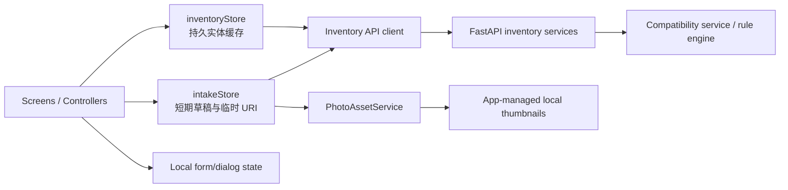

# 我的化学品库——前端组件图与设计令牌映射

> 版本：v2.0（已确认）
>
> 日期：2026-08-02
>
> 上游：[家庭化学品库用户流程](../product/用户流程.md) · [手机端低保真线框图](./手机端页面线框图.md) · [移动端视觉基础](./移动端视觉规范.md)
>
> 可视化组件图：[inventory-component-map.html](../../design/component-map/inventory-component-map.html)
>
> 渲染预览：[inventory-component-map.png](../../design/component-map/inventory-component-map.png)

## 一、绑定规则

组件只能绑定语义令牌名称。最终颜色、圆角、阴影和装饰值在最终视觉润色前保持可替换。

组件层级：

```text
Tokens
└── Primitives
    └── Composites
        └── Feature views
            └── Screens / Controllers
```

网络、文件和相容性规则不进入展示组件。页面控制器负责读取状态、调用服务和导航，功能视图只接收语义数据与事件。

## 二、导航与页面树

```text
AppRoot
└── RootStack
    ├── MainTabs
    │   ├── InventoryScreen              我的化学品库
    │   ├── IntakeEntryScreen            扫描入库入口
    │   └── CompatibilityScreen          库内相容性
    ├── IntakeFlowScreen                 入库流程控制器
    │   ├── PhotoInputView
    │   ├── PermissionView
    │   ├── RecognitionProgressView
    │   ├── RecognitionRecoveryView
    │   ├── ProductReviewView
    │   ├── LabelSupplementView
    │   ├── DuplicateDecisionView
    │   ├── SaveRecoveryView
    │   └── IntakeSuccessView
    ├── ProductDetailScreen
    ├── ProductEditScreen
    ├── CompatibilityDetailScreen
    └── PhotoPreviewScreen               可选：查看本地缩略图
```

导航参数只传稳定标识：

```ts
type RootStackParamList = {
  MainTabs: undefined;
  IntakeFlow: { mode: 'create' | 'update'; productId?: string };
  ProductDetail: { productId: string };
  ProductEdit: { productId: string };
  CompatibilityDetail: { relationId: string };
  PhotoPreview: { productId: string };
};
```

禁止把完整产品对象、临时图片 URI 或识别草稿放进导航参数。

## 三、页面到组件映射

### 3.1 InventoryScreen

```text
InventoryScreen [controller]
└── InventoryView
    ├── ScreenHeader
    ├── InventorySummary
    ├── SearchField
    ├── FilterTrigger
    ├── ProductGrid
    │   └── ProductCard × N
    │       ├── ProductPhoto
    │       ├── ProductName
    │       ├── ExpirySummary
    │       ├── StorageSummary
    │       └── SemanticBadge × 0..2
    ├── InventoryEmptyState | InventoryLoadingState | InventoryErrorState
    ├── PrimaryActionBar
    └── MainTabBar
```

状态所有权：`inventoryStore`。
屏幕职责：首次加载、刷新、筛选、打开产品、开始入库。
视图不得调用 API、读取文件或计算相容性。

### 3.2 IntakeFlowScreen

```text
IntakeFlowScreen [controller + finite states]
├── PhotoInputView
│   ├── PhotoGuidance
│   ├── PhotoPrivacyNotice
│   └── PhotoSourceActions
├── PermissionView
├── RecognitionProgressView
│   └── ProductPhoto
├── RecognitionRecoveryView
│   ├── ProductPhoto
│   └── RecoveryActions
├── ProductReviewView
│   ├── CoverPhotoPicker
│   ├── ConfidenceBadge
│   ├── ProductForm
│   └── FieldSourceNotice
├── LabelSupplementView
│   ├── PhotoGuidance
│   └── PhotoSourceActions
├── DuplicateDecisionView
│   ├── ProductComparison
│   │   └── ProductSnapshot × 2
│   └── DecisionActions
├── SaveRecoveryView
│   └── PreservedDraftSummary
└── IntakeSuccessView
    ├── ProductSnapshot
    ├── CompatibilityResultSummary
    └── CompletionActions
```

状态所有权：`intakeStore`，只保存未确认的短期数据。
控制器职责：相机/相册、识别请求、补拍合并、重复检查、缩略图提交、幂等保存与离开确认。
入库成功后清空 `intakeStore`，由 `inventoryStore` 接收持久产品。

### 3.3 ProductDetailScreen

```text
ProductDetailScreen [controller]
└── ProductDetailView
    ├── ProductPhoto
    ├── ProductIdentity
    ├── ProductMetricRow
    ├── StorageRequirementSection
    ├── HazardSection
    ├── IngredientSection
    ├── CompatibilitySummary
    ├── EvidenceSourceList
    └── ProductActions
        ├── Edit
        ├── RescanLabel
        └── DeleteProductDialog
```

状态所有权：产品实体来自 `inventoryStore`；删除确认只属于页面本地 UI 状态。
删除成功后由 store 移除实体和受影响关系，再导航回仓库。

### 3.4 ProductEditScreen

```text
ProductEditScreen [controller]
└── ProductEditView
    ├── CoverPhotoPicker
    ├── ProductForm
    ├── FieldSourceNotice
    ├── SaveActions
    └── UnsavedChangesDialog
```

表单草稿属于页面本地状态，不在每次键入时写入 `inventoryStore`。保存成功后一次性提交并更新 store。

### 3.5 CompatibilityScreen

```text
CompatibilityScreen [controller]
└── CompatibilityListView
    ├── CompatibilitySummaryMetrics
    ├── CompatibilityTabs
    ├── CompatibilityList
    │   ├── ProductPairCard × N
    │   └── SingleProductNoticeCard × N
    ├── CompatibilityEmptyState
    ├── NeedsEvidenceState
    └── CompatibilityBoundaryNotice
```

状态所有权：`inventoryStore.relationsById` 与 `compatibilitySummary`。
视图按后端返回的优先级排序，不在前端重新执行化学规则。

### 3.6 CompatibilityDetailScreen

```text
CompatibilityDetailScreen [controller]
└── CompatibilityDetailView
    ├── RelationshipStatusHeader
    ├── ProductPair
    ├── RelationshipReasonSection
    ├── RelationshipAdviceSection
    ├── EvidenceSourceList
    ├── SafetyBoundaryNotice
    └── RelatedProductActions
```

## 四、组件目录

| 组件 | 层 | 职责 | 变体 | 状态所有者 |
|---|---|---|---|---|
| `AppText` | Primitive | 字体角色、文字颜色、标题语义 | display/title/body/label/caption/metric | 无 |
| `AppButton` | Primitive | 通用按钮、忙碌与禁用语义 | primary/secondary/quiet/destructive | 无 |
| `IconButton` | Primitive | 44×44 图标操作与可访问名称 | default/destructive | 无 |
| `Surface` | Primitive | 语义表面和边框 | raised/subtle/outlined/inverse | 无 |
| `TextField` | Primitive | 单字段输入、帮助与错误 | text/date/multiline | 表单 |
| `SemanticBadge` | Primitive | 状态文字＋图标 | critical/attention/info/positive/unknown/neutral | 无 |
| `AppDialog` | Primitive | 模态焦点、返回键和确认顺序 | confirm/destructive/unsaved | 页面 |
| `StatePanel` | Primitive | 加载/空/错误/权限通用骨架 | loading/empty/error/permission | 无 |
| `ScreenScroll` | Primitive | 安全区、键盘、滚动与底部间距 | form/detail/list | 无 |
| `ProductPhoto` | Composite | 本地缩略图、占位、丢失与描述 | card/detail/thumbnail/missing | 无 |
| `ProductCard` | Composite | 双列产品摘要和打开事件 | default/needsEvidence/hasConflict | 无 |
| `ProductGrid` | Composite | 固定双列、瀑布高度和列表可访问语义 | loading/content | 无 |
| `InventorySummary` | Composite | 在库、相容性、待补充三个指标 | default | 无 |
| `ProductForm` | Composite | 产品字段、来源与校验汇总 | create/edit/review | 页面表单 |
| `CoverPhotoPicker` | Composite | 选择/更换封面和照片状态 | temporary/saved/missing | 页面或 intakeStore |
| `PhotoSourceActions` | Composite | 相机、相册和权限替代 | default/permissionDenied | 页面 |
| `ProductSnapshot` | Composite | 重复对比和成功摘要 | compact/comparison | 无 |
| `ProductPair` | Composite | 两件产品的语义关系 | incompatible/attention/unknown | 无 |
| `ProductPairCard` | Composite | 产品对＋原因摘要＋详情事件 | critical/attention/unknown | 无 |
| `CompatibilitySummary` | Composite | 关系数量与优先结果 | compact/full | 无 |
| `EvidenceSourceList` | Composite | 证据状态和外部来源 | compact/expanded | 页面展开状态 |
| `InventoryView` | Feature | 仓库各数据状态布局 | loading/empty/error/content/noResults | Screen |
| `ProductReviewView` | Feature | 入库核对步骤 | ready/invalid/submitting | IntakeFlow |
| `DuplicateDecisionView` | Feature | 重复产品分支 | ready/submitting/error | IntakeFlow |
| `ProductDetailView` | Feature | 完整档案展示 | loading/content/missingPhoto/error | Screen |
| `ProductEditView` | Feature | 编辑与离开确认 | ready/dirty/submitting/error | Screen |
| `CompatibilityListView` | Feature | 关系筛选与列表 | loading/content/empty/error | Screen |
| `CompatibilityDetailView` | Feature | 关系原因、建议与证据 | content/error | Screen |

## 五、核心 ViewModel 与事件

展示组件使用 ViewModel，不直接接收后端 DTO：

```ts
type ProductCardViewModel = {
  id: string;
  accessibleName: string;
  cover: { uri?: string; alt: string; state: 'ready' | 'missing' };
  name: string;
  category: string;
  expiryText: string;
  storageSummary?: string;
  badges: Array<{ tone: SemanticTone; label: string; icon: SemanticIcon }>;
};

type ProductFormValue = {
  brand: string;
  name: string;
  category: string;
  manufactureDate?: string;
  expiryDate?: string;
  ingredients: string[];
  storageRequirements: string[];
  hazardNotes: string[];
};

type CompatibilityCardViewModel = {
  id: string;
  tone: 'critical' | 'attention' | 'unknown';
  label: string;
  productA: ProductSnapshotViewModel;
  productB?: ProductSnapshotViewModel;
  summary: string;
  evidenceStatus: string;
};
```

语义事件：

```ts
type InventoryEvents = {
  onStartIntake(): void;
  onOpenProduct(productId: string): void;
  onOpenCompatibility(relationId?: string): void;
  onSearchChange(query: string): void;
  onApplyFilters(filters: InventoryFilters): void;
  onRetryLoad(): void;
};

type IntakeEvents = {
  onCapturePhoto(): void;
  onPickPhoto(): void;
  onRetryRecognition(): void;
  onChangeForm(next: ProductFormValue): void;
  onSupplementLabel(): void;
  onChooseDuplicateAction(action: 'update' | 'create-another'): void;
  onSave(): void;
  onRetrySave(): void;
  onCancel(): void;
};
```

禁止组件接收：颜色值、任意 `style` 变体、API 回调、SQL/规则对象、完整 store、未经筛选的照片文件句柄。

## 六、状态与数据流



### 6.1 `inventoryStore`

建议状态：

```ts
type InventoryStore = {
  itemsById: Record<string, InventoryProduct>;
  orderedIds: string[];
  relationsById: Record<string, CompatibilityRelation>;
  summary: CompatibilitySummaryData;
  listStatus: 'idle' | 'loading' | 'ready' | 'error';
  mutationStatusById: Record<string, MutationStatus>;
  filters: InventoryFilters;
};
```

职责：服务端数据缓存、加载/刷新、成功后的规范化更新。
不保存：表单逐字输入、模态框开关、临时相机 URI、导航对象。

### 6.2 `intakeStore`

建议状态：

```ts
type IntakeStore = {
  step: 'photo' | 'recognizing' | 'review' | 'supplement' | 'duplicate' | 'saving' | 'success' | 'recovery';
  operationId: string;
  temporaryPhotos: TemporaryPhoto[];
  selectedCoverTempId?: string;
  recognitionDraft?: RecognitionDraft;
  formValue?: ProductFormValue;
  duplicateCandidates: ProductSnapshot[];
  lastFailure?: IntakeFailure;
};
```

职责：单次入库流程恢复和幂等 operationId。
生命周期：进入流程创建，成功/明确取消后清空；应用重启不承诺恢复临时照片。

### 6.3 页面本地状态

- 搜索输入防抖前文本。
- 表单 dirty 状态和字段级错误。
- 删除、未保存退出对话框开关。
- 证据来源展开/折叠。
- 当前滚动位置由导航/列表组件恢复。

## 七、可访问性所有权

| 责任 | 所有者 |
|---|---|
| 按钮名称、忙碌、禁用 | `AppButton` / `IconButton` |
| 表单标签、必填、错误关联 | `TextField` / `ProductForm` |
| 对话框焦点、返回键、确认顺序 | `AppDialog` |
| 图片替代文本和缺失状态 | `ProductPhoto` |
| 双列列表语义、位置和数量 | `ProductGrid` |
| 状态文字与非颜色图标 | `SemanticBadge` |
| 加载、保存、删除完成公告 | Screen controller |
| 识别失败与字段错误公告 | IntakeFlow / ProductForm |
| 关系结论朗读顺序 | `ProductPairCard` / `CompatibilityDetailView` |
| 动态字号与内容滚动 | `ScreenScroll` + Feature view |
| 减少动态 | motion hook + Primitive |

产品卡可访问名称示例：

> “84消毒液，含氯消毒剂，2027年5月到期，与库内1件产品存在混用禁忌，按钮。”

## 八、三层令牌映射

### 8.1 当前到目标

| 当前 | 目标语义令牌 | 迁移说明 |
|---|---|---|
| `semanticColors.surface.page` | `color.surface.page` | 保留角色 |
| `surface.subtle` | `color.surface.subtle` | 保留角色 |
| `surface.muted` | `color.surface.sunken` | 明确层级用途 |
| 无 | `color.surface.photoFallback` | 产品照片缺失/加载占位 |
| `text.primary/secondary/muted` | 同名目标 | 保留角色 |
| `text.error` | `text.critical` | 风险/错误语义分离由组件 tone 决定 |
| `status.noRuleHit` | `status.noRegisteredConflict` | 禁止暗示绝对安全 |
| 无 | `status.unknown` | 未识别和证据不足 |
| `componentTokens.photo` | `productPhoto` | 移除全景权威，拆分 card/detail |
| 无 | `inventoryGrid` | 双列、间距和最大宽 |
| 无 | `productCard` | 封面比例、摘要间距 |
| 无 | `relationshipCard` | 产品对与解释布局 |
| 无 | `dialog` | 删除/退出确认 |
| 无 | `bottomNav` | 三任务导航与安全区 |
| `analysis` | 无 | 旧全景分析专用，完成迁移后删除 |
| `report` | 无 | 新方案无评分报告 |
| `shareCard` | 无 | 新方案无传播结果卡 |

### 8.2 组件绑定

| 组件 | 只允许绑定 |
|---|---|
| ProductCard | `productCard.*`, `surface.raised`, `border.default`, `text.*`, `status.*` |
| ProductPhoto | `productPhoto.*`, `surface.photoFallback`, `text.secondary` |
| ProductGrid | `inventoryGrid.*`, `layout.*` |
| ProductForm | `field.*`, `type.*`, `text.*`, `border.*` |
| ProductPairCard | `relationshipCard.*`, `status.*`, `surface.*`, `border.*` |
| AppDialog | `dialog.*`, `surface.raised`, `action.*` |
| StatePanel | `statePanel.*`, `status.*`, `surface.*` |

## 九、反组件与非目标

禁止：

- 一个带十几个布尔属性的 `UniversalCard`。
- `ProductCard` 同时负责读取文件、查询 API、计算有效期或执行相容性规则。
- `InventoryScreen` 同时拥有网络、文件、表单、删除对话框和相容性算法。
- 以“长得像卡片”为理由复用语义不同的 ProductCard 与 ProductPairCard。
- 页面内硬编码双列宽度、风险颜色或照片比例。
- 前端根据成分自行推导化学关系；前端只呈现服务端关系结果。
- 把临时识别照片写入长期 store，或把本地 `file://` URI发给后端永久保存。
- 以 `safe` 命名未命中规则状态。

首期非目标：

- 复杂可缩放网络图。
- 三列或四列仓库。
- 拖拽排序。
- 云端相册、跨设备图片同步。
- 批量编辑和批量删除。

## 十、迁移切片

1. **令牌兼容层**：新增目标语义和组件令牌，旧别名暂时保留。
2. **可访问基础组件**：AppDialog、IconButton、SemanticBadge、ScreenScroll。
3. **代表性只读切片**：InventoryScreen → ProductGrid → ProductCard → ProductPhoto，使用 Mock Inventory API。
4. **入库切片**：照片输入 → 识别 → 核对 → 保存 → 仓库刷新。
5. **重复与补拍切片**：重复分支、背标补拍、保存恢复。
6. **详情维护切片**：详情 → 编辑 → 重新扫描 → 删除。
7. **相容性切片**：关系列表 → 详情 → 信息待补充 → 当前未命中。
8. **恢复与可访问性切片**：加载、权限、识别、保存、删除、图片丢失与动态字号。
9. **旧流程退出**：首页切换后再删除 challenge 全景、报告、SBTI和分享页面。

代表性垂直切片选择第 3 条，先证明“双列真实照片仓库”在 320/390px、图片缺失和长产品名下稳定，再接入写流程。

## 十一、测试所有权

| 层 | 测试责任 |
|---|---|
| Tokens | 名称存在、无页面硬编码、关键对比度 |
| Primitives | 可访问角色、触控尺寸、禁用/忙碌、动态字号 |
| Composites | ViewModel 映射、缺图、长名称、Badge 组合、关系朗读 |
| Feature views | 24 个低保真状态的渲染和动作事件 |
| Stores | 规范化更新、幂等保存、失败保留、删除关联清理 |
| Screens | 导航、请求协调、状态公告和返回规则 |
| Visual regression | 320×568、390×844、520px 内容上限，普通/长文本/缺图 |
| E2E | 新增、重复更新、编辑、删除、相容性关系、失败恢复 |

## 十二、确认

- [x] 组件层级和页面树确认。
- [x] `inventoryStore`、`intakeStore` 与页面本地状态边界确认。
- [x] ViewModel、语义事件和可访问性所有权确认。
- [x] 当前到目标令牌映射确认。
- [x] 迁移切片与代表性只读仓库切片确认。
- [x] 无组件 API 依赖临时颜色和装饰值。
- [x] 下一阶段更新架构方案和功能实施计划，应用代码仍保持不变。

> 2026-08-02：产品方明确回复“确认家庭化学品库组件图”，同意进入架构与功能实施计划阶段。
