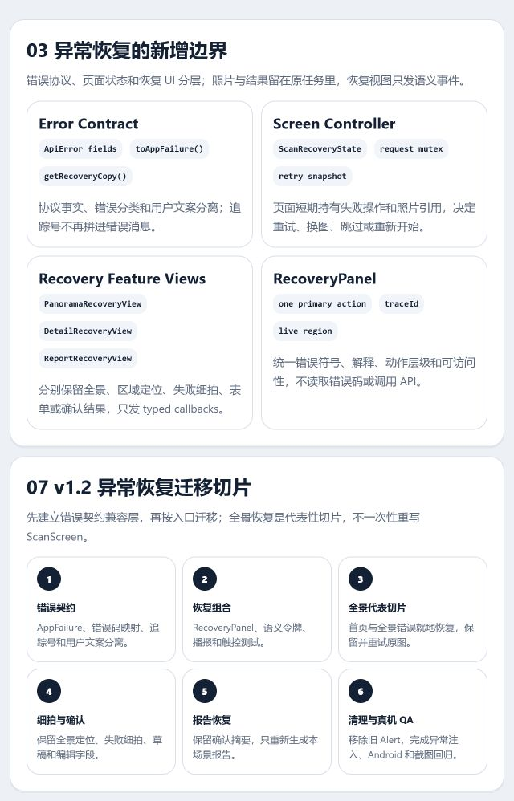
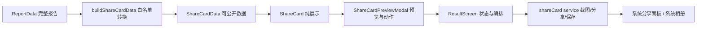

# 家庭化学品排雷大挑战——前端组件图与设计令牌映射

> 版本：v1.3（传播结果卡修订，已确认）
> 日期：2026-07-19
> 上游输入：[异常恢复用户流程](../product/异常恢复用户流程.md) · [异常恢复页面线框图](./异常恢复页面线框图.md) · [移动端视觉基础约束](./移动端视觉规范.md)
> 可视化组件图：[打开浏览器组件图](../../design/component-map/frontend-component-map.html)



## 一句话架构结论

页面负责“什么时候做什么”，功能视图负责“这一状态展示什么”，基础组件负责“怎样稳定且可访问地交互”，最终视觉通过令牌替换，不在业务页面里散落具体色值。

## 一、现状判断

当前实现已经把扫描页面的主要状态拆进 `components/views`，方向正确。单场景快速检查已经实施完成；本轮异常恢复审查发现以下新增问题：

1. `HomeScreen`、全景扫描和报告生成仍使用系统 `Alert`，会覆盖当前上下文，与已确认线框图不一致。
2. `ApiError.message` 把追踪号拼进用户文案，并在连接失败时暴露“API 地址”；错误分类与展示文案没有分层。
3. `ScanScreen` 只有 `detailError`、`confirmationError` 两个字符串，不能可靠表达失败发生在哪个操作、能否重试原照片或是否必须换图。
4. 全景请求失败后只回到空白全景入口，刚拍摄的照片仍在页面内存中却没有通过 UI 提供“重试这张照片”。
5. 细拍失败虽然保留区域进度，但失败细拍图没有进入恢复视图；用户难以确认重试对象。
6. 报告失败会退回单品结果，已确认结果仍在但页面没有明确说明，容易让用户误以为要重新识别。
7. 相册、相机、识别、确认和报告的恢复动作散落在页面分支里，缺少统一的语义模型和测试边界。

本阶段只定义目标边界，不修改 React Native 代码。

## 二、五层组件模型

```text
三层设计令牌
└── Primitives 基础组件
    └── Composites 组合组件
        └── Feature Views 功能视图
            └── Screens 页面控制器
```

依赖只能向下。基础组件不能读取 Zustand、调用 API 或理解领域对象；页面控制器不能重新实现按钮、输入和状态卡的视觉细节。

### 1. Tokens

- 原始令牌：色阶、字号、间距、尺寸、圆角候选和时长。
- 语义令牌：`surface.*`、`text.*`、`action.*`、`border.*`、`status.*`、`risk.*`。
- 组件令牌：`button.*`、`input.*`、`card.*`、`photo.*`、`dialog.*`。

### 2. Primitives

| 组件 | 职责 | 主要变体 | 不负责 |
|---|---|---|---|
| `AppText` | 字体层级、行高、动态字号 | display/title/body/label/caption | 文案业务含义 |
| `AppButton` | 统一触控、禁用、加载、按压反馈 | primary/secondary/quiet/danger | 导航和 API |
| `IconButton` | 44×44 图标操作与可访问标签 | default/overlay/danger | 图标业务选择 |
| `TextField` | 标签、输入、帮助、错误 | default/error/disabled | 产品字段校验规则 |
| `StatusBadge` | 色 + 图标 + 文字状态 | risk/status/evidence | 计算风险等级 |
| `Surface` | 统一表面、边框和间距 | plain/outlined/subtle/emphasis | 万能业务卡片 |
| `ProgressBar` | 确定/不确定进度表达 | determinate/indeterminate | 推导流程进度 |
| `StateMessage` | 加载、空、错误、权限和重试 | loading/empty/error/permission | 决定恢复动作 |

### 3. Composites

| 组件 | 职责 | 关键输入/事件 |
|---|---|---|
| `PageHeader` | 返回/退出、标题、步骤进度 | `title`、`progress`、`onBack` |
| `PhotoInputActions` | 拍照与相册的等价入口 | `onCamera`、`onLibrary`、`disabled` |
| `PhotoFrame` | 全景/单品图、标注框和覆盖层 | `uri`、`ratio`、`annotations` |
| `ProgressSummary` | 当前区域、总数和已发现雷点 | `current`、`total`、`mineCount` |
| `ProductSummary` | 用户已确认的产品事实 | `product`、`confirmed` |
| `RiskCard` | 风险结论、原因、行动建议 | `risk`、`evidence` |
| `EvidenceStatus` | 资料等级、复核日期和来源 | `status`、`sources`、`onOpen` |
| `ChemicalProfileCard` | 展示受控黑色幽默人格，不计算风险 | `label`、`note` |
| `ConfirmExitDialog` | 解释退出后果并二次确认 | `consequence`、`onStay`、`onExit` |

### 4. Feature Views

| 功能视图 | 对应用户流程状态 | 状态来源 |
|---|---|---|
| `CameraCaptureView` | 相机、权限和拍摄 | 页面传入拍摄/相册/取消事件 |
| `PanoramaInputView` | 全景输入 | 页面传入事件，无业务状态 |
| `AnalysisView` | 图片分析中 | 页面传入图片与旁白 |
| `PanoramaEmptyView` | 未定位到区域 | 页面传入原图与三种恢复事件 |
| `AreaGuideView` | 区域引导 | store 数据经页面选择后传入 |
| `EvidenceInsufficientView` | 全部区域跳过、无法评分 | 页面传入原图、区域与三种恢复事件 |
| `IdentificationReviewView` | 产品事实确认 | 本地表单状态归视图，提交归页面 |
| `SingleResultView` | 单品结果 | 页面传入已确认结果 |
| `ReportGeneratingView` | 正在生成最终报告 | 页面传入进度语义 |
| `ReportView` | 最终报告 | 页面传入报告与分享/重开事件 |
| `HistoryList` | 历史记录 | 页面传入记录与打开事件 |

### 5. Screens

| 页面控制器 | 保留职责 | 下放职责 |
|---|---|---|
| `HomeScreen` | 开始挑战、导航、开始失败 | 按钮、说明步骤和错误反馈外观 |
| `ScanScreen` | 扫描状态机、API 编排、跳过判定和跨状态恢复 | 各状态布局、照片操作、表单和结果外观 |
| `ResultScreen` | 报告来源、场景标签、分享和开始其他场景 | 分数、人格卡、风险列表、无雷点和数据丢失状态 |
| `HistoryScreen` | 加载/刷新、打开报告、导航 | 加载空错状态、记录列表与状态标签 |

## 三、扫描主链路的事件与数据流

```text
用户操作
  ↓ event
Feature View
  ↓ typed callback
ScanScreen（流程控制器）
  ├── imagePicker / Camera
  ├── api
  └── challengeStore
          ↓ selected props
      Feature View 重新渲染
```

- 相机与相册只返回统一的图片 URI，后续分析流程不区分来源。
- `ScanScreen` 负责网络请求和状态迁移；视图只触发 `onRetry`、`onConfirm`、`onSkip` 等语义事件。
- `IdentificationReviewView` 可以持有品牌、名称、品类、成分输入值，但不能调用风险评估接口。
- `challengeStore` 只保存挑战 ID、页面状态、场景标签、最多 3 个区域、已确认扫描结果、雷点数量和报告。
- 相机是否打开、当前上传图片、提交中和未确认草稿仍是页面短生命周期状态；后续如控制器继续膨胀，再单独提取 `useScanController`，不提前抽象。
- 最后一个区域被处理时，`ScanScreen` 先判断确认结果数量：大于 0 才进入报告生成；等于 0 则进入 `evidence_insufficient`，不调用报告 API。
- `EvidenceInsufficientView` 只发出 `onReviewAreas`、`onReplacePanorama`、`onExit`；回到第一个区域、清空全景会话或退出挑战都由页面与 store 完成。
- 场景标签由全景分析返回并持久化，展示层只读取；标签识别错误不得改变区域选择、风险规则或评分。

## 四、三层令牌结构

### 原始令牌

```ts
palette.orange.600
palette.neutral.900
space.4
font.size.body
size.control.md
radius.md
duration.fast
```

原始令牌只描述值，不描述业务用途。

### 语义令牌

```ts
surface.page
surface.subtle
text.primary
text.secondary
text.onAction
action.primary
action.primaryPressed
border.default
status.error
risk.critical
evidence.verified
```

业务页面和功能视图优先使用语义令牌。最终视觉精修只需替换这些令牌指向的值。

### 组件令牌

```ts
button.primary.background
button.primary.foreground
input.border.default
input.border.error
photo.overlay.background
riskCard.critical.border
dialog.scrim
```

组件令牌用于稳定组件配方，不能以页面命名，例如禁止 `homeButtonOrange`、`scanCardShadow`。

## 五、当前主题到目标语义的映射

| 当前值/令牌 | 目标语义令牌 | 迁移说明 |
|---|---|---|
| `colors.bgPrimary` | `surface.page` | 页面背景 |
| `colors.bgSecondary` | `surface.subtle` | 次级信息表面 |
| `colors.bgDark` | `surface.inverse` | 相机和深色图片区域 |
| `colors.textPrimary` | `text.primary` | 主正文 |
| `colors.textSecondary` | `text.secondary` | 辅助正文 |
| `colors.textLight` | `text.muted` | 非关键说明，仍需校验对比度 |
| `colors.textWhite` | `text.onAction` / `text.inverse` | 按用途拆分 |
| `colors.primary` | `action.primary` / `accent.decorative` | 交互与装饰分离，旧值不直接沿用 |
| `colors.primaryLight` | `surface.accentSubtle` | 候选值可在最终视觉阶段替换 |
| `colors.border` | `border.default` | 普通分隔和卡片边界 |
| `colors.overlay` | `photo.overlay.background` / `dialog.scrim` | 图片蒙层与对话框遮罩分离 |
| `colors.critical` | `risk.critical` | 必须同时配文字和图标 |
| `colors.medium` | `risk.medium` | 必须同时配文字和图标 |
| `colors.low` | `risk.low` | 必须同时配文字和图标 |
| `colors.safe` | `status.noRuleHit` / `evidence.verified` | 避免把“未命中规则”表达成绝对安全 |
| `#DDF8EF` | `status.completedSurface` | 消除 `HistoryScreen` 页面硬编码 |
| `spacing.xs/sm/md/lg/xl/xxl` | `space.1/2/4/6/8/12` | 兼容旧 4/8/16/24/32/48 |
| `fontSize.*` | `font.size.*` | 以语义层级别名兼容迁移 |
| `borderRadius.*` | `radius.*` | 当前值作为候选，不锁定最终风格 |

## 六、现有文件到目标组件的迁移

| 当前实现 | 目标 | 处理 |
|---|---|---|
| `CameraCapture` | `CameraCaptureView` | 保留相机能力，使用统一权限状态和图标按钮 |
| `PanoramaView` | `PanoramaInputView` | 用 `PhotoInputActions` 统一拍照/相册 |
| `EmptyPanoramaView` | `PanoramaEmptyView` | 用 `PhotoFrame` + `StateMessage` |
| `GuideView` | `AreaGuideView` | 拆出 `ProgressSummary`、`PhotoFrame` |
| `AnnotatedPanorama` | `PhotoFrame.annotations` | 保留百分比坐标映射与无框降级 |
| `MagnifierAnimation`、`NarrationBubble` | `AnalysisView` 内部反馈 | 动画服从减少动态效果，旁白不控制流程 |
| `IdentificationReviewView.Field` | `TextField` | 保留表单状态，统一标签/错误 |
| `ResultView` | `SingleResultView` | 使用 `ProductSummary` 和 `RiskCard` |
| 全部跳过时直接生成报告 | `EvidenceInsufficientView` | 保留全景上下文并提供补拍、换图、退出 |
| `MineCard`、`MineList` | `RiskCard` + 报告列表 | 共用风险与证据语义 |
| `ScoreDisplay` | `ScoreDisplay` + `ChemicalProfileCard` | 保留现有名称与统计展示，只把人格卡拆成组合组件 |
| `ScoreDisplay.getProfile` 内部模板 | `selectChemicalProfile` | 选择规则与展示分离，仍不写入报告数据 |
| `ProcessingViews` | `AnalysisView` + `ReportGeneratingView` | 避免无关处理中状态混放 |
| 页面内重复按钮 | `AppButton` | 统一加载、禁用、按压和可访问性 |
| 页面内空/错卡片 | `StateMessage` | 统一恢复动作与朗读 |

## 七、不创建的“反组件”

- 不创建带 `isRisk`、`isHistory`、`isHome`、`hasImage` 等大量布尔参数的万能 `Card`。
- 不创建允许任意 `backgroundColor`、`padding`、`radius` 的组件 API，这会绕过令牌层。
- 不让 `RiskCard` 自己请求证据链接或计算风险等级。
- 不让基础按钮根据按钮文案猜测颜色和行为。
- 不让 `ChemicalProfileCard` 根据文案、颜色或风险详情自行计算人格；它只展示选择器给出的受控标签。
- 不让 `EvidenceInsufficientView` 直接修改 store、请求报告或决定退出后果。
- 不让基础组件理解“厨房、卫生间”等场景名；场景标签属于全景分析契约与报告展示数据。
- 不因两个区域“长得像”就复用；只有语义、交互和可访问性一致才共用组件。
- 不在本阶段提前提取 `useScanController`；先迁移一条垂直切片，再用真实复杂度判断。

## 八、迁移切片

| 顺序 | 切片 | 主要目标 | 验收 |
|---|---|---|---|
| 1 | 令牌兼容层 | 三层结构、旧令牌别名 | 无页面视觉回归、类型通过 |
| 2 | 基础组件 | Text/Button/Input/Badge/Surface/State | 单测、触控、加载禁用 |
| 3 | 全景输入链路 | 输入、分析、零区域恢复 | 拍照/相册汇合，失败原地恢复 |
| 4 | 区域与确认 | 引导、照片框、产品表单 | 长文本、低置信度、重拍 |
| 5 | 单品结果与报告 | 风险卡、证据、评分 | 状态非颜色独占 |
| 6 | 历史与首页 | 列表、空错、入口 | 刷新、打开中、未完成诚实表达 |
| 7 | 异常与退出 | 权限、超时、退出确认 | 已有进度不丢失 |
| 8 | 清理 | 删除重复样式和旧令牌 | 全量 CI、Expo 构建 |
| 9 | 最终视觉精修 | 替换令牌值和组件配方 | 真机、截图、可访问性 |

第一条代表性功能切片选择“全景输入 → 分析 → 零区域恢复”，因为它同时覆盖照片输入、加载、原图上下文、失败恢复和双入口汇合，能最早验证组件体系是否有效。

### v1.1 单场景快速检查迁移顺序

原九步迁移已经完成多条切片，本次不重新迁移整个组件系统，只按依赖方向增加一个小型垂直切片：

| 顺序 | 修改层 | 主要内容 | 完成标准 |
|---|---|---|---|
| 1 | 后端契约 | `PanoramaResult` 最多 3 个区域；新增 `scene_label`；零确认结果禁止生成评分报告 | Mock/Qwen/模型/接口测试一致 |
| 2 | Types + Store | 增加 `sceneLabel`、`evidence_insufficient`、`reviewAreas`、`replacePanorama` | 状态迁移单测通过 |
| 3 | Scan Feature | 增加 `EvidenceInsufficientView`；最后区域先判断确认结果再决定报告或恢复 | 全跳过不调用报告 API |
| 4 | Report + History | 展示场景标签；拆分 `ChemicalProfileCard`；保留受控人格模板 | 人格与风险事实分区，历史一图一记录 |
| 5 | Copy + QA | 首页、全景、区域和报告统一单场景文案；验证 320/390/宽屏与错误恢复 | 类型、后端测试、Web 构建和关键截图通过 |

## 九、单场景组件树与事件接口

```text
ScanScreen
├── PanoramaInputView
├── AnalysisView
├── PanoramaEmptyView
├── AreaGuideView
│   ├── ProgressSummary
│   ├── PhotoFrame
│   └── PhotoInputActions
├── EvidenceInsufficientView
│   ├── PhotoFrame
│   ├── StateMessage
│   └── AppButton
├── IdentificationReviewView
├── SingleResultView
└── ReportGeneratingView

ResultScreen
├── ScoreDisplay
│   └── ChemicalProfileCard
├── RiskCard / MineList
└── AppButton actions

HistoryScreen
└── HistoryList
    └── HistoryItem(sceneLabel)
```

关键事件接口：

```ts
type EvidenceInsufficientViewProps = {
  panoramaImageUri: string;
  areas: PanoramaArea[];
  skippedCount: number;
  onReviewAreas: () => void;
  onReplacePanorama: () => void;
  onExit: () => void;
};

type ChemicalProfileCardProps = {
  label: string;
  note: string;
};
```

`EvidenceInsufficientView` 不接收 `challengeStore`、`api` 或导航对象。`ChemicalProfileCard` 不接收 `score`、`risk` 或 `totalMines`，避免它在展示层暗中承担业务计算。

## 十、异常恢复 v1.2 组件边界

### 10.1 状态所有权

| 状态/数据 | 所有者 | 原因 |
|---|---|---|
| HTTP 状态、错误码、`requestId`、`Retry-After` | `api.ts` / `toAppFailure` | 统一协议差异，不负责页面文案和导航 |
| 当前失败操作、失败照片、可用重试动作 | `HomeScreen` 或 `ScanScreen` 局部状态 | 只在本次页面会话有效，不应污染持久挑战状态 |
| `challengeId`、场景、区域、已确认结果、报告 | `challengeStore` | 属于跨视图共享的挑战进度 |
| 错误标题、解释、追踪号和动作布局 | `RecoveryPanel` | 统一语义、触控和屏幕阅读器播报 |
| 原图、区域定位、失败细拍和报告摘要 | 对应 Feature View | 负责保留并展示当前任务上下文 |
| 是否重试、换图、重拍、重新开始 | Screen Controller | 只有页面控制器能调用服务、更新 store 和导航 |

明确不把照片 URI、错误对象或重试闭包写入 Zustand。当前版本不跨应用重启恢复照片；页面被系统销毁后按既有规则重新开始。

### 10.2 错误与恢复模型

```ts
type RecoverableOperation =
  | 'start'
  | 'panorama'
  | 'detail'
  | 'confirm'
  | 'report';

type FailureKind =
  | 'network'
  | 'timeout'
  | 'rate_limited'
  | 'invalid_photo'
  | 'challenge_expired'
  | 'service'
  | 'unknown';

type AppFailure = {
  kind: FailureKind;
  code?: string;
  requestId?: string;
  retryAfterSeconds?: number;
};

type ScanRecoveryState =
  | { operation: 'panorama'; failure: AppFailure; imageUri: string }
  | {
      operation: 'detail';
      failure: AppFailure;
      imageUri: string;
      areaId: string;
    }
  | { operation: 'confirm'; failure: AppFailure }
  | { operation: 'report'; failure: AppFailure };
```

- `ApiError` 保留协议字段，不再把追踪号拼进 `message`。
- `toAppFailure(error)` 只归一化错误种类；`getRecoveryCopy(operation, failure)` 负责用户文案，二者都是无副作用纯函数。
- `INVALID_IMAGE`、`IMAGE_TOO_LARGE`、`UNSUPPORTED_IMAGE_TYPE` 等归为 `invalid_photo`，主操作为换图或重拍；网络、超时和临时服务异常优先重试原输入。
- `CHALLENGE_NOT_FOUND`、草稿失效等不可继续当前上下文的错误归为 `challenge_expired`，主操作改为返回首页重新开始。
- 同一操作只允许一个请求进行中；重试期间复用原 `challengeId`、草稿和照片 URI，不重复创建 challenge。

### 10.3 屏幕到组件树

```text
HomeScreen
├── HomeContent
└── RecoveryPanel(start failure)

ScanScreen
├── PanoramaInputView
├── PanoramaRecoveryView
│   ├── PhotoFrame(retained panorama)
│   └── RecoveryPanel
├── DetailRecoveryView
│   ├── PhotoFrame(panorama + active annotation)
│   ├── PhotoFrame(failed detail)
│   └── RecoveryPanel
├── IdentificationReviewView
│   ├── editable fields retained locally
│   └── RecoveryPanel(confirm failure)
├── ReportGeneratingView
└── ReportRecoveryView
    ├── ConfirmedResultSummary
    └── RecoveryPanel
```

不为这四种恢复状态增加导航路由。它们都是 `HomeScreen` 或 `ScanScreen` 的状态变体。

### 10.4 新增与修订组件接口

```ts
type RecoveryAction = {
  label: string;
  onPress: () => void;
  loading?: boolean;
  accessibilityHint: string;
};

type RecoveryPanelProps = {
  title: string;
  description: string;
  traceId?: string;
  primaryAction: RecoveryAction;
  secondaryAction?: RecoveryAction;
  tertiaryAction?: RecoveryAction;
  announceKey: string;
};

type PanoramaRecoveryViewProps = {
  imageUri: string;
  failure: AppFailure;
  mode: 'retry_request' | 'replace_invalid_photo';
  onRetrySamePhoto: () => void;
  onRetake: () => void;
  onSelectFromAlbum: () => void;
};

type DetailRecoveryViewProps = {
  panoramaImageUri: string;
  detailImageUri: string;
  area: PanoramaArea;
  failure: AppFailure;
  onRetrySamePhoto: () => void;
  onRetake: () => void;
  onSelectFromAlbum: () => void;
  onSkip: () => void;
};

type ReportRecoveryViewProps = {
  confirmedResults: ScanResult[];
  failure: AppFailure;
  onRetry: () => void;
  onReviewConfirmedResults: () => void;
};
```

- `RecoveryPanel` 只接收语义动作，不接收 `backgroundColor`、`isPanorama`、`isReport` 等页面或视觉参数。
- Feature View 不接收 `api`、store、navigation 或原始异常；页面先把异常归一化为 `AppFailure`。
- `IdentificationReviewView` 继续拥有尚未提交的表单值；确认失败只追加 `RecoveryPanel`，不得重建表单或重新识别照片。
- `ReportRecoveryView` 只展示已经确认的结果摘要；重试事件只重新请求报告。
- `announceKey` 在每次新失败时变化，由 `RecoveryPanel` 以 `polite` 或 `assertive` live region 播报；按钮均提供动作与对象完整标签。

### 10.5 语义令牌映射

异常恢复不增加页面专属颜色，只增加组件配方：

```ts
recoveryPanel.background       -> surface.page
recoveryPanel.border           -> border.strong
recoveryPanel.iconForeground   -> status.error
recoveryPanel.title            -> text.primary
recoveryPanel.description      -> text.secondary
recoveryPanel.trace            -> text.muted
recoveryPanel.primaryAction    -> action.primary
```

错误不能只靠 `status.error` 表达；符号、标题、正文和动作必须同时存在。最终视觉精修可以替换这些令牌的具体值，不能改变恢复动作层级。

### 10.6 反组件与非目标

- 不创建一个带 `isStart / isPanorama / isDetail / isReport` 的万能错误页。
- 不让 `RecoveryPanel` 根据错误码猜测操作，也不让它调用 API。
- 不把 `try/catch`、上传逻辑或 challenge 状态放进照片组件。
- 不把失败照片写入 store、SQLite、日志或长期缓存。
- 不在本轮修改后端风险判断、评分、AI 提示词、照片隐私或历史报告模型。
- 不为了异常恢复重写整个 `ScanScreen` 状态机；先完成代表性切片，再评估是否需要提取 controller hook。

### 10.7 迁移顺序

| 顺序 | 垂直切片 | 主要内容 | 完成标准 |
|---|---|---|---|
| 1 | 错误契约兼容层 | `AppFailure`、错误码映射、追踪号分离、用户文案纯函数 | 单元测试覆盖网络、超时、无效图、失效 challenge |
| 2 | 恢复组合组件 | `RecoveryPanel`、语义令牌、live region、44px 动作 | 组件测试与长中文渲染通过 |
| 3 | 代表性切片：全景 | 首页创建失败、全景请求失败、无效照片；保留并重试原图 | 不使用系统 Alert，重试不重新拍照 |
| 4 | 细拍与确认 | 保留全景定位、失败细拍、识别草稿和编辑字段 | 重试对象明确，确认失败不丢表单 |
| 5 | 报告恢复 | `ReportRecoveryView` 保留确认摘要，只重新生成报告 | 失败不退回单品结果，不重复识别 |
| 6 | 清理与真机 QA | 删除对应 Alert 与旧错误字符串，补充流程和截图测试 | TypeScript、Expo、Android 全链路与无障碍通过 |

选择“全景请求失败”作为代表性切片，因为它同时验证照片生命周期、错误分类、原输入重试、替换输入和页面内恢复，能最早暴露边界问题。

## 十一、测试所有权

| 层 | 主要验证 |
|---|---|
| Tokens | 类型、必需键、对比度计算 |
| Primitives | 状态变体、触控、焦点、可访问标签 |
| Composites | `RecoveryPanel` 动作层级、事件转发、追踪号、长文本和播报 |
| Feature Views | 原图/定位/草稿/结果是否保留，恢复事件是否正确发出 |
| Screens | 错误归一化、请求互斥、重试同一输入、状态迁移和导航 |
| Backend domain | 最大区域数、场景标签持久化、零证据拒绝评分 |
| E2E | 网络失败、超时、无效照片、确认失败、报告失败和 challenge 失效 |

## 十二、组件图验收

- [x] 可编辑 HTML 已同步 `Backend Contract → ScanScreen → EvidenceInsufficientView → Report Presentation` 四段边界。
- [x] PNG 预览已渲染，新增边界和五步迁移顺序无文字裁切或横向溢出。
- [x] 新组件只绑定现有语义令牌，不新增页面专属颜色、间距或视觉 API。
- [x] 全部跳过、场景标签降级、旧历史记录和零证据后端拒绝均有明确责任归属。
- [x] 黑色幽默人格选择与展示分离，风险事实、评分和证据职责保持不变。
- [x] HTML 与 PNG 已同步 v1.2 异常恢复边界，并完成原尺寸目检。
- [x] 六种异常恢复均能映射到明确的状态所有者、组件与重试事件。
- [x] 新接口不依赖最终色值，也没有万能错误页或页面布尔参数。

## 十三、确认清单

- [x] 原五层结构、依赖方向和三层令牌继续有效。
- [x] 页面控制器负责流程，功能视图不直接调用 API。
- [x] 同意增加 `EvidenceInsufficientView`，但不创建新的导航页面。
- [x] 同意由 `ScanScreen` 判定“生成报告 / 证据不足”，后端同时拒绝零证据评分。
- [x] 同意新增 `scene_label`，只用于报告和历史展示，不参与风险判断。
- [x] 同意把人格选择器与 `ChemicalProfileCard` 展示拆开，继续使用受控模板。
- [x] 同意按 v1.1 的五步小切片实施，不重新改造已稳定组件。
- [x] 同意组件图与架构方案确认后才修改前后端代码。

> 2026-07-19：产品侧以“下一步”确认本版组件边界与迁移顺序，进入《单场景快速检查实施计划》与功能编码；实施完成后再做全流程和视觉回归。

### v1.2 异常恢复已确认

- [x] 同意错误协议、用户文案和页面恢复动作三层分离。
- [x] 同意照片 URI 与失败状态只由页面短期持有，不写入 Zustand 或后端。
- [x] 同意新增 `RecoveryPanel`、`PanoramaRecoveryView`、`DetailRecoveryView`、`ReportRecoveryView`。
- [x] 同意网络/超时优先重试原输入，无效照片优先换图，challenge 失效重新开始。
- [x] 同意确认失败保留表单，报告失败保留确认结果且不退回单品结果。
- [x] 同意按六个小切片实施，先完成全景代表性切片，不一次性重写 `ScanScreen`。

> 2026-07-19：产品侧明确回复“确认异常恢复组件边界和架构方案”，Stage 4 通过，进入异常恢复第一条功能垂直切片。

## 十四、传播结果卡 v1.3 组件边界（2026-07-23）

### 14.1 数据与依赖方向



- `buildShareCardData(report)` 是完整报告进入传播层的唯一入口；返回新对象，不透传 `mines`、`share_text`、来源链接或任何照片字段。
- `ShareCard` 只接收 `ShareCardData`，不读取 Zustand、API、导航、设备权限或文件 URI。
- `ShareCardPreviewModal` 只接收预览数据、动作状态、反馈和 typed callbacks；不决定风险结论，也不直接读取报告。
- `ResultScreen` 拥有 `visible / action / feedback / cardRef`，编排捕获、分享、保存和 Web 降级。
- `shareCard service` 是唯一接触 `react-native-view-shot`、`expo-sharing` 与 `expo-media-library` 的模块；不接触后端和业务 store。

### 14.2 公开字段白名单

| 允许 | 禁止 |
|---|---|
| 场景名、规则评分 | 原始照片和照片 URI |
| 雷点数、当前未命中数、已检查数 | 产品名称、识别草稿、完整风险详情 |
| 受控人格标题与说明 | 地址、挑战编号、请求追踪号 |
| 固定邀请、隐私与免责声明 | 证据链接、后端原始分享文案 |

白名单由纯函数和单元测试锁定；新增公开字段必须先修改产品流程、隐私说明和测试，不能直接给组件加 `report` 属性。

### 14.3 组件接口与状态

```ts
type ShareCardAction = 'idle' | 'capturing' | 'sharing' | 'saving';

type ShareCardProps = { data: ShareCardData };

type ShareCardPreviewModalProps = {
  visible: boolean;
  data: ShareCardData;
  cardRef: RefObject<View | null>;
  action: ShareCardAction;
  feedback: string | null;
  supportsImageShare: boolean;
  onClose(): void;
  onShare(): void;
  onSave(): void;
};
```

- 请求进行中禁用关闭与并发动作；反馈使用 `accessibilityLiveRegion="polite"`。
- 原生先捕获临时 PNG，再交给系统分享或在用户授权后写入相册；临时 URI 不进入 store、后端或日志。
- Web 不假装支持本地文件分享，保留卡片预览并降级为现有文字摘要。

### 14.4 令牌与迁移顺序

`shareCard.aspectRatio / previewMaxWidth / padding / borderWidth / scoreRingSize / statMinHeight / summaryBorderWidth / outputWidth / outputHeight` 组成组件配方；页面不硬编码卡片尺寸。

1. 先锁定流程、线框、视觉配方和公开字段白名单。
2. 增加 `ShareCardData` 转换与隐私单测。
3. 实现 `ShareCard` 和 `ShareCardPreviewModal`。
4. 增加原生捕获、系统分享、相册保存与 Web 文字降级。
5. 接入 `ResultScreen`，保留风险详情和“检查另一个场景”原行为。
6. 通过 TypeScript、单测、Web 导出和 Android 真机分享/保存验收。

完整异常恢复组件的后续切片不删除，但优先级移到 MVP 传播闭环之后；本切片不扩大 `RecoveryPanel` 或重写 `ScanScreen`。

> 2026-07-23：产品侧明确要求“按顺序一次性搞完”，视为 v1.3 流程、线框、组件边界与实施顺序连续确认。
