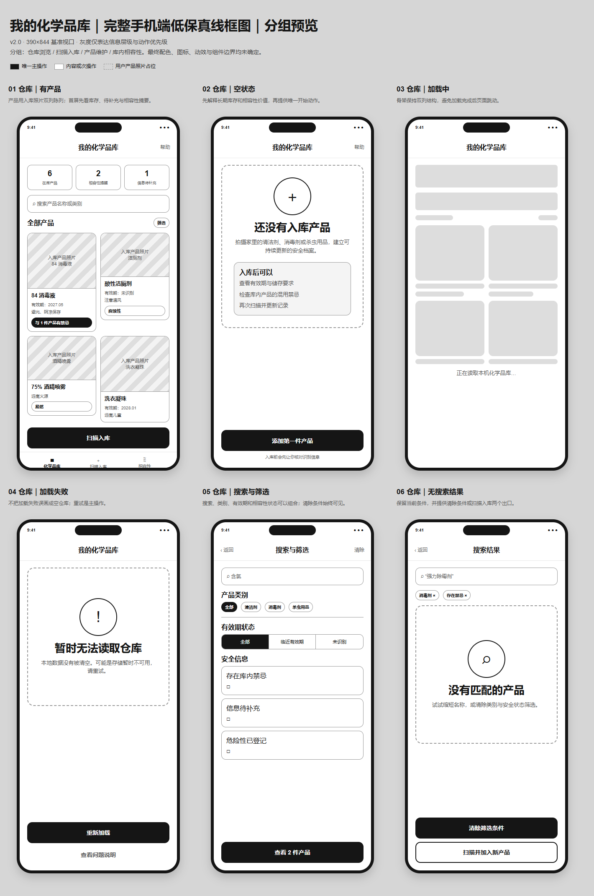
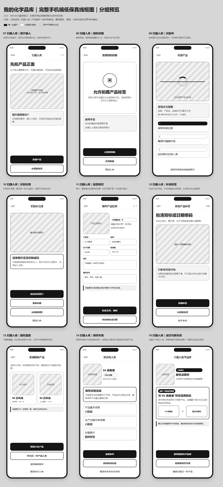
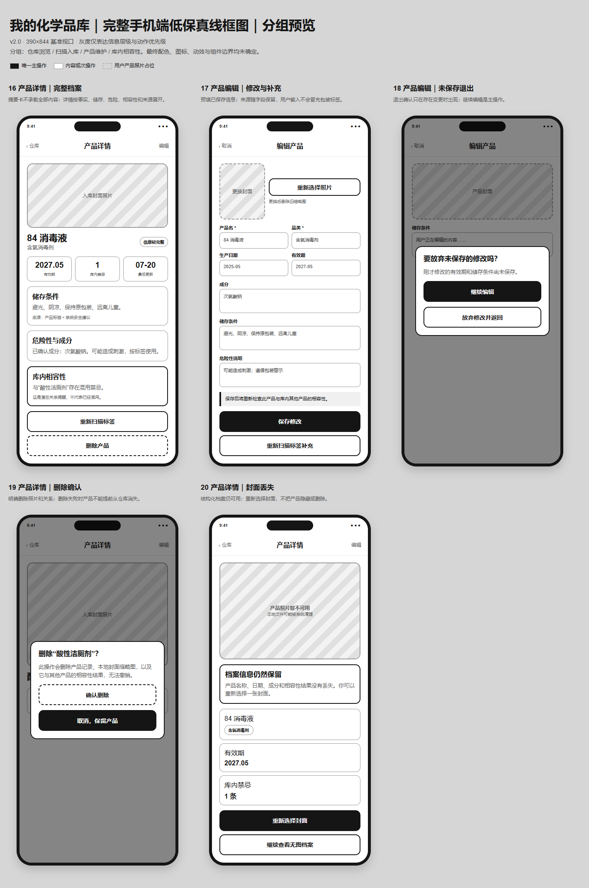
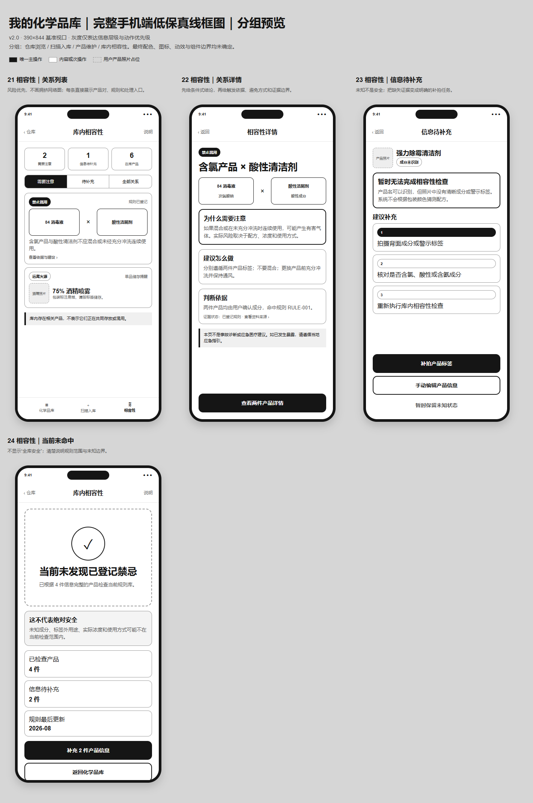

# 我的化学品库——手机端低保真线框图

> 版本：v2.0（已确认）
>
> 日期：2026-08-02
>
> 上游输入：[家庭化学品库用户流程](../product/用户流程.md)
>
> 可编辑画板：[inventory-mobile-low-fi.html](../../design/wireframes/inventory-mobile-low-fi.html)

## 一、范围与非目标

本阶段确定：

- 仓库、扫描入库、产品详情、编辑删除和相容性检查的信息顺序。
- 用户要求的真实产品照片双列陈列方向。
- 每个状态的唯一主操作和恢复出口。
- 加载、空、错误、权限、重复、保存失败、未保存退出、删除和图片丢失状态。
- “库内存在潜在禁忌”与“用户已经混用”的表达边界。

本阶段不确定：

- 最终品牌色、字体、插画、图标、阴影、圆角细节和动效。
- React Native 组件、Props、状态容器和 API 结构。
- 数据库表、图片目录、迁移脚本和旧 challenge 删除顺序。
- 最终桌面 Web 布局；首期以手机为主。

## 二、可视化总览

### 仓库浏览

[打开仓库浏览 PNG](../../design/wireframes/inventory-warehouse-low-fi.png)

### 扫描入库

[打开扫描入库 PNG](../../design/wireframes/inventory-intake-low-fi.png)

### 产品维护

[打开产品维护 PNG](../../design/wireframes/inventory-manage-low-fi.png)

### 库内相容性

[打开库内相容性 PNG](../../design/wireframes/inventory-compatibility-low-fi.png)

## 三、全局布局规则

- 基准手机画板为 390×844，包含顶部安全区、页面标题区、内容区和底部操作区。
- 仓库采用双列产品陈列；产品卡高度可随摘要变化，页面纵向滚动。
- 产品详情、长表单和关系详情允许纵向滚动，底部动作不得被内容遮挡。
- 产品照片使用用户确认入库时选择的本地缩略图；无图时保留结构化档案并显示明确占位。
- 双列卡只展示摘要：产品名、有效期状态、一条储存要求、最高危险性和库内禁忌数量。
- 生产日期、完整成分、完整危险说明、来源和更新时间放在产品详情。
- 主导航使用“化学品库 / 扫描入库 / 相容性”三类任务，不保留挑战、历史报告或 SBTI 入口。

## 四、动作层级

| 层级 | 用途 | 例子 |
|---|---|---|
| 主操作 | 推进当前唯一任务，每个状态最多一个 | 扫描入库、重试识别、保存修改、补拍标签 |
| 次操作 | 等价输入或安全替代路径 | 从相册选择、重新拍摄、手动编辑 |
| 文字操作 | 退出、跳过或低频动作 | 暂不补充、取消入库、查看说明 |
| 破坏性操作 | 不可逆删除，必须确认 | 删除产品 |

## 五、页面组

### A. 仓库浏览

#### 01 仓库有产品

- 目标：快速看见库存规模、相容性提醒和双列产品照片。
- 信息顺序：三项摘要 → 搜索 → 产品双列陈列 → 扫描入库 → 主导航。
- 主操作：扫描入库。
- 产品卡摘要：封面、名称、有效期、短储存要求、危险/禁忌标签。
- 页面允许纵向滚动，不要求所有产品同时出现在首屏。

#### 02 仓库空状态

- 目标：解释长期档案与相容性价值，帮助用户添加第一件产品。
- 主操作：添加第一件产品。
- 不显示全零统计或“全库安全”。

#### 03 仓库加载中

- 使用双列骨架，降低数据出现后的布局跳动。
- 不允许在数据未确认前短暂显示空状态。

#### 04 仓库加载失败

- 明确本地数据没有被清空。
- 主操作：重新加载。

#### 05 搜索与筛选

- 支持名称、类别、有效期状态、库内禁忌和信息完整度。
- 主操作显示命中数量。
- 清除条件始终可见。

#### 06 无搜索结果

- 保留查询与筛选条件。
- 主操作：清除筛选；次操作：扫描并加入新产品。

### B. 扫描入库

#### 07 照片输入

- 目标：先拍产品正面建立产品身份。
- 主操作：拍摄产品；相册为等价替代。
- 入库前说明照片保存边界。

#### 08 相机权限

- 解释相机只用于用户主动选择的产品。
- 主操作：去授权；相册为完整替代；取消不产生记录。

#### 09 识别中

- 保留当前照片，说明只提取可见信息。
- 返回时保留本次临时照片，防止重复拍摄。

#### 10 识别失败

- 失败照片仍可见。
- 主操作：重试当前照片；次操作：重拍、相册换图、取消。

#### 11 信息核对

- 照片、置信度和关键字段同屏。
- 产品名、品类为必填；日期和成分允许未知。
- 主操作：信息无误，继续。

#### 12 补拍标签

- 补拍用于背标、警示语和日期喷码，不默认替换仓库封面。
- 允许暂不补充非必填信息。

#### 13 疑似重复

- 本次照片与已有封面并排对比。
- 由用户选择更新已有产品或作为另一件入库；系统不得静默覆盖。

#### 14 保存失败

- 保留核对字段和临时照片。
- 主操作：重新保存；重试必须幂等，不能生成重复产品。

#### 15 入库成功与新关系

- 先确认产品已经成功入库，再显示新增相容性提醒。
- 文案明确：库内同时存在相关产品，不表示已经混用或共同存放。

### C. 产品维护

#### 16 产品详情

- 信息顺序：封面 → 名称/类别 → 日期与状态 → 储存条件 → 危险性与成分 → 库内相容性 → 重新扫描/删除。
- 标签要求、系统建议和用户输入必须标记来源。

#### 17 产品编辑

- 预填已有数据；未知仍保持未知。
- 保存后重算受影响的相容性关系。
- 允许重新扫描标签补充字段。

#### 18 未保存退出

- 仅当存在修改时出现确认。
- 主操作：继续编辑；次操作：放弃修改并返回。

#### 19 删除确认

- 说明将删除记录、封面缩略图和相关相容性关系。
- 取消/保留产品比确认删除的视觉优先级更高，减少误删。
- 删除失败时产品不能提前从仓库消失。

#### 20 封面丢失

- 结构化档案继续可用，不自动隐藏或删除产品。
- 主操作：重新选择封面；次操作：继续查看无图档案。

### D. 库内相容性

#### 21 关系列表

- 不绘制复杂节点网络图，使用按风险排序的产品对卡片。
- 摘要区分“需要注意”“信息待补充”和在库产品数。
- 每条显示产品对、关系类型、条件式说明和详情入口。

#### 22 关系详情

- 信息顺序：条件式结论 → 产品对 → 为什么注意 → 怎么做 → 判断依据 → 适用边界。
- 证据包括用户确认的成分、规则编号和资料来源。

#### 23 信息待补充

- 未知不是安全；明确说明缺少哪类标签证据。
- 主操作：补拍产品标签；次操作：手动编辑或保留未知。

#### 24 当前未命中

- 使用“当前未发现已登记禁忌”，不使用“全库安全”。
- 同时显示已检查产品、待补充产品和规则更新时间。

## 六、跨页面一致性

| 检查项 | 决策 |
|---|---|
| 产品如何进入系统 | 拍照/相册 → 识别 → 用户核对 → 重复分支 → 确认入库 |
| 产品照片如何保存 | 仅保存用户确认的压缩封面缩略图 |
| 未确认照片 | 只在当前流程暂存，取消后不进入仓库 |
| 仓库如何陈列 | 双列、真实产品照片、摘要在照片下方 |
| 实际位置 | 不采集、不展示、不据此下结论 |
| 储存信息 | 展示“应该如何储存”及来源 |
| 相容性 | 计算潜在禁忌，不声称已经混用 |
| 未命中规则 | 不表达绝对安全 |
| 重复产品 | 用户决定更新或另存 |
| 删除 | 二次确认，删除记录、缩略图和相关关系 |
| 图片丢失 | 保留结构化档案并允许重选封面 |
| SBTI/评分 | 不进入新导航、仓库或详情流程 |

## 七、视觉 QA

- [x] 可编辑 HTML 包含 24 个核心与恢复状态。
- [x] 四组 PNG 已在 390×844 基准手机框中渲染。
- [x] 双列产品卡使用真实照片占位，摘要层级可读。
- [x] 加载、空、错误、权限、重复、保存失败、未保存退出、删除和图片丢失已覆盖。
- [x] 长表单、仓库列表和长详情明确允许纵向滚动。
- [x] 渲染脚本检查了所有非滚动页面的内容高度，无意外裁切。
- [x] 删除和未保存退出均有明确后果与取消路径。
- [x] 相容性所有状态均保留“潜在关系不等于已经混用”的边界。
- [x] 线框保持灰度，未提前冻结最终艺术方向。

## 八、完整性与交接边界

产品定位和用户流程已经完整，低保真覆盖了当前 MVP 的核心、空、加载、错误、权限、退出和删除状态。后续 agent 可以据此继续设计工作，但不应直接凭线框开始大规模实现，因为以下权威文件仍是旧 challenge 方案：

1. 移动端视觉基础与设计令牌。
2. 前端组件图与状态所有权。
3. 架构方案、库存数据模型、图片生命周期和 API 契约。
4. 分阶段实施与迁移计划。

正确后续顺序：

`确认低保真 → 更新视觉基础 → 更新组件图/令牌映射 → 更新架构和实施计划 → 修改代码`

## 九、线框确认

- [x] 仓库采用真实产品照片的双列陈列。
- [x] 卡片只显示摘要，完整信息进入详情。
- [x] 产品入口、核对、重复、保存与成功流程符合预期。
- [x] 详情支持编辑、重新扫描和删除。
- [x] 相容性使用列表和详情，不画复杂网络图。
- [x] 当前 24 个状态足以进入视觉基础阶段。
- [x] 下一阶段是视觉基础，不修改应用代码。

> 2026-08-02：产品方要求完善为可直接编码的实施方案，视为确认 v2.0 低保真图并同意进入视觉基础阶段。
