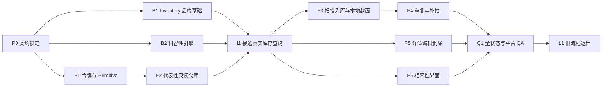

# 家庭化学品库——功能实施计划

> 版本：v1.0（已确认）
>
> 日期：2026-08-02
>
> 已确认输入：[产品方案](../product/家庭化学品安全方案.md) · [用户流程](../product/用户流程.md) · [低保真线框图](../design/手机端页面线框图.md) · [视觉基础](../design/移动端视觉规范.md) · [组件图](../design/前端组件图与设计令牌映射.md)
>
> 已确认输入：[架构方案 v2.0（已确认）](../architecture/架构方案.md)

## 一、交付目标

把当前“全景 challenge → 一次性报告”迁移为可运行的“扫描入库 → 我的化学品库 → 产品维护 → 库内相容性”MVP，同时保留安全表达、错误恢复和现有项目的可回退性。

本计划可以直接拆给多个 Agent，但必须按依赖波次合并。每个任务都有文件所有权、输入、输出和验收；Agent 不得在自己的切片外顺手重构。

## 二、范围

### 2.1 包含

- 新的 Inventory 数据模型、SQLite 表、Repository、Service 和 API。
- 产品临时照片识别、用户核对、补拍合并和疑似重复分支。
- 设备本地封面缩略图保存、读取、替换、删除和孤儿清理。
- 固定双列仓库、搜索筛选、产品详情、编辑、重新扫描和删除。
- 确定性相容性规则、关系摘要、关系列表和详情。
- 24 个低保真状态对应的加载、空、错误、权限、冲突和确认状态。
- Android、iOS 和 Expo Web 的功能适配与测试。
- 旧 challenge 主入口退出和历史代码清理。

### 2.2 不包含

- 最终品牌配色、图标语言、插画、阴影性格、圆角细节和动效性格。
- 账号、云同步、家庭成员协作和跨设备封面同步。
- 真实位置、复杂关系图、批量管理和拖拽排序。
- SBTI、评分、报告、传播卡和社交挑战的新功能。
- 化学规则的大规模内容扩充；本期只迁移并校验 MVP 规则集。

## 三、实施总原则

1. 先令牌与无障碍 Primitive，再共享 Composite，再做代表性只读仓库切片。
2. 先固定 API DTO 和错误码，再让前后端并行。
3. 识别结果不是正式事实，用户确认是写库存的门槛。
4. 封面图片只存设备本地，产品 API 不接收长期照片。
5. 每个写请求携带 operationId；修改和删除携带 expectedRevision。
6. 相容性计算只在后端，前端只展示服务端结果。
7. 新旧代码短期共存；迁移完成前不删除旧 challenge 能力。
8. 每个切片完成后运行类型、单元、后端、Web 构建和真实渲染检查。

## 四、目标目录

### 4.1 后端新增

```text
backend/app/
  api/routes/
    inventory.py
    recognition.py
    compatibility.py
  models/
    inventory.py
    compatibility.py
  services/
    inventory_service.py
    recognition_service.py
    compatibility_service.py
  data/
    inventory_repository.py
    compatibility_rules.json
    ingredient_aliases.json
  core/
    compatibility_engine.py
    duplicate_matcher.py
```

### 4.2 客户端新增

```text
mobile/src/
  screens/
    InventoryScreen.tsx
    IntakeFlowScreen.tsx
    ProductDetailScreen.tsx
    ProductEditScreen.tsx
    CompatibilityScreen.tsx
    CompatibilityDetailScreen.tsx
  components/
    primitives/        AppDialog · IconButton · SemanticBadge · ScreenScroll
    composites/        ProductCard · ProductGrid · ProductPhoto · ProductPairCard
    features/          InventoryView · IntakeViews · ProductDetailView · CompatibilityViews
  services/
    inventoryApi.ts
    photoAssetService.ts
    photoAssetService.web.ts
  store/
    inventoryStore.ts
    intakeStore.ts
  view-models/
    inventory.ts
    compatibility.ts
  types/
    inventory.ts
    compatibility.ts
```

文件名可以在实现中按现有索引组织微调，但不得改变已确认的组件责任。

## 五、依赖波次



同一波次可并行的任务必须拥有不重叠文件。`App.tsx`、`mobile/src/types/index.ts`、`backend/app/main.py` 和公共导出文件由集成负责人统一修改，避免多 Agent 冲突。

## 六、任务包

### P0：共享契约锁定

**目标**：先把 DTO、错误码、规则枚举和导航参数写成可引用的技术契约。

**文件所有权**：

- `docs/architecture/架构方案.md`
- `docs/implementation/家庭化学品库实施计划.md`
- 后续编码时新增 `backend/app/models/inventory.py`、`backend/app/models/compatibility.py`
- 后续编码时新增 `mobile/src/types/inventory.ts`、`mobile/src/types/compatibility.ts`

**要求**：

- 前后端字段使用统一 camelCase JSON 别名，Python 内部保持 snake_case。
- 固定 `InventoryProduct`、`RecognitionDraft`、`CompatibilityRelation`、`ProductMutationResult`。
- 固定 `ProductCategory`、事实来源、相容性类型、严重等级和稳定错误码。
- 生成至少一份正常、未知字段、疑似重复和冲突关系的契约夹具。

**验收**：Pydantic 序列化快照与 TypeScript fixture 字段一致；不得出现 `safe` 关系状态。

### F1：令牌兼容层与无障碍 Primitive

**依赖**：P0 文档确认。

**文件所有权**：

- `mobile/src/theme/*`
- `mobile/src/components/primitives/*`
- `mobile/src/hooks/useReducedMotion.ts`

**实现**：

- 建立 `raw → semantic → component` 三层令牌并保留旧别名。
- 新增 `AppDialog`、`IconButton`、`SemanticBadge`、`ScreenScroll`。
- 补齐 AppButton 忙碌/禁用、TextField 错误关联和 StatePanel live-region。
- 页面不得获得最终装饰色或页面专属颜色名。

**测试**：令牌导出、44/52px 触控、可访问性状态、动态字号、减少动态。

**回退**：旧 tokens 导出继续可用，未迁移页面不变。

### B1：Inventory 后端基础

**依赖**：P0。

**文件所有权**：

- `backend/app/models/inventory.py`
- `backend/app/data/inventory_repository.py`
- `backend/app/services/inventory_service.py`
- `backend/app/api/routes/inventory.py`
- `backend/tests/test_inventory_models.py`
- `backend/tests/test_inventory_repository.py`
- `backend/tests/test_inventory_api.py`

**实现**：

- 建表 `inventory_products`、`inventory_mutations`，保留 `challenges`。
- 实现列表、详情、创建、修改、删除、搜索、筛选、revision 和幂等。
- 所有 SQL 参数化；每个连接开启 foreign keys。
- 创建/修改/删除预留相容性 Service 注入点。
- 产品 API 只接受 JSON，不接受永久照片或本地 URI。

**测试重点**：

- 相同 operationId 同请求返回同结果。
- 相同 operationId 不同请求返回 `IDEMPOTENCY_CONFLICT`。
- 陈旧 revision 不覆盖新数据。
- 删除失败不提前消失；旧 challenge 表内容不受建表影响。

### B2：相容性与重复匹配领域

**依赖**：P0；可与 B1、F1 并行。

**文件所有权**：

- `backend/app/models/compatibility.py`
- `backend/app/core/compatibility_engine.py`
- `backend/app/core/duplicate_matcher.py`
- `backend/app/data/compatibility_rules.json`
- `backend/app/data/ingredient_aliases.json`
- `backend/app/services/compatibility_service.py`
- `backend/app/api/routes/compatibility.py`
- `backend/tests/test_compatibility_engine.py`
- `backend/tests/test_duplicate_matcher.py`

**实现**：

- 迁移首批已审查规则，增加规则版本、证据状态和别名。
- A/B 顺序对称；空白、大小写和常见中文别名归一化。
- 输出 `do_not_mix`、`separate_storage`、`usage_interval` 或 `needs_information`。
- 无命中返回 `no_registered_conflict` 摘要，不创建 `safe` 关系。
- DuplicateMatcher 只返回候选和原因，不合并记录。

**测试夹具至少覆盖**：

- 含氯产品与酸性清洁剂。
- 含氯产品与含氨产品。
- 成分未知导致待补充。
- A/B 交换结果不变。
- 同品类但无规则不得误报确定性冲突。
- 未经复核来源正确显示 `needs_review`。

### F2：代表性只读仓库切片

**依赖**：F1；数据先使用 `InventoryDataSource` Mock，不等待后端。

**文件所有权**：

- `mobile/src/screens/InventoryScreen.tsx`
- `mobile/src/components/composites/ProductPhoto.tsx`
- `mobile/src/components/composites/ProductCard.tsx`
- `mobile/src/components/composites/ProductGrid.tsx`
- `mobile/src/components/features/InventoryView.tsx`
- 对应测试、fixture 和截图脚本

**功能状态**：loading、empty、error、content、noResults、imageMissing。

**必须验证**：

- 320px 与 390px 固定双列，520px 内容上限仍为双列。
- 产品图按 3:4 容器 contain 展示，不裁掉标签主体。
- 长品牌/产品名、未知日期、多个 Badge、图片缺失不溢出。
- 列表滚动、卡片触控和辅助技术朗读顺序正确。
- 只读切片不进入扫描、编辑或删除逻辑。

**完成证据**：TypeScript、Expo Web 导出、三档宽度截图和无控制台错误。

### I1：真实库存查询集成

**依赖**：B1、B2、F2。

**集成负责人独占文件**：

- `backend/app/main.py`
- `backend/app/api/deps.py`
- `mobile/App.tsx`
- `mobile/src/types/index.ts`
- `mobile/src/components/*/index.ts`

**其他文件**：

- `mobile/src/services/inventoryApi.ts`
- `mobile/src/store/inventoryStore.ts`
- `mobile/src/view-models/inventory.ts`

**实现**：

- 注册新路由与依赖。
- Inventory 成为新导航入口，但旧页面文件保留。
- Store 加载实体、摘要和筛选，失败保留会话缓存。
- DTO → ViewModel 统一处理日期、风险摘要和适用边界。

**验收**：空库、种子数据、搜索无结果、断网重试和刷新成功均按线框图工作。

### F3：扫描入库与 PhotoAssetService

**依赖**：I1。

**文件所有权**：

- `backend/app/services/recognition_service.py`
- `backend/app/api/routes/recognition.py`
- `mobile/src/screens/IntakeFlowScreen.tsx`
- `mobile/src/components/features/intake/*`
- `mobile/src/services/photoAssetService.ts`
- `mobile/src/services/photoAssetService.web.ts`
- `mobile/src/store/intakeStore.ts`
- 对应前后端测试

**实现顺序**：

1. 照片输入、权限和取消。
2. 临时上传识别，失败保留照片。
3. 核对必填字段、未知值和字段来源。
4. 选择封面并生成本地暂存缩略图。
5. operationId 幂等创建。
6. 成功后提升本地封面、刷新库存和显示关系摘要。

**照片契约**：

- 上传图默认最长边 1280px、JPEG 质量约 0.7；后端仍执行 MIME 和 5MB 校验。
- 长期封面去 EXIF，只保存应用管理的压缩副本。
- Native 与 Web 实现同一接口；业务组件不分支平台。
- 取消、超时、保存失败和部分成功都有清理/恢复测试。

### F4：补拍与疑似重复分支

**依赖**：F3、B2。

**文件所有权**：

- Intake feature 中 supplement、duplicate、recovery、success 视图
- `mobile/src/view-models/intake.ts`
- `backend/app/api/routes/recognition.py` 的 duplicate check 集成
- 对应测试

**实现**：

- 正面、背标、日期补拍返回观察集合；冲突字段由用户确认。
- 前置重复检查提供“更新已有 / 添加另一件 / 返回 / 取消”。
- 服务端创建时再次检查，防止检查与保存之间的数据变化。
- 更新已有走 PATCH，不把旧记录静默覆盖。

**验收**：四个重复分支、补拍合并冲突、二次 409、重试不重复建产品。

### F5：产品详情、编辑、重新扫描和删除

**依赖**：I1；与 F6 可在文件不重叠时并行。

**文件所有权**：

- `mobile/src/screens/ProductDetailScreen.tsx`
- `mobile/src/screens/ProductEditScreen.tsx`
- `mobile/src/components/features/product/*`
- `mobile/src/components/composites/ProductSnapshot.tsx`
- 对应测试

**实现**：

- 详情读取 productId，对已删除产品提供返回恢复。
- 编辑预填、字段校验、dirty 退出确认、保存失败保留。
- 重新扫描只把观察合并到编辑草稿，用户保存前不修改正式实体。
- 删除明确说明产品、封面和关系的影响；后端成功后清本地封面。
- revision 冲突要求刷新并重新确认，不做 last-write-wins。

### F6：相容性列表与详情

**依赖**：I1、B2。

**文件所有权**：

- `mobile/src/screens/CompatibilityScreen.tsx`
- `mobile/src/screens/CompatibilityDetailScreen.tsx`
- `mobile/src/components/features/compatibility/*`
- `mobile/src/components/composites/ProductPairCard.tsx`
- `mobile/src/components/composites/EvidenceSourceList.tsx`
- `mobile/src/view-models/compatibility.ts`
- 对应测试

**实现**：

- 按 critical → attention → unknown 排序产品对。
- 区分禁止混用、分开储存、使用间隔和信息待补充。
- 展示触发事实、条件式说明、建议、规则编号、证据状态与来源。
- 无命中时使用“当前规则库未发现已登记禁忌”，持续显示适用边界。
- 不实现网络图，不根据共同入库推断共同存放。

### Q1：全状态、平台与可访问性 QA

**依赖**：F4、F5、F6。

**检查矩阵**：

| 类别 | 必测 |
|---|---|
| Viewport | 320×568、390×844、520px 内容上限、1280×900 Web 外框 |
| 内容 | 长中文、长英文、未知日期、缺成分、缺图、500 件上限抽样 |
| 权限 | 相机允许、拒绝、再次授权、相册替代、系统选择器取消 |
| 网络 | 加载、识别、创建、编辑、删除、关系查询分别断网/超时/429/500 |
| 一致性 | 重复 operationId、revision 冲突、删除清理失败、启动孤儿清理 |
| 无障碍 | 44/52px、动态字号、焦点、公告、非颜色状态、减少动态 |
| 平台 | Android 真机、iOS 发布前真机、Expo Web |

**命令基线**：

```powershell
Set-Location backend
.\.venv\Scripts\python.exe -m pytest

Set-Location ..\mobile
npx tsc --noEmit
npx expo export --platform web
```

实际实现前需按 `mobile/AGENTS.md` 查阅 Expo 57 精确版本文档；上述命令不得下载或升级依赖，除非用户另行授权。

### L1：旧流程退出与清理

**依赖**：Q1 全部通过并经产品方确认功能实现。

**范围**：

- 删除未被新导航引用的 challenge、全景、结果报告、传播卡与相关组件。
- 删除 `challengeStore`、旧 API 方法、旧 DTO 和旧页面专属令牌。
- 后端旧路由与 challenge 表是否删除单独决策；MVP 默认先停止注册路由但保留表和可回滚提交。
- 更新 README、部署指南、开发日记和测试命令。

**禁止**：在新主流程尚未验收前提前删除旧能力。

## 七、切片验收表

| ID | 交付物 | 单元/类型 | 构建 | 功能渲染 | 状态 |
|---|---|---|---|---|---|
| P0 | 共享 DTO 与错误契约 | 契约快照 | 不适用 | 不适用 | 已完成 |
| F1 | 令牌兼容与 Primitive | TS/组件测试 | Web | 样例状态 | 已完成 |
| B1 | Inventory CRUD | pytest（127 passed） | 后端启动 | API 实测 | 已完成 |
| B2 | 规则与重复匹配 | pytest | 后端启动 | API 实测 | 已完成 |
| F2 | 只读双列仓库 | TypeScript | Web 导出 | 3 档宽度 | 已完成 |
| I1 | 真实查询集成 | 前后端测试 | Web | 空/有/错/无结果 | 已完成 |
| F3 | 扫描入库与封面 | 前后端测试 | Web/Native | 相机/相册/保存 | 已完成 |
| F4 | 补拍与重复 | 前后端测试 | Web/Native | 四分支/重试 | 已完成 |
| F5 | 详情编辑删除 | 前后端测试 | Web/Native | dirty/冲突/删除 | 已完成 |
| F6 | 相容性界面 | 前后端测试 | Web/Native | 命中/待补充/无命中 | 已完成 |
| Q1 | 全量 QA | 自动化通过 | Web | 待真机验证 | 进行中 |
| L1 | 旧流程退出 | 全量回归 | 全平台 | 新入口无旧文案 | 待开始 |

## 八、Agent 分派规则

每个 Agent 接收任务时必须包含：

1. 任务 ID 和本文件链接。
2. 只允许修改的文件/目录。
3. 明确依赖的已完成任务和契约版本。
4. 必须运行的测试和需要提交的截图/日志摘要。
5. 禁止修改最终装饰令牌和其他 Agent 文件。

建议分工：

| 角色 | 任务 | 可并行条件 |
|---|---|---|
| 契约/集成负责人 | P0、I1、公共入口合并 | 全程独占公共入口文件 |
| 前端基础负责人 | F1、F2 | P0 后；可与 B1/B2 并行 |
| 后端库存负责人 | B1 | P0 后；不改 B2 文件 |
| 规则负责人 | B2 | P0 后；不改 B1 Repository |
| 入库负责人 | F3、F4 | I1 后 |
| 维护负责人 | F5 | I1 后；可与 F6 并行 |
| 相容性 UI 负责人 | F6 | I1+B2 后；可与 F5 并行 |
| QA/清理负责人 | Q1、L1 | 所有功能切片后 |

Agent 完成时只报告本任务改动、验证、风险和未完成项，不自行宣布整个项目完成。

## 九、回退策略

- 令牌：保留旧导出，按组件逐步迁移。
- 导航：新入口切换前保留旧页面和可恢复的导航配置。
- API：新 `/inventory/*` 与旧 challenge 路由共存。
- 数据库：只新增表；旧版本忽略新表，不执行降级删除。
- 图片：本地封面失败只降级为占位，不破坏结构化产品。
- 每个任务独立提交；发生阻断只回退当前切片，不使用破坏性重置。

## 十、功能完成标准

- [x] 用户可从空仓库或有数据仓库直接扫描一件家庭化学品。
- [x] 识别失败保留照片，低置信度和未知字段如实展示。
- [x] 入库前用户能核对、补拍、选择封面和处理疑似重复。
- [x] 双列仓库展示当时选定的本地产品照片和摘要。
- [x] 产品可以查看、编辑、重新扫描和删除。
- [x] 新增、修改、删除只重算受影响关系。
- [x] 关系列表能解释两个产品、条件、建议、规则和证据。
- [x] 没有命中规则时不使用“安全”或“检测合格”。
- [x] 不记录真实位置，不出现 SBTI、排雷评分或传播挑战主线。
- [ ] 24 个状态、三档宽度、Android/iOS/Web 和可访问性检查完成。
- [x] TypeScript、Expo Web、pytest 与目标平台构建通过。
- [x] 架构、README、开发日记和验收证据同步更新。

## 十一、进入最终视觉润色前的交接

- 真实页面/状态清单：由 Q1 根据 24 个低保真状态生成。
- 暂定令牌值：保留视觉基础 v3.0 中通过对比度验证的中性值。
- 允许存在的视觉不一致：仅限最终颜色、图标、插画、阴影、圆角细节和动效性格。
- 不允许推迟的问题：布局、信息层级、状态区分、触控、动态字号、照片可读性和错误恢复。

## 十二、确认门禁

实施计划已于 2026-08-02 确认。P0 至 F6 全部切片已完成编码和自动化验证，Q1 自动化检查通过（后端 127 项后端测试 + 103 项移动端测试、TypeScript、Expo Web 导出），真机 QA 待执行。
