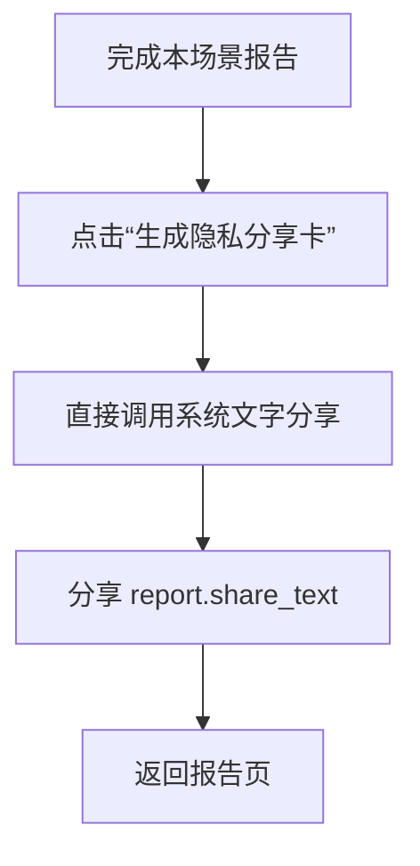
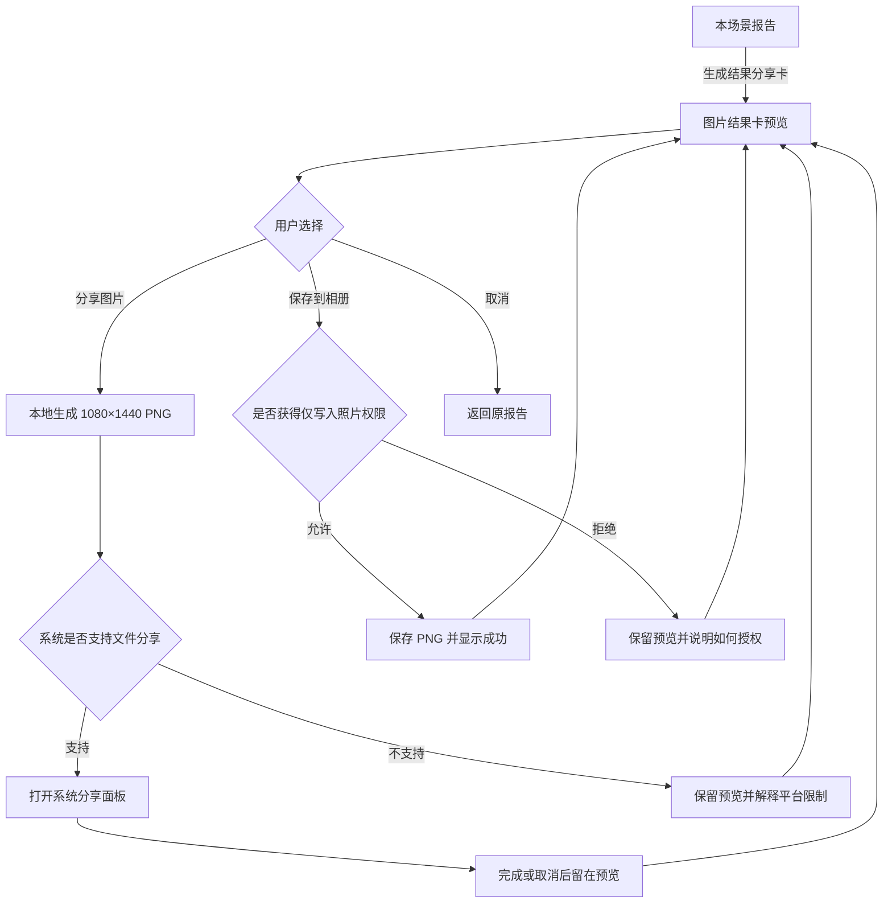

# 家庭化学品排雷大挑战——传播闭环用户流程

> 版本：v1.0
> 日期：2026-07-23
> 状态：已确认，连续进入线框图与实现

## 一、目标

把已经完成的单场景检查结果转化成一张用户愿意保存、愿意发给朋友、朋友看得懂且不会泄露家庭隐私的图片结果卡，补齐产品最核心的传播出口。

传播卡负责表达“我这次是哪一种家庭化学品人格”，不负责承载完整风险事实；严肃风险、建议和证据继续留在应用报告内。

## 二、用户与场景

### 发起分享的人

- 已完成一次厨房、卫生间或储物柜等单场景检查。
- 想展示分数、雷点数量和自嘲标签，但不愿暴露照片、产品名称或家庭环境。
- 可能直接分享，也可能先保存到相册，再发布到微信、小红书等平台。

### 看到分享的人

- 先被人格标签和分数吸引，再理解这是一次家庭化学品安全检查。
- 不需要看到原始场景和具体产品，也能理解“拍一个场景即可参与”。
- 当前 Demo 尚无公开下载入口，先通过邀请语形成兴趣；公开入口上线后再接入二维码或短链接。

## 三、入口与出口

### 入口

1. 本场景报告页主操作“生成结果分享卡”。
2. 历史报告打开已完成报告后，进入同一个分享入口。

### 出口

1. 调起 Android / iOS 系统分享面板并分享 PNG，关闭面板后留在预览页。
2. 保存 PNG 到系统相册，显示明确成功反馈并留在预览页。
3. 取消预览，返回原报告，报告滚动位置和详情展开状态不重置。
4. 关闭预览后仍可“检查另一个场景”。

## 四、当前流程（AS-IS）

当前问题：

- 按钮承诺“分享卡”，实际只有文字摘要，名实不符。
- 用户无法在分享前预览对外内容，也无法确认隐私边界。
- 文字在社交信息流中缺少识别度，无法承载黑白检验档案与人格标签。
- 没有保存到相册的路径，用户难以二次编辑或发布到内容平台。
- 分享文本没有把“一个场景即可参与”变成清楚邀请。

## 五、目标流程（TO-BE）

## 六、结果卡内容边界

### 必须包含

- 产品名：家庭化学品安全检查 / 单场景排雷档案。
- 场景标签，例如“厨房水槽场景”。
- 规则评分与“本轮命中雷点”数量。
- 已检查数量和本轮未命中数量。
- 受控家庭化学品人格标签与一句自嘲文案。
- 邀请语：“测测你家离家庭实验室还有几步”。
- 结论边界：“本轮结果仅供预防参考，不替代标签和专业检测”。
- 隐私声明：“不含原始照片、产品名称和家庭地址”。

### 禁止包含

- 原始全景或细拍照片及其 URI。
- 识别到的品牌、产品名称、成分列表或包装文字。
- 家庭地址、定位、设备信息、challenge ID、request ID。
- 具体风险详情、化学事故描述或容易脱离上下文传播的处置建议。
- “绝对安全”“已通过检测”等确定性表述。

## 七、状态与动作表

| 状态 | 主操作 | 次操作 | 状态所有者 | 退出目的地 |
|---|---|---|---|---|
| 报告完成 | 生成结果分享卡 | 查看详情 / 检查另一场景 | `ResultScreen` | 报告页 |
| 卡片预览 | 分享图片 | 保存到相册 / 取消 | `ResultScreen` | 报告页 |
| 正在生成 | 等待 | 无，动作禁用 | `ResultScreen` | 预览页 |
| 系统分享面板 | 由系统处理 | 取消分享 | 系统 | 预览页 |
| 保存成功 | 分享图片 | 关闭提示 | `ResultScreen` | 预览页 |
| 相册权限拒绝 | 继续查看预览 | 再试 / 取消 | 系统权限 + `ResultScreen` | 预览页 |
| 平台不支持图片分享 | 继续查看预览 | 关闭 | `ResultScreen` | 预览页 |
| 生成失败 | 再试一次 | 取消 | `ResultScreen` | 预览页或报告页 |

## 八、平台规则

- Android / iOS：本地捕获卡片为临时 PNG，通过系统分享面板分享；只有用户主动点“保存到相册”才申请仅写入照片权限。
- Web：保留卡片视觉预览，但当前不承诺分享本地 PNG；继续提供现有文字分享作为降级，不伪装成图片分享成功。
- 临时 PNG 只存在于系统缓存，由运行时管理，不写入后端、SQLite、日志或挑战状态。
- 系统分享取消不算错误，不显示“分享失败”。

## 九、MVP 优先级调整

### 当前 MVP 必须完成

1. 单场景拍摄与细拍引导。
2. 用户确认识别结果。
3. 规则评分、风险报告和受控人格标签。
4. 图片结果卡预览、系统分享和保存到相册。

### MVP 后迭代

- 细拍识别、产品确认和报告生成的完整统一异常恢复。
- 跨应用重启恢复未完成检查。
- 账号、云端同步、公开下载页、二维码和传播归因。
- 分享卡模板选择、编辑文案、动态效果和平台定制尺寸。

现有首页与全景异常恢复代码保留，不回退；只暂停继续扩展，待核心 MVP 完成后统一验收。

## 十、确认

- [x] 分享卡是核心 MVP 的传播出口，不再以文字摘要冒充图片卡。
- [x] 分享前必须可预览，用户可以明确看到对外内容。
- [x] 原图、产品名称、地址和技术标识永不进入分享卡。
- [x] 娱乐表达只使用受控模板，不影响评分和风险事实。
- [x] 完整异常恢复迁移调整为 MVP 后迭代，现有能力保留。
- [x] 下一阶段连续进入低保真线框图，不再逐阶段等待确认。
