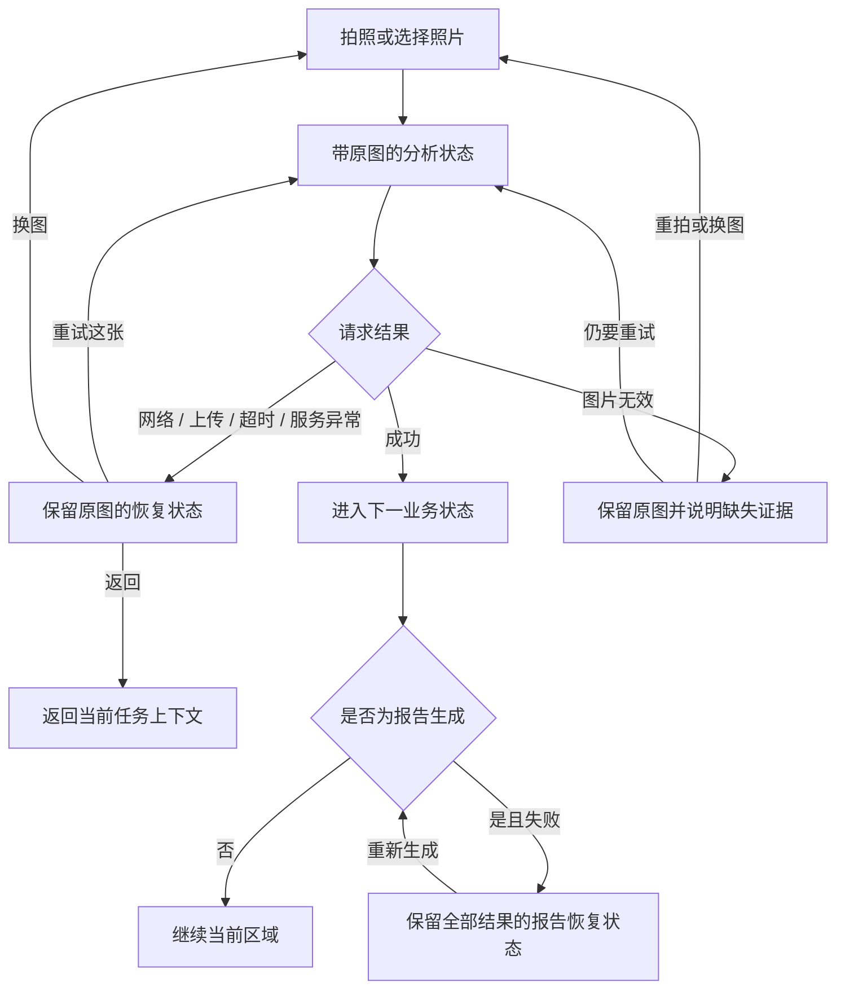

# 家庭化学品安全检查——异常恢复用户流程增量

> **历史文档：** 本增量属于 v1 全景挑战流程。v2 仓库方案的加载、识别、重复、保存、编辑、删除和图片丢失恢复规则已合并到 [家庭化学品库用户流程](./用户流程.md)，请勿将本文件作为新实现依据。

> 版本：v1.2（待确认）
> 日期：2026-07-19
> 上游基线：`用户流程.md` v1.1 单场景快速检查
> 范围：网络失败、模型超时、照片无效、报告生成失败，以及相机/相册恢复路径。本文不决定颜色、装饰或组件拆分。

## 一、目标

异常不应把用户送回首页或空白的全景输入页。系统必须保留仍然有用的照片、区域进度、识别草稿和已确认结果，让用户在错误发生的位置继续。

本增量遵循五条原则：

1. 错误就地呈现，不使用阻断整个页面的系统弹窗承载可恢复错误。
2. 重试默认复用当前照片和当前 challenge，不要求用户重复拍摄。
3. 更换照片是次操作；只有照片本身无效时才建议优先换图。
4. 旧识别草稿和已确认结果不得被一次失败的替换操作覆盖。
5. 错误文案说明“发生了什么”和“现在能做什么”，不把所有异常都写成“检查网络和 API 地址”。

## 二、当前流程（AS-IS）

当前代码中的异常行为如下：

| 操作 | 当前失败行为 | 当前保留内容 | 问题 |
|---|---|---|---|
| 创建检查 | 首页弹出系统 Alert | 首页内容 | 错误原因笼统，重试入口与任务分离 |
| 全景分析 | Alert 后回到全景输入状态 | 内存中仍可能有全景 URI | 页面不展示失败照片，也没有“重试这张” |
| 全景未找到区域 | 独立恢复页 | 全景照片 | 已具备重试、重拍、相册三条路径 |
| 细拍识别 | 回到当前区域并显示行内错误 | 当前区域与进度 | 失败照片未成为可复用证据，通常需要重新拍/选 |
| 替换识别照片失败 | 返回旧识别草稿并显示错误 | 旧草稿 | 行为正确，但错误与重试动作仍不完整 |
| 确认产品失败 | 核对页显示行内错误 | 草稿与用户编辑 | 基本符合目标 |
| 生成报告失败 | Alert 后返回单品结果 | 已确认结果 | 可恢复，但重新生成入口不够直接 |
| 旁白失败 | 静默使用默认旁白 | 主流程 | 符合非关键能力降级原则 |
| 应用被关闭/重载 | 前端内存状态丢失 | 后端保留未完成 challenge | 暂无恢复未完成检查入口 |

当前 API 层已经能区分 HTTP 状态、错误码、追踪号、请求超时和图片上传失败，但页面层多数只展示 `message`，没有按错误类型选择恢复路径。

## 三、目标流程（TO-BE）

### 1. 创建检查失败

1. 用户点击“检查一个场景”。
2. 创建失败时保留首页，在主按钮上方显示行内状态卡。
3. 主操作为“重新连接并开始”；次操作为“查看历史报告”。
4. 重试期间按钮进入忙碌状态，禁止重复创建 challenge。

### 2. 全景分析失败

1. 拍照或选图后进入带原图背景的分析状态。
2. 如果网络断开、上传失败、模型超时或服务异常，进入“全景分析恢复”状态，不返回空白输入页。
3. 页面保留：原照片、challenge ID、当前场景进度。
4. 主操作为“重试分析这张照片”。
5. 次操作为“换一张照片”，并保留“返回”能力。
6. 若服务明确返回“图片无效/过大/无法解析”，主操作改为“换一张照片”，重试原图降为次操作或隐藏。

### 3. 细拍识别失败

1. 识别失败后回到当前全景区域，但同时展示刚才的细拍照片缩略图。
2. 网络、超时和服务异常时，主操作为“重试识别这张照片”。
3. 次操作为“重新拍照”“从相册换图”；“跳过此区域”保持低优先级。
4. 如果是在已有识别草稿上换图，失败后继续显示旧草稿；新照片只作为失败尝试，不覆盖旧草稿。
5. 如果照片模糊或关键包装文字不可见，系统说明缺少什么，并把“重新拍清楚”设为主操作。

### 4. 产品确认失败

1. 保留用户已经修改的品牌、产品名、品类和成分。
2. 在确认按钮附近显示错误与追踪号。
3. 主操作为“再次确认”，不得要求重新识别照片。
4. challenge 已失效或已完成时，明确说明本次草稿无法继续写入，并提供“返回首页开始新检查”。

### 5. 报告生成失败

1. 保留所有已确认产品、风险结果和当前场景名称。
2. 报告生成页原地切换为失败状态，不退回某个单品结果，也不重复图片识别。
3. 主操作为“重新生成报告”；次操作为“返回查看已确认结果”。
4. 重试必须复用同一个 challenge，并防止连续点击产生并发请求。

### 6. 退出与应用重载

1. 在分析、识别或报告生成过程中返回，先取消前端等待状态，再回到仍可恢复的上一状态。
2. 用户主动退出未完成检查时二次确认；说明已拍照片当前不会长期保存。
3. 本增量暂不实现跨应用重启恢复；后端未完成 challenge 继续保留，但历史页只诚实标记“未完成”。

## 四、目标流程图

## 五、状态与动作表

| 状态 | 必须保留 | 主操作 | 次操作 | 失败去向 |
|---|---|---|---|---|
| 首页创建失败 | 首页上下文 | 重新连接并开始 | 历史报告 | 留在首页 |
| 全景上传/分析失败 | 全景照片、challenge ID | 重试这张 | 换图、返回 | 留在全景恢复状态 |
| 全景照片无效 | 全景照片、原因 | 换一张 | 重试原图、返回 | 留在照片无效状态 |
| 全景零区域 | 全景照片 | 换一张 | 重拍、再次分析 | 留在零区域恢复页 |
| 细拍识别失败 | 当前区域、失败照片、进度 | 重试这张 | 重拍、相册、跳过 | 留在当前区域 |
| 替换照片失败 | 旧草稿、旧照片、编辑内容 | 保留旧结果 | 再次换图 | 留在核对页 |
| 产品确认失败 | 草稿与编辑内容 | 再次确认 | 返回核对 | 留在核对页 |
| 报告生成失败 | 全部确认结果、场景名 | 重新生成 | 查看已确认结果 | 留在报告恢复页 |
| challenge 失效 | 当前本地上下文 | 返回首页开始新检查 | 退出 | 首页 |

## 六、错误分类与文案规则

| 错误类型 | 判定依据 | 用户文案重点 | 默认恢复动作 |
|---|---|---|---|
| 离线/连接失败 | 无 HTTP 响应 | 电脑服务当前不可达 | 重试当前操作 |
| 请求超时 | `REQUEST_TIMEOUT` | 分析时间超过等待上限，照片仍保留 | 重试当前操作 |
| 图片上传失败 | `IMAGE_UPLOAD_FAILED` | 照片尚未送达分析服务 | 重试上传这张 |
| 图片无效 | 400/413/415 或图片错误码 | 说明过大、格式或清晰度问题 | 换图/重拍 |
| 请求过频 | 429 | 显示需要等待，不鼓励连续点击 | 倒计时后重试 |
| 模型暂不可用 | 模型错误码、502/503/504 | 服务暂时忙，不暗示用户操作错误 | 稍后重试 |
| challenge 不存在/失效 | 404/409 对应错误码 | 当前检查无法继续写入 | 回首页新建 |
| 未知服务错误 | 500 或未知 | 给出追踪号，保留上下文 | 重试或退出 |

## 七、退出、重试与数据规则

- “重试这张照片”只重发当前动作，不创建新 challenge。
- 每个可重试请求只有一个进行中实例；按钮在请求完成前不可再次触发。
- 全景分析成功前允许换图；已有确认结果后，不允许无提示替换全景图。
- 失败尝试不得增加已完成区域数、雷点数或报告分数。
- 报告生成重试不得重复调用图片识别或风险评估写入。
- 追踪号只在服务返回时显示，用于定位问题；不向用户展示 API 地址、堆栈或密钥。
- 本阶段不新增跨重启照片持久化，避免扩大隐私和存储范围。

## 八、发现的体验问题

1. 全景失败目前通过 Alert 反馈，关闭后用户看不到失败照片，也没有复用原图的主操作。
2. “无法连接服务器，请检查网络和 API 地址”把开发配置语言暴露给普通用户，且无法区分上传失败、离线和模型超时。
3. 细拍识别失败时虽然保留区域进度，但没有把失败照片变成可重试对象。
4. 报告失败会退回单品结果，用户容易误以为前面的确认丢失。
5. 错误类型已经存在于 API 层，但缺少统一的页面恢复语义。

## 九、确认清单

- [ ] 网络、上传、超时和服务异常都保留当前照片，并优先提供“重试这张”。
- [ ] 图片无效时优先引导换图，不无限重试同一张无效照片。
- [ ] 细拍替换失败不覆盖旧草稿；确认失败不清空用户编辑。
- [ ] 报告失败原地重试，并保留所有已确认结果。
- [ ] 本轮不做跨应用重启恢复，也不长期保存原图。
- [ ] 下一阶段更新异常状态低保真线框图，仍不修改应用代码。
