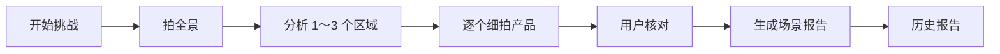
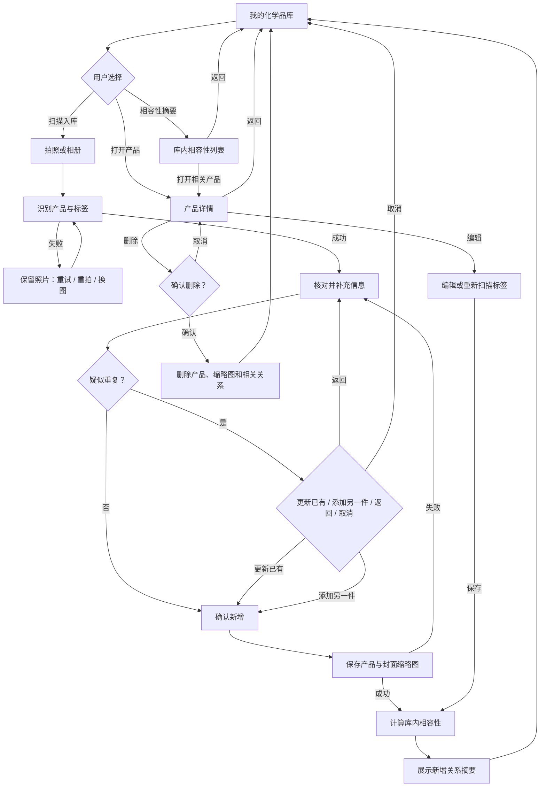

# 家庭化学品安全管理——用户流程

> 版本：v2.0（家庭化学品库，已确认）
>
> 日期：2026-08-02
>
> 状态：第 1 阶段用户流程已确认。下一阶段为低保真线框图，不在本文件决定最终颜色、卡片比例或组件拆分。

## 一、流程目标

用户无需理解 OCR、视觉模型或化学规则，只需要完成三个任务：

1. 拍摄一件家庭化学品并核对系统识别的信息。
2. 将产品和一张封面照片加入“我的化学品库”，以后可持续查看和维护。
3. 查看该产品与库内已有产品之间的潜在相容性提醒。

流程原则：

- 直接拍产品，不强制先拍大场景。
- 入库前必须经过用户核对，低置信度信息不得静默写入。
- 不记录实际存放位置，减少持续维护负担。
- 产品照片只在用户确认入库后长期保存。
- 相容性提醒使用条件式语言，不把“可能禁忌”写成“已经发生危险”。
- 增加、修改和删除均能恢复或确认，避免误操作破坏库存。

## 二、用户与场景

### 主要用户

- 想整理家庭清洁剂、消毒剂、洗衣用品和杀虫用品的普通用户。
- 想快速知道产品储存条件、有效期、危险性和不可混用对象的用户。
- 再次遇到同一产品时，希望复用或更新原有档案的用户。

### 典型场景

- 用户购买或发现一件家庭化学品，立即扫描并入库。
- 用户补拍产品背标，完善生产日期、有效期、成分或警示语。
- 用户再次扫描疑似已有产品，选择更新原记录或添加另一件。
- 用户浏览仓库，打开产品详情进行编辑或删除。
- 新产品入库后，用户查看它与库内产品的相容性提醒。

## 三、入口与出口

### 入口

| 入口 | 用户意图 | 去向 |
|---|---|---|
| 应用首页/仓库“扫描入库” | 添加或更新一件产品 | 产品照片输入 |
| “我的化学品库” | 浏览已有产品 | 仓库列表 |
| 仓库产品项 | 查看和维护产品 | 产品详情 |
| 仓库相容性摘要 | 查看需要注意的库内关系 | 相容性列表 |
| 空仓库“添加第一件产品” | 建立第一条库存 | 产品照片输入 |

### 出口

| 出口 | 结果 |
|---|---|
| 入库成功“返回化学品库” | 显示新增或更新后的产品 |
| 扫描流程取消 | 不保存未确认的产品和照片，返回原入口 |
| 产品详情返回 | 保留已保存信息，返回仓库原滚动位置 |
| 编辑保存 | 更新产品并重算受影响的相容性关系 |
| 删除确认 | 删除产品、缩略图和相关关系，返回仓库 |
| 删除取消 | 保留产品并停留在详情页 |

## 四、当前流程（AS-IS）

当前代码仍以一次 challenge 为单位：先拍全景、分析区域、逐个细拍、确认产品、生成一次性报告，再从历史列表回看报告。

当前流程与新目标的主要冲突：

- 用户必须多拍一张全景图，但正式产品信息仍来自细拍。
- `scanned_products` 只属于一次 challenge，不是长期独立库存。
- 历史页保存报告，而不是支持增删改查的产品档案。
- 原始图片请求结束即丢弃，无法用于仓库陈列。
- 报告、评分和传播标签强调一次性结果，不支持长期关系维护。

## 五、目标流程（TO-BE）

### 5.1 浏览仓库

1. 用户打开“我的化学品库”。
2. 系统加载有效库存和相容性摘要。
3. 有库存时，用户可以浏览、搜索、打开产品或开始扫描入库。
4. 无库存时，页面解释用途，并提供“添加第一件产品”。
5. 加载失败时保留页面框架，允许重试。

### 5.2 提供产品照片

1. 用户选择拍照或从相册选择。
2. 页面说明照片将用于识别；只有确认入库后，选定的压缩缩略图才会长期保存。
3. 相机权限被拒绝时，允许再次授权、改用相册或取消。
4. 用户取消相机或相册时，返回输入页，不产生空记录。
5. 选图成功后显示当前照片并进入识别。

### 5.3 识别与补充信息

1. 系统从照片中提取品牌、产品名、品类和可见标签信息。
2. 识别失败或超时时保留照片，允许重试、重拍或换图。
3. 识别成功后显示照片、置信度和可编辑字段。
4. 产品名和品类缺失时不能直接入库，用户可手动补充或重新拍摄。
5. 生产日期、有效期、成分、警示语或储存条件看不清时显示“未识别”，不进行猜测。
6. 用户可以补拍背标或日期喷码；补拍照片只作为识别证据，除非用户将其选为封面，否则不进入长期陈列。
7. 用户核对全部信息并选择封面照片。

### 5.4 重复产品分支

1. 系统用品牌、产品名、品类、成分及可用标识查找疑似重复记录。
2. 没有疑似重复：进入新增确认。
3. 有疑似重复：展示旧记录的名称、封面和最后更新时间，并让用户选择：
   - 更新已有记录。
   - 添加为另一件产品。
   - 返回继续核对。
   - 取消本次入库。
4. 系统不得在没有用户选择的情况下覆盖旧记录。

### 5.5 确认入库

1. 页面汇总将要保存的产品信息和封面照片。
2. 用户确认后保存产品记录和压缩缩略图。
3. 保存失败时保留编辑内容和临时照片，允许原地重试。
4. 保存成功后，系统计算该产品与库内其他产品的相容性关系。
5. 没有命中规则时表达为“当前规则库未发现已登记禁忌”，不写“绝对安全”。
6. 命中关系时展示相关产品、条件式风险说明、依据和建议。
7. 用户返回仓库后能够立即看到新产品。

### 5.6 查看产品详情

1. 用户从仓库打开任一产品。
2. 详情显示完整封面、产品事实、日期、成分、警示语、储存条件、危险性、信息来源和最后更新时间。
3. 详情显示与库内其他产品的相容性关系。
4. 用户可以返回、编辑、重新扫描标签或删除。

### 5.7 编辑产品

1. 编辑页预填所有已保存字段，未知值保持未知。
2. 用户可以修改文本和日期，也可以重新扫描补充标签信息。
3. 保存失败时保留编辑内容。
4. 保存成功时更新产品，并只重算受影响的相容性关系。
5. 用户取消编辑时，如果存在未保存更改，需要确认放弃或继续编辑。

### 5.8 删除产品

1. 用户在产品详情发起删除。
2. 确认层说明将删除产品、应用保存的封面缩略图及相关相容性关系。
3. 用户可以确认删除或取消。
4. 删除成功后返回仓库，并更新相容性摘要。
5. 删除失败时停留在详情页，产品不从界面中提前消失。

### 5.9 查看库内相容性

1. 仓库显示需要关注的关系数量，但不默认绘制复杂网络图。
2. 用户打开摘要后，按风险优先级查看产品对。
3. 每条关系显示两个产品、规则类型、条件式说明、储存/使用建议和证据状态。
4. 信息不足的关系进入“待补充”，提供补拍或编辑入口。
5. 用户不能把“没有命中规则”理解为检测合格，页面持续展示适用边界。

## 六、目标主流程图

## 七、状态与动作表

| 状态 | 主要动作 | 次要动作 | 失败目的地 |
|---|---|---|---|
| 仓库加载 | 等待 | 返回 | 仓库错误状态 |
| 仓库空状态 | 添加第一件产品 | 无 | 产品输入 |
| 仓库有数据 | 扫描入库 | 搜索、打开产品、相容性摘要 | 保留仓库 |
| 产品输入 | 拍照 | 相册、取消 | 保留输入页 |
| 相机权限缺失 | 去授权 | 相册、取消 | 保留输入页 |
| 产品识别 | 等待 | 目标体验允许取消 | 识别恢复状态 |
| 识别恢复 | 重试当前照片 | 重拍、换图、取消 | 保留照片 |
| 信息核对 | 确认信息 | 编辑、补拍、换图、取消 | 保留编辑内容 |
| 疑似重复 | 更新已有/添加另一件 | 返回、取消 | 保留核对结果 |
| 入库保存 | 等待 | 防止重复提交 | 返回核对并保留内容 |
| 入库成功 | 返回化学品库 | 查看新关系 | 保留成功结果 |
| 产品详情 | 查看信息 | 编辑、重扫、删除、返回 | 保留详情 |
| 产品编辑 | 保存 | 取消 | 保留编辑内容 |
| 未保存退出 | 继续编辑 | 放弃更改 | 返回详情 |
| 删除确认 | 确认删除 | 取消 | 保留详情 |
| 删除失败 | 重试 | 取消 | 保留详情和产品 |
| 相容性列表 | 查看关系 | 打开产品、返回 | 保留列表 |

## 八、异常与恢复规则

| 异常 | 必须保留 | 用户可执行动作 |
|---|---|---|
| 仓库加载失败 | 页面入口和已有本地状态 | 重试、返回 |
| 相机无权限 | 当前入库任务 | 授权、相册、取消 |
| 相册取消 | 当前输入页 | 继续拍照或退出 |
| 识别超时/失败 | 当前临时照片 | 重试、重拍、换图 |
| 关键字段未知 | 已识别字段和照片 | 手动补充、补拍、取消 |
| 封面保存失败 | 临时照片和编辑内容 | 重试保存、重新选图 |
| 产品保存失败 | 全部核对结果 | 原地重试、取消 |
| 相容性计算失败 | 已成功保存的产品 | 重试计算、稍后查看；不得回滚产品 |
| 编辑保存失败 | 用户修改内容 | 原地重试、放弃修改 |
| 删除失败 | 原产品、照片和关系 | 重试、取消 |
| 图片文件丢失 | 产品结构化信息 | 重新选择封面、继续查看无图卡片 |

## 九、退出与返回规则

- 未确认入库前退出，不建立库存记录，不长期保存临时照片。
- 有未保存修改时退出，必须确认是否放弃。
- 识别或保存过程中不得重复提交。
- 返回仓库时尽量恢复之前的滚动位置和筛选条件。
- 删除属于不可逆操作，必须二次确认。
- 首期不提供账号和云同步，不承诺跨设备恢复。

## 十、流程审计发现

1. 现有 challenge JSON 不能承担独立产品 CRUD，需要后续建立库存实体。
2. 当前历史报告不能替代长期仓库。
3. 当前照片不落盘，与产品陈列需求冲突，需要新的本地缩略图授权和生命周期。
4. 当前跨产品规则默认比较同一 challenge 内已扫描产品；新方案需要按有效库存重算，同时使用条件式表达。
5. 重复产品、日期识别失败、封面丢失、编辑冲突和删除失败均需要独立恢复状态。
6. 双列陈列、卡片信息密度和详情页层级属于下一阶段线框图决策。

## 十一、确认清单

- [x] 用户从“我的化学品库”浏览或扫描入库。
- [x] 产品直接拍摄，不再强制全景和区域引导。
- [x] 入库前必须核对，未知信息不得猜测。
- [x] 不保存真实位置，只保存储存条件与相容性建议。
- [x] 入库确认后长期保存一张本地封面缩略图。
- [x] 疑似重复时由用户决定更新旧记录或添加另一件。
- [x] 产品支持查看、编辑、重新扫描和删除。
- [x] 删除同步移除缩略图和相关相容性关系，并必须二次确认。
- [x] 相容性检查不默认绘制网络图，也不声称用户已经混用。
- [x] 下一阶段是低保真线框图；本阶段不修改架构和实现代码。

> 2026-08-02：产品方要求绘制完整低保真图，视为确认本用户流程并同意进入低保真线框图阶段。
