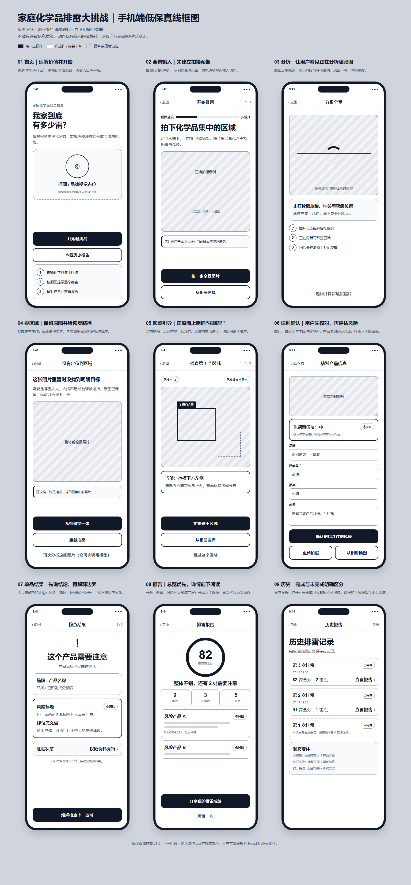

# 家庭化学品排雷大挑战——手机端页面线框图

> 版本：v1.0  
> 日期：2026-07-15  
> 上游输入：[用户流程](./用户流程.md)  
> 可视化画板：[打开九屏低保真线框图](./design/wireframes/mobile-low-fi.html)

## 一、本阶段解决什么

本线框图只确定：

- 每个页面首先展示什么信息。
- 当前页面唯一的主操作是什么。
- 拍照、相册、重试、跳过和退出如何排列。
- 图片、进度、风险说明和恢复入口是否始终可见。
- 九组页面之间是否能完整承接已确认的用户流程。

本阶段不确定：

- 最终品牌色、渐变、插画或图标风格。
- 最终字号、字体和动效参数。
- React Native 组件如何拆分。
- 桌面 Web 的宽屏排版。

## 二、全局布局规则

### 手机基准

- 基准画板：390×844。
- 页面从上到下分为：系统安全区、导航/进度区、主要内容区、底部操作区。
- 主要触控目标不小于 44×44。
- 页面默认单列纵向阅读，不依赖横向卡片承载关键信息。

### 动作优先级

| 级别 | 用途 | 示例 |
|---|---|---|
| 主操作 | 推进当前核心任务，每页最多一个 | 开始挑战、拍摄当前区域、确认并评估、继续检查 |
| 次操作 | 等价输入或可恢复动作 | 从相册选择、重新拍照 |
| 文字操作 | 低频、可跳过或可能产生额外成本 | 跳过区域、再次分析原图、再排一次 |

### 扫描上下文

- 全景分析、零区域和区域引导必须显示同一张全景照片。
- 单品分析与识别确认必须显示本次单品照片。
- 进度在区域引导、单品结果中持续可见。
- 安全提示不能只用颜色、图标或 Emoji，必须有明确文字。

## 三、九组页面说明

### 01 首页

目标：让第一次使用的用户在数秒内理解产品价值并开始挑战。

信息顺序：

1. 产品类别和核心标题。
2. 一句话价值说明。
3. 品牌视觉占位。
4. “开始新挑战”主按钮。
5. “查看历史报告”次按钮。
6. 三步玩法摘要。

决策：历史入口保留，但不与开始按钮争夺主视觉。

### 02 全景输入

目标：在打开相机前讲清楚拍摄对象和合格照片标准。

信息顺序：

1. 顶部退出、标题和步骤进度。
2. 拍摄任务标题与场景示例。
3. 正确拍摄范围占位图。
4. 图片隐私说明。
5. 拍照主按钮。
6. 相册次按钮。

状态变体：无相机权限时保留任务说明，提供再次授权、相册和取消。

### 03 分析

目标：明确系统正在分析哪张照片，以及完成后会得到什么。

信息顺序：

1. 原照片和扫描反馈。
2. 当前阶段说明。
3. 三步处理进度。
4. 返回并保留照片的低优先级入口。

错误变体：保留原图，出现“重试分析”和“换一张”，不直接回到空白输入页。

### 04 零区域

目标：把“没有找到区域”呈现为可恢复结果，不表现成系统崩溃。

操作顺序：

1. 从相册换一张。
2. 重新拍照。
3. 再次分析原图，并明确会再次调用模型。

决策：原图始终保留；再次分析不能作为默认主操作，避免无意识重复消耗额度。

### 05 区域引导

目标：用户无需阅读长描述，也能从原图看懂下一处要拍哪里。

信息顺序：

1. 区域进度和已发现雷点数量。
2. 全景图：当前区域实线强调，后续区域虚线弱化。
3. 当前区域名称与拍摄要求。
4. 拍摄主按钮。
5. 相册次按钮。
6. 跳过文字操作。

退出变体：点击退出时弹出“继续排雷 / 退出挑战”，明确未完成记录不会生成报告。

### 06 识别确认

目标：让用户先确认模型观察到的产品事实，再进入安全判断。

信息顺序：

1. 本次单品照片。
2. 置信度与核对提示。
3. 品牌、产品名、品类、成分字段。
4. “确认信息并评估风险”主按钮。
5. 重新拍照与相册换图。
6. 本地规则边界说明。

校验：产品名和品类必填；确认失败后必须保留用户编辑内容。

### 07 单品结果

目标：先给用户可理解的结论，再解释原因、行动和证据。

信息顺序：

1. “需要注意”或“当前规则未发现雷点”的文字结论。
2. 已由用户确认的产品事实。
3. 风险标题、等级、原因与建议。
4. 证据状态和来源入口。
5. 识别/规则不等于实验室检测的边界说明。
6. 继续下一区域或生成报告的主按钮。

文案约束：不再把无规则命中直接写成绝对“安全”。

### 08 报告

目标：让用户先看整体情况，再按需阅读风险详情。

信息顺序：

1. 安全分和概括性结论。
2. 雷点、安全项、已检查数量。
3. 风险产品摘要列表。
4. 证据状态和详情入口。
5. 分享主按钮。
6. 再排一次文字操作。

失败变体：报告生成失败时回到已完成扫描结果，主按钮明确写“重新生成报告”。

### 09 历史

目标：快速打开已完成报告，并清楚理解未完成记录的限制。

记录状态：

- 已完成：显示日期、分数、雷点，可打开报告。
- 未完成：不可点击，解释当前版本不能继续，也没有报告。
- 空数据：说明完成挑战后会出现记录，并提供开始挑战入口。
- 加载失败：保留历史页并提供重新加载。

## 四、跨页面一致性检查

| 检查项 | 线框图处理 |
|---|---|
| 当前任务是否明确 | 每页标题只描述当前任务 |
| 主按钮是否唯一 | 每组页面最多一个深色主按钮 |
| 相册是否可用 | 所有图片输入节点均保留相册入口 |
| 原图是否保留 | 分析、零区域、引导、确认均显示对应照片 |
| 失败是否可恢复 | 失败作为当前页面状态变体处理 |
| 进度是否连续 | 顶部步骤和区域计数持续显示 |
| 风险表达是否克制 | 文字结论包含规则与检测边界 |
| 退出后果是否明确 | 未完成挑战使用二次确认 |

## 五、需要确认的线框决策

- [x] 首页历史入口保持次级，不做底部 Tab。
- [x] 全景与区域页面都以“拍照”为主操作、“相册”为次操作。
- [x] 分析失败后保留照片，并提供原地重试。
- [x] 区域引导保留“跳过”，但使用低优先级文字按钮。
- [x] 单品结果把绝对“安全”改为“当前规则未发现雷点”。
- [x] 报告页以分享为主操作，“再排一次”为次操作。
- [x] 未完成历史记录只解释状态，暂不提供删除或继续功能。

> 2026-07-15：产品方已确认以上线框决策，同意进入移动端视觉规范阶段。

确认以上结构后，下一阶段产物是《视觉规范》：确定品牌色、风险色、字体层级、间距、圆角、图片蒙层、按钮状态和图标风格，仍不直接修改业务代码。
