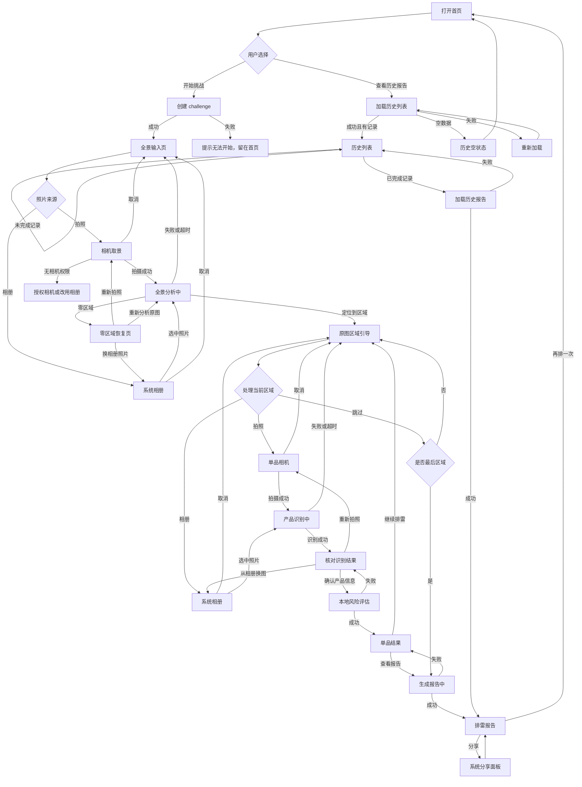
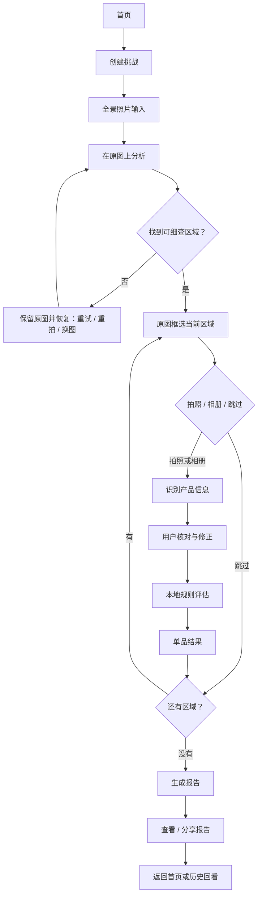

# 家庭化学品排雷大挑战——用户流程

> 版本：v1.0  
> 日期：2026-07-15  
> 用途：本文件是手机端 UI 优化的第一阶段产物。流程确认后才进入页面线框图，不在本阶段决定颜色、排版或组件拆分。

## 一、流程目标

用户无需理解 AI、OCR 或风险规则，只需要完成三个任务：

1. 提供一张家庭化学品集中区域的全景照片。
2. 按原图标记逐个补充清晰的产品照片，并核对识别信息。
3. 查看可信、可解释、可以再次打开的排雷报告。

体验目标：

- 每一步只突出一个主要动作，同时保留相册作为等价入口。
- 用户始终知道“现在在哪一步、还剩几个区域、接下来会发生什么”。
- 任何失败都在当前任务附近恢复，不突然跳回首页或全景起点。
- AI 识别与安全结论之间必须有用户确认，避免错误 OCR 直接污染报告。
- 图片用途和隐私边界在首次选图、拍摄和确认阶段保持可见。

## 二、用户与使用场景

### 主要用户

- 想快速检查厨房、卫生间、储物柜等家庭区域的普通用户。
- 对化学品名称和成分不熟悉，需要明确拍摄指引和通俗风险说明。
- 主要使用手机单手操作，也可能先在电脑 Web 端体验流程。

### 典型场景

- 用户站在水槽、浴室柜或储物柜前，现场拍摄并逐个细查。
- 用户已经在手机相册中保存照片，希望直接选择，不重新拍摄。
- 用户查看之前完成的挑战报告，不发起新扫描。

## 三、入口与出口

### 入口

| 入口 | 用户意图 | 去向 |
|---|---|---|
| 首页“开始挑战” | 开始一次新检查 | 创建挑战后进入全景输入 |
| 首页“查看历史报告” | 回看已完成结果 | 进入历史记录列表 |
| 历史空状态“去开始挑战” | 没有历史，转去新建 | 返回首页 |

### 完成出口

| 出口 | 结果 |
|---|---|
| 报告页“分享我的排雷成绩” | 调起系统分享面板，留在报告页 |
| 报告页“再排一次” | 清空当前前端状态并返回首页 |
| 历史报告返回 | 回到历史列表 |
| 未完成挑战退出 | 目标体验中先二次确认，再返回首页并保留后端未完成记录 |

## 四、当前实现流程（AS-IS）

下图只描述当前代码已经实现的行为。

## 五、目标用户流程（TO-BE）

目标流程保留现有业务能力，优先修复信息不明确、退出无确认和失败反馈不足的问题。

### 阶段 1：了解与开始

1. 用户打开首页。
2. 首页用一句话说明价值：“拍照检查家中化学品，发现需要注意的存放与使用风险。”
3. 首页展示两个清晰入口：
   - 主操作：开始新挑战。
   - 次操作：查看历史报告。
4. 点击开始后按钮进入加载状态，禁止重复点击。
5. 创建失败时在首页显示可重试提示，不丢失首页内容。

### 阶段 2：提供全景照片

1. 页面说明应该拍哪里、需要包含什么、照片将如何使用。
2. 用户选择“拍一张”或“从相册选择”，两条路径权重接近。
3. 相机权限被拒绝时：
   - 允许再次申请权限。
   - 明确提供相册替代方案。
   - 允许取消并返回全景输入页。
4. 选图或拍照成功后，在原照片上展示分析过程，避免白色空屏。
5. 分析成功后：
   - 有区域：进入原图定位引导。
   - 无区域：保留原图，提供换图、重拍和再次分析。
6. 分析失败或超时：保留原图，提供“重试分析”和“换一张”，不直接清空图片。

### 阶段 3：逐个细查区域

1. 页面在原全景图上突出当前区域，并弱化后续区域。
2. 顶部持续显示：当前进度、已发现雷点、剩余区域数。
3. 用户对当前区域选择：
   - 拍照识别。
   - 从相册选择。
   - 跳过此区域。
4. 跳过时进入下一区域；若是最后一区域，进入报告生成。
5. 已确认的产品显示在进度列表中；跳过项不伪装成安全结果。

### 阶段 4：识别并核对产品

1. 分析过程以本次单品照片作为背景，并展示等待反馈。
2. 识别成功后展示原照片、置信度和可编辑字段：品牌、产品名、品类、成分。
3. 产品名和品类为必填；缺失时不能确认，并就近说明原因。
4. 低置信度或关键字段未知时，突出建议重拍，但不禁止人工修正。
5. 用户可以：
   - 修正字段并确认。
   - 重新拍照。
   - 从相册换一张。
6. 只有确认后才执行本地风险评估并写入报告。
7. 确认失败时保留用户编辑内容，允许原地重试。

### 阶段 5：查看单品结果

1. 首屏先表达“需要注意”或“当前规则未发现雷点”，避免只依赖表情和颜色。
2. 展示用户已确认的产品事实。
3. 有风险时展示：风险级别、原因、建议、证据状态和资料来源。
4. 无风险时明确边界：未命中当前规则不等于实验室检测合格。
5. 主按钮根据进度显示“继续检查下一区域”或“生成排雷报告”。

### 阶段 6：报告与后续动作

1. 报告生成时说明正在汇总已确认结果，不重复调用图片识别。
2. 生成失败时保留全部已确认结果，并提供明确的“重新生成报告”。
3. 报告页展示总分、风险分布、产品详情、证据状态和安全建议。
4. 分享成功或取消后停留在报告页；分享异常时给用户可见提示。
5. “再排一次”返回首页并清空当前前端状态，不自动创建新挑战。

### 阶段 7：历史报告

1. 历史页进入时加载最近挑战，支持下拉刷新。
2. 已完成记录可打开报告。
3. 未完成记录不可伪装成可打开报告，需要清楚标注“未完成”。
4. 空状态提供开始挑战入口。
5. 加载或打开失败时留在历史页并允许重试。

## 六、目标主流程图

## 七、状态与用户动作对照

| 用户看到的状态 | 主要动作 | 次要动作 | 失败后的落点 |
|---|---|---|---|
| 首页 | 开始挑战 | 查看历史 | 留在首页重试 |
| 全景输入 | 拍照 | 相册 | 保留当前页 |
| 相机 | 拍摄 | 相册、取消 | 留在相机或返回输入页 |
| 全景分析 | 等待 | 目标体验允许取消/返回 | 保留照片的恢复页 |
| 零区域 | 换一张 | 重拍、再次分析 | 保留零区域页 |
| 区域引导 | 拍摄当前区域 | 相册、跳过 | 保留当前区域 |
| 单品识别 | 等待 | 目标体验允许取消/返回 | 返回当前区域或旧草稿 |
| 识别确认 | 确认并评估 | 修正、重拍、换图 | 保留编辑内容 |
| 单品结果 | 继续/生成报告 | 查看证据 | 保留单品结果 |
| 报告生成 | 等待 | 无重复提交 | 返回单品结果并重试 |
| 报告 | 分享 | 再排一次 | 留在报告页 |
| 历史列表 | 打开报告 | 刷新、返回 | 留在历史页 |

## 八、异常与恢复规则

| 异常 | 必须保留 | 用户可执行动作 |
|---|---|---|
| 创建挑战失败 | 首页上下文 | 重试开始 |
| 相机无权限 | 当前任务说明 | 再次授权、改用相册、取消 |
| 相册取消 | 当前页面与进度 | 继续原任务 |
| 图片分析超时 | 当前照片、挑战 ID、区域进度 | 重试、换图 |
| 全景零区域 | 全景原图 | 重试分析、重拍、换图 |
| 产品识别失败 | 当前区域、旧草稿（如有） | 重试拍摄或换图 |
| 产品确认失败 | 用户编辑后的字段 | 原地重试 |
| 报告生成失败 | 所有已确认结果 | 重新生成 |
| 历史加载失败 | 历史页面 | 重新加载或返回 |
| 分享失败 | 当前报告 | 再次分享或继续查看 |

## 九、离开与返回规则

### 当前实现

- 扫描页使用系统导航返回时没有退出确认。
- 后端会保留未完成挑战，历史列表将其显示为“未完成”，但不能继续或打开。
- 分析中和报告生成中没有显式取消入口。

### 目标体验

- 用户主动离开未完成挑战时弹出确认：
  - “继续排雷”：留在当前步骤。
  - “退出挑战”：返回首页，并说明本次未完成记录不会生成报告。
- 当前版本不承诺恢复未完成挑战，因此文案不能写“稍后继续”。
- 分析或提交中的返回操作需要先阻止重复请求，再决定是否允许退出。

## 十、流程阶段发现的体验问题

以下问题进入下一阶段线框图解决，不在本文件直接指定组件样式：

1. 扫描页退出无确认，用户可能误触并留下无法继续的未完成记录。
2. 全景分析失败会回到初始输入页，当前照片不再可见；目标应保留照片和重试入口。
3. 单品识别失败后只弹窗，恢复动作不够直观。
4. 单品结果的“安全”容易被理解为产品绝对安全，需要更谨慎的结果文案。
5. 报告生成失败虽然能重试，但按钮仍沿用“查看排雷报告”，应明确为“重新生成”。
6. 分享异常只写控制台，用户看不到失败反馈。
7. 未完成历史记录只展示不可点击状态，没有解释为何不能打开或如何处理。
8. Web 与手机共用最大宽度布局，但后续线框图必须以手机视口为主，不以桌面页面比例做设计。

## 十一、本阶段确认项

进入线框图前，需要确认以下原则：

- [x] 主流程仍以“先全景、再按区域细拍”为核心。
- [x] 拍照与相册在所有图片输入节点保持并列。
- [x] 允许用户跳过任一区域，包括最后一个区域。
- [x] 产品识别必须经用户确认，不能恢复为一步式自动判定。
- [x] 未完成挑战暂不支持断点续扫，退出时明确提示。
- [x] 报告页继续保留分享与再次挑战两个出口。
- [x] 下一阶段只画手机端低保真线框图，不立即修改代码。

> 2026-07-15：产品方已确认以上原则，同意进入手机端低保真线框图阶段。

以上原则确认后，下一份产物是《手机端页面线框图》，覆盖首页、全景输入、分析、零区域、区域引导、识别确认、单品结果、报告和历史九组页面。
