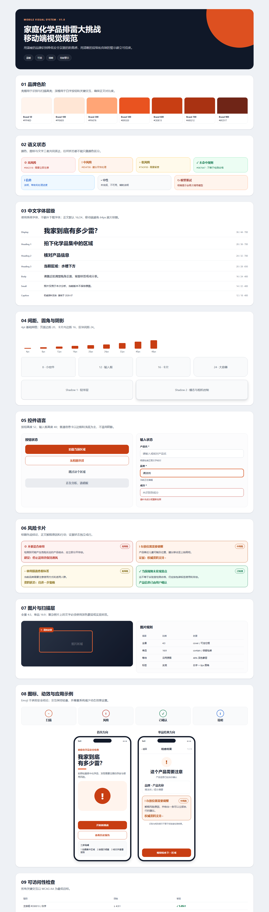

# 家庭化学品排雷大挑战——移动端视觉规范

> 版本：v1.0  
> 日期：2026-07-16  
> 上游输入：[用户流程](./用户流程.md) · [手机端页面线框图](./手机端页面线框图.md)  
> 可视化样式板：[打开浏览器样式板](./design/visual-system/mobile-style-guide.html)

## 一、视觉定位

设计关键词：

- **温暖**：家庭场景保留活力橙的亲和力。
- **可信**：用清晰层级、证据状态和克制文案建立信任。
- **清晰**：每页一个主操作，正文保持足够字号和行距。
- **克制警示**：风险色只用于风险语义，不把全页做成红色警报。

不采用大面积高饱和红色、低对比霓虹色、玻璃拟态和大量阴影。Emoji 不作为风险等级或安全结论的唯一表达。

## 二、颜色系统

### 品牌色阶

| 令牌 | 色值 | 用途 |
|---|---|---|
| <code>brand.50</code> | <code>#FFF4ED</code> | 品牌浅背景、提示底色 |
| <code>brand.100</code> | <code>#FFE6D5</code> | 焦点环、选中浅底 |
| <code>brand.300</code> | <code>#FFA576</code> | 插画辅助、装饰 |
| <code>brand.500</code> | <code>#E95320</code> | 品牌图形、扫描线、大字号 |
| <code>brand.600</code> | <code>#C83E13</code> | 主按钮、关键链接、实底标签 |
| <code>brand.700</code> | <code>#A93212</code> | 按下状态 |
| <code>brand.900</code> | <code>#6F2517</code> | 深色品牌文字 |

现有主色 <code>#FF6B35</code> 搭配白字只有约 2.84:1，不满足普通正文 AA。它只用于不承载文字的扫描高亮和装饰。主按钮改为 <code>#C83E13</code>，与白字约 5.05:1。

### 中性色

| 语义令牌 | 色值 | 用途 |
|---|---|---|
| <code>surface.primary</code> | <code>#FFFFFF</code> | 页面主背景 |
| <code>surface.subtle</code> | <code>#F9FAFB</code> | 次级区块、弱卡片 |
| <code>surface.muted</code> | <code>#F2F4F7</code> | 禁用、骨架屏 |
| <code>text.primary</code> | <code>#101828</code> | 标题、核心正文 |
| <code>text.secondary</code> | <code>#475467</code> | 正文说明 |
| <code>text.tertiary</code> | <code>#667085</code> | 辅助信息、时间 |
| <code>border.default</code> | <code>#D0D5DD</code> | 输入框、卡片边界 |
| <code>border.subtle</code> | <code>#EAECF0</code> | 分割线、弱边界 |

### 风险与功能色

| 状态 | 前景 | 背景 | 边框 | 强制文字 |
|---|---|---|---|---|
| 高风险 | <code>#B42318</code> | <code>#FEF3F2</code> | <code>#FDA29B</code> | 高风险 / 需要立即注意 |
| 中风险 | <code>#B54708</code> | <code>#FFF4ED</code> | <code>#FDB022</code> | 中风险 / 建议尽快处理 |
| 低风险 | <code>#7A5F00</code> | <code>#FFFAEB</code> | <code>#FEC84B</code> | 低风险 / 需要留意 |
| 未命中规则 | <code>#067647</code> | <code>#ECFDF3</code> | <code>#75E0A7</code> | 当前规则未发现雷点 |
| 信息 | <code>#175CD3</code> | <code>#EFF8FF</code> | <code>#84CAFF</code> | 说明 / 处理中 |

所有状态同时显示文字和图标。禁止将“未命中规则”简写为绝对“安全”。

## 三、字体与排版

使用系统字体，不引入网络字体。

| 令牌 | 字号/行高 | 字重 | 用途 |
|---|---|---|---|
| <code>display</code> | 36/44 | 700 | 首页主标题、报告分数 |
| <code>heading.1</code> | 28/36 | 700 | 页面任务标题 |
| <code>heading.2</code> | 24/32 | 700 | 区块标题 |
| <code>heading.3</code> | 20/28 | 600–700 | 卡片标题、状态结论 |
| <code>body</code> | 16/24 | 400 | 主要正文、按钮文字 |
| <code>body.small</code> | 14/22 | 400 | 说明、卡片正文 |
| <code>caption</code> | 12/18 | 400–600 | 时间、证据状态、辅助标签 |

正文默认不小于 16px；标题允许两行，但不再使用 64px 超大字号挤压手机首屏。

## 四、间距与尺寸

采用 4pt 基础网格：4、8、12、16、20、24、32、40、48。

- 手机页面水平边距：20。
- 卡片内边距：16。
- 页面区块间距：24。
- 主按钮高度：52。
- 输入框最小高度：48，多行输入最小 88。
- 所有触控区域至少 44×44。

## 五、圆角、边框和阴影

| 令牌 | 数值 | 用途 |
|---|---:|---|
| <code>radius.sm</code> | 8 | 标签、小图标底 |
| <code>radius.md</code> | 12 | 输入框、次级按钮 |
| <code>radius.lg</code> | 16 | 信息卡、风险卡 |
| <code>radius.xl</code> | 24 | 大图容器、首页视觉区 |
| <code>radius.full</code> | 999 | 胶囊标签、圆形按钮 |

普通卡片使用浅底或 1px 边框，不默认添加阴影。轻阴影只用于浮层，重阴影只用于模态和相机控制。

## 六、按钮与输入

### 按钮

- 主按钮：<code>brand.600</code> 背景、白字、52px 高、14px 圆角。
- 次按钮：白底、<code>brand.600</code> 边框与文字。
- 文字按钮：<code>text.secondary</code>，用于跳过、再次分析、再排一次。
- 加载中保留原宽高并显示明确文字。
- 每页最多一个主按钮，文案描述动作结果。

### 输入

- 默认：白底、1.5px <code>border.default</code>、12px 圆角。
- 聚焦：2px <code>brand.600</code> + 3px <code>brand.100</code> 外环。
- 错误：红色边框加就近文字原因，不能只变色。
- 标签始终显示在输入框上方。
- 确认失败后保留用户编辑内容。

## 七、卡片与状态

风险卡的信息顺序固定为：

1. 风险图标、标题和等级标签。
2. 原因说明。
3. 可执行建议。
4. 证据状态和来源入口。

风险色只出现在真正的风险内容上。空状态和错误状态必须包含辅助图形、标题、原因说明和一个恢复动作。

## 八、图片与扫描视觉

- 全景图片默认 4:3，优先 cover。
- 单品图片默认 16:9，优先 contain，避免裁掉标签。
- 分析等待保留原图，覆盖 <code>rgba(16,24,40,0.48)</code> 蒙层。
- 当前定位框使用 3px 亮橙 <code>#FF6B35</code>。
- “请拍这里”使用 <code>brand.600</code> 实底白字。
- 扫描线、放大镜和旁白不能遮挡当前定位目标。

## 九、图标与插画

- 使用圆角线性图标，默认 2px 描边。
- 常用尺寸：16、20、24、32–48。
- 风险、成功、信息使用不同形状和文字，不只换颜色。
- Emoji 只用于轻量庆祝或空状态，不用于风险、证据或按钮。
- 首页插画表现家庭场景与拍摄任务，不表现爆炸、伤害或恐吓画面。

## 十、动效

| 类型 | 时长 | 规则 |
|---|---:|---|
| 点击反馈 | 160ms | 透明度或 0.98 缩放 |
| 元素进入 | 240ms | 淡入，位移不超过 8px |
| 状态切换 | 240ms | 旧内容淡出、新内容淡入 |
| 扫描循环 | 400–800ms | 匀速关键帧，不快速闪烁 |
| 报告分数 | 600ms 内 | 数字递增一次，不循环 |

系统开启减少动态效果时停用位移、循环缩放和数字滚动。网络等待必须有文字阶段说明。

## 十一、可访问性

- 普通文字对比度目标 ≥ 4.5:1；大字和大图标 ≥ 3:1。
- 主按钮 <code>#C83E13 / #FFFFFF</code> 约 5.05:1。
- 正文 <code>#475467 / #FFFFFF</code> 约 7.69:1。
- 辅助字 <code>#667085 / #FFFFFF</code> 约 4.97:1。
- 点击区域至少 44×44，支持系统字体放大。
- 屏幕阅读器名称包含动作和对象。
- 风险状态必须被读为完整文字，不能只读图标。

## 十二、现有主题迁移原则

视觉规范确认后进入组件图阶段，再规划代码迁移：

- 将 <code>colors.ts</code> 从扁平颜色表升级为原始色阶与语义令牌。
- 将 <code>spacing.ts</code> 补齐 12、20、40，并限制超大字号。
- 清除组件内硬编码的蒙层、背景和标签颜色。
- 建立按钮、输入框、卡片、状态标签和图片覆盖层的统一视觉变体。
- 视觉规范确认前不直接修改页面样式。

## 十三、需要确认的视觉决策

- [ ] 保留橙色品牌方向，主交互使用深橙 <code>#C83E13</code>。
- [ ] 亮橙 <code>#FF6B35</code> 仅用于装饰和扫描定位。
- [ ] 使用系统中文字体，不额外引入网络字体。
- [ ] 风险使用红/橙/琥珀/绿，并始终搭配文字和图标。
- [ ] 普通卡片以浅底或边框为主，减少阴影。
- [ ] Emoji 不承担风险结论，后续替换为统一线性图标。
- [ ] 首页保持温暖轻量，风险详情保持克制专业。
- [ ] 下一阶段先画组件图，再开始修改 React Native 代码。

确认后，下一份产物是《前端组件图与设计令牌映射》。
